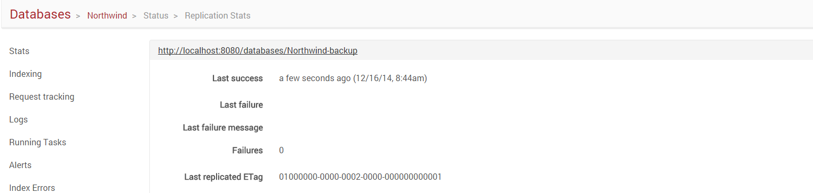

import Admonition from '@theme/Admonition';
import Tabs from '@theme/Tabs';
import TabItem from '@theme/TabItem';
import CodeBlock from '@theme/CodeBlock';
import LanguageSwitcher from "@site/src/components/LanguageSwitcher";
import LanguageContent from "@site/src/components/LanguageContent";

# Status: Replication Stats

Here you can find information about replication status and detailed information concerning  each node to which data is replicated or from which it is received.

## Replication Topology

An additional functionality allows requesting server a replication topology. When the answer is received, a graph presenting nodes and their connection status will be displayed.

<Admonition type="warning" title="Warning">
Gathering replication topology data may be time consuming.
</Admonition>
