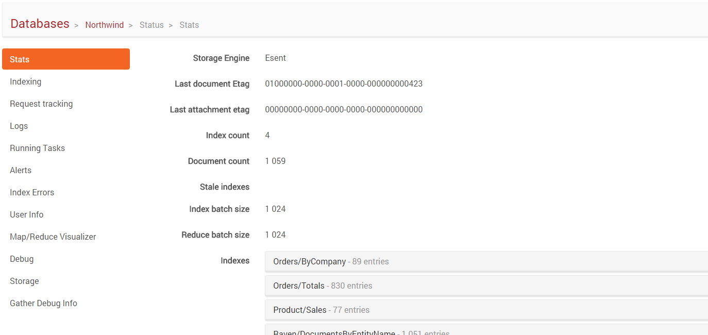

import Admonition from '@theme/Admonition';
import Tabs from '@theme/Tabs';
import TabItem from '@theme/TabItem';
import CodeBlock from '@theme/CodeBlock';
import LanguageSwitcher from "@site/src/components/LanguageSwitcher";
import LanguageContent from "@site/src/components/LanguageContent";

# Status: Stats

This view displays the statistics for a current database. Here you can find information like:

- number of documents and indexes,
- last document and attachment ETags,
- list of Stale indexes,
- statistics for respective indexes

Learn more about information available in this view [here](../../../server/administration/statistics.mdx).

