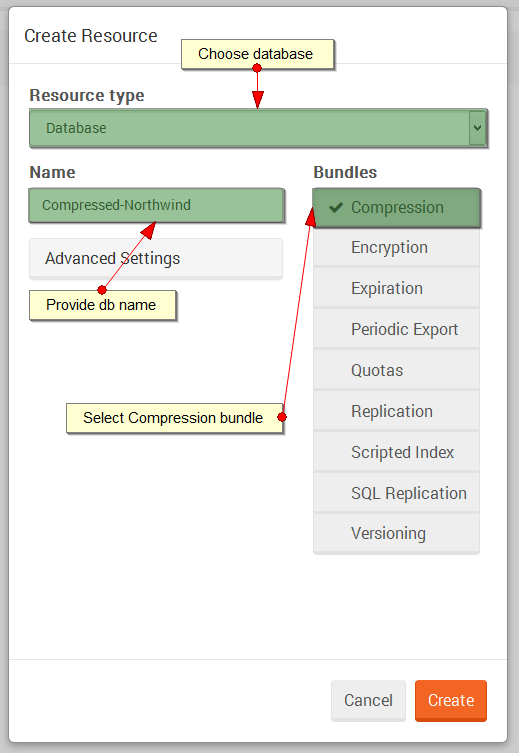

import Admonition from '@theme/Admonition';
import Tabs from '@theme/Tabs';
import TabItem from '@theme/TabItem';
import CodeBlock from '@theme/CodeBlock';
import LanguageSwitcher from "@site/src/components/LanguageSwitcher";
import LanguageContent from "@site/src/components/LanguageContent";

# Walkthroughs: Setting up compression

To set up [Compression](../../server/bundles/compression.mdx) bundle using Studio following steps need to be taken:

Step 1. Create new database (e.g. `Compressed-Northwind`) with `Compression` enabled.

  
