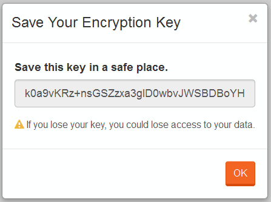

import Admonition from '@theme/Admonition';
import Tabs from '@theme/Tabs';
import TabItem from '@theme/TabItem';
import CodeBlock from '@theme/CodeBlock';
import LanguageSwitcher from "@site/src/components/LanguageSwitcher";
import LanguageContent from "@site/src/components/LanguageContent";

# Walkthroughs: Setting up encryption

To set up an [Encryption](../../server/bundles/encryption.mdx) bundle using Studio following steps need to be taken:

Step 1. Create new database (e.g. `Encrypted-Northwind`) with `Encryption` enabled.

  

Step 2. Configure encryption.

  

- `Select Key` - your encryption key. **DO NOT LOOSE IT!**
- `Encryption Algorithm` - algorithm that will be used to encrypt your data
	- `DES`
	- `RC2`
	- `Rijndael` (default)
	- `Triple DESC`
- `Encryption Key Bits`
	- `128`
	- `192`
	- `256` (default)
- `Indexes` - indicates if indexing data should be encrypted or not
	- `Encrypt` (default)
	- `Unencrypt`

Step 3. Save Your Encryption Key.

  
