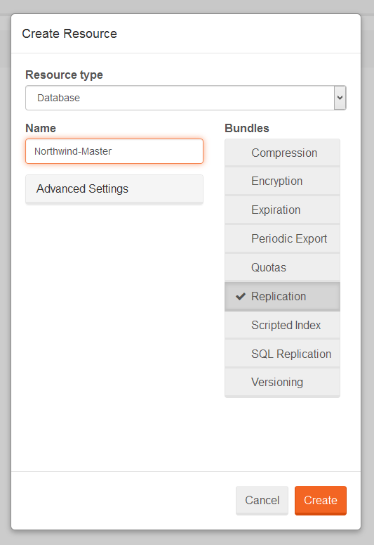
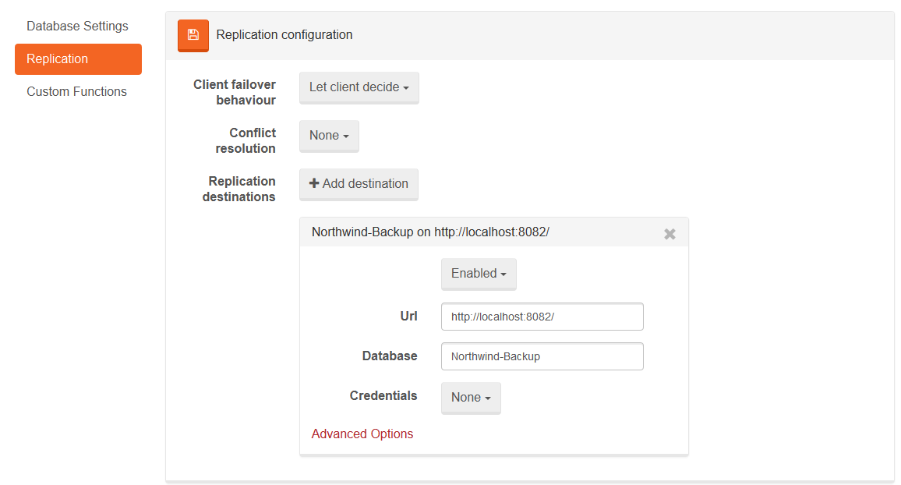
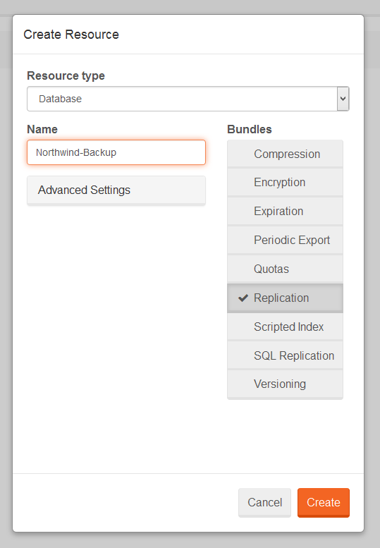
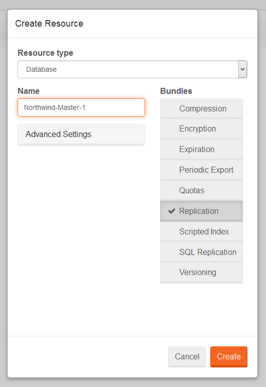
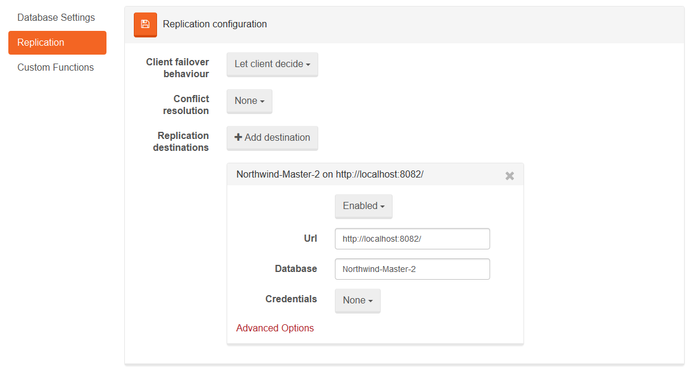

import Admonition from '@theme/Admonition';
import Tabs from '@theme/Tabs';
import TabItem from '@theme/TabItem';
import CodeBlock from '@theme/CodeBlock';
import LanguageSwitcher from "@site/src/components/LanguageSwitcher";
import LanguageContent from "@site/src/components/LanguageContent";

# Walkthroughs: Setting up replication

Below a step-by-step guide will demonstrate how to quickly setup  master-slave and master-master replication between the databases using the Studio.

## **Master-Slave replication**

To setup a master-slave replication, this is to replicate documents from one database to another, we need to have two databases (they can be on the same or different servers). For our purposes, we will create two separate servers. The first one will be our master server and will run on port 8081. The second one, the slave server, will run at 8082 port.

### Configuring a master server

- first, we need to have a database that we want to replicate to another server. This database **must** have a replication bundle enabled. Let's call it `Northwind-Master`.

  

- to setup replication, we need to go to our [Replication Settings View](../../studio/overview/settings/replication.mdx) and add new replication destination using the `Add destination` button. Here we need to provide information such as the URL of the destination server (`http://localhost:8082/`) and the name of the database there (`Northwind-Backup`).

  

- you will notice that two documents have been created. The first one is called `Raven/Replication/Destinations`, and you will find your replication configuration there. The second document is called `Raven/Replication/Destinations/localhost8082databasesNorthwind-Backup` and it has been created because RavenDB detected a problem with replicating documents to slave, which is expected because we haven't configured it yet.

  

---

### Configuring a slave server

- there is only one step here: you need to create a database with replication bundle **turned on**.

  

---

### Test

- on the slave server go to [Documents View](../../studio/overview/documents/documents-view.mdx) and, if all went well, all documents from the master server should be there. Note that replication process might take some time.

  

## **Master-Master replication**

To setup a master-master replication, this is to replicate documents from one database to another and backwards, you need to have two databases (they can be on the same or different servers). For our purposes we will create two separate servers. The first one will run on port 8081, and the second one on port 8082.

### Configuring the first master server

- first, we need to have a database that we want to replicate to another server. This database **must** have a replication bundle enabled. Let's call it `Northwind-Master-1` and fill it up with [sample data](../../studio/overview/tasks/create-sample-data.mdx).

  

- to setup a replication, we need to go to our [Replication Settings View](../../studio/overview/settings/replication.mdx) and add a new replication destination using the `Add destination` button. Here we need to provide information such as the URL of the destination server (`http://localhost:8082/`) and the name of the database there (`Northwind-Master-2`).

  

- you will notice that two documents have been created. The first one is called `Raven/Replication/Destinations` and you will find your replication configuration there. The second document is called `Raven/Replication/Destinations/localhost8082databasesNorthwind-Master-2` and it has been created because RavenDB detected a problem with replicating documents to slave, which is expected because we haven't configured it yet.

  

### Configuring the second master server

- open the Studio on the second master server and create a new database called `Northwind-Master-2`. Remember to **enable** the replication bundle.

  

- setup a replication to your first master server by going into [Replication Settings View](../../studio/overview/settings/replication.mdx) and adding new replication destination. In our example we need to use `http://localhost:8081/` as a server URL and `Northwind-Master-1`.

  

### Test

- one of the masters (let's say 8082) creates [sample data](../../studio/overview/tasks/create-sample-data.mdx),
- go to the 8081 server and wait for the documents from 8082 (it might take some time),
- change any value on 8081 and check corresponding document on the 8082 (it might take some time)

