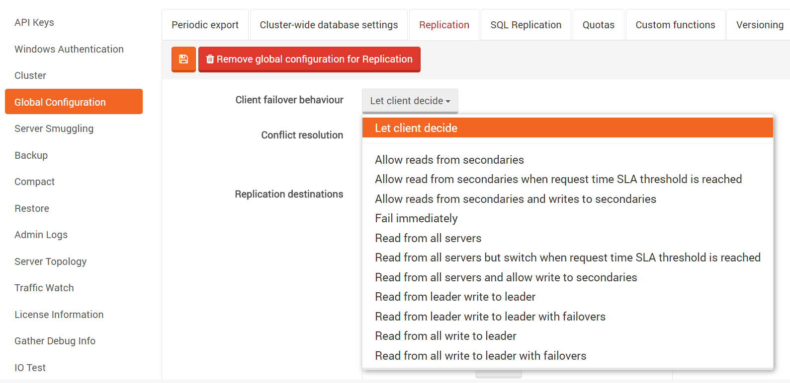

import Admonition from '@theme/Admonition';
import Tabs from '@theme/Tabs';
import TabItem from '@theme/TabItem';
import CodeBlock from '@theme/CodeBlock';

RavenDB's Client API is aware of the replication mechanism offered by the server instances and is ready to support failover scenarios.

## **Failover behavior**

 By default the client will detect and respond appropriately whenever a server has the replication bundle enabled. This includes:

* Detecting that an instance is replicating to another set of instances.
* When that instance is down, the client will be automatically shifted to other instances.

This is caused by a failover mechanism which is turned in a document stored by default. The client can load a replication document from `/replication/topology` to learn what replication instances to use if the failover occurred.

<Admonition type="note" title="">
The client by default creates requests for the replication document even if the server does not have the replication bundle enabled. In this case, the request for `/replication/topology` results in  `404` in server logs.
</Admonition>

You can turn off the failover behavior by using the document store conventions. In order to do so, use `FailImmediately` option

<TabItem value="client_integration_1" label="client_integration_1">
<CodeBlock language="csharp">
{`store.Conventions.FailoverBehavior = FailoverBehavior.FailImmediately;
`}
</CodeBlock>
</TabItem>

When `FailImmediately` option is used then client will raise exception when primary server is down.

The remaining values of `FailoverBehavior` enumeration are:

* *AllowReadsFromSecondaries* (default) - allow to read from secondary server(s), but immediately fail writes to the secondary server(s)
* *AllowReadsFromSecondariesAndWritesToSecondaries* - allow reads from and writes to secondary server(s)
* *AllowReadFromSecondariesWhenRequestTimeSlaThresholdIsReached* - Allow read from secondaries when request time [SLA](../../../server/scaling-out/sla.mdx) threshold is reached (configurable in conventions). 
* *ReadFromAllServers* - spread read requests across all servers, instead of doing all the work against master. Write requests will always go to master

They determine the strategy of the failovers if the primary server is down and the environment is configured to replicate between sibling instances.

<Admonition type="note" title="Mixing" id="mixing" href="#mixing">

FailoverBehavior enumeration values are actually flags and can be combined, e.g. to spread all reads across all servers and allow writes to secondaries one can do as follows:

<TabItem value="client_integration_4" label="client_integration_4">
<CodeBlock language="csharp">
{`store.Conventions.FailoverBehavior = FailoverBehavior.ReadFromAllServers 
	| FailoverBehavior.AllowReadsFromSecondariesAndWritesToSecondaries;
`}
</CodeBlock>
</TabItem>

</Admonition>

## **Cluster failover behavior**

Inside the cluster by default replication bundles in all the servers are enabled. This includes:

* All instances will be replicated to every server inside the cluster.
* Default failover behavior is `FailoverBehavior.ReadFromLeaderWriteToLeader`.
* Write calls are always referred to the leader (if a write request is made to a none leader server the client will be redirected)
* In the cluster there will be only one leader. In a case the leader is down, a vote will be made to choose another.  

To change a behavior from the client, one can use:
<TabItem value="client_integration_5" label="client_integration_5">
<CodeBlock language="csharp">
{`session.Store(new ReplicationDocument
\{
    ClientConfiguration = new ReplicationClientConfiguration
    \{
        FailoverBehavior = FailoverBehavior.ReadFromLeaderWriteToLeader
    \}

\}, "Raven/Replication/Destinations");
`}
</CodeBlock>
</TabItem>

The client can load the cluster toplogy from `/cluster/topology` to learn which servers are in the cluster and can be promoted to leader.

You can turn off the failover behavior by using the document store conventions. In order to do so, use `FailImmediately` option

<TabItem value="client_integration_1" label="client_integration_1">
<CodeBlock language="csharp">
{`store.Conventions.FailoverBehavior = FailoverBehavior.FailImmediately;
`}
</CodeBlock>
</TabItem>

When `FailImmediately` option is used then client will raise exception when primary server is down.

The remaining values of `FailoverBehavior` enumeration are:

* *ReadFromLeaderWriteToLeader* (default) - Allows read from leader and write only to leader
* *ReadFromAllWriteToLeader* - Allows read from any server and write only to leader
* *ReadFromAllWriteToLeaderWithFailovers* - Allows read from leader and write only to leader with failovers. 
* *ReadFromLeaderWriteToLeaderWithFailovers* - spread read requests across all servers, instead of doing all the work against master. Write requests will always go to master

<Admonition type="note" title="WithFailovers behavior" id="withfailovers-behavior" href="#withfailovers-behavior">
The behaviors `ReadFromAllWriteToLeaderWithFailovers` and `ReadFromLeaderWriteToLeaderWithFailovers` will make the client use the new leader only when trying to write
to a unreachable server. Work only if we configure the Client failover behaviour in the server side to Let client decide .

</Admonition>

## **Discovering destinations**

Once the document store is configured to support failovers, the replication configuration of the database is checked. A list of replicated nodes is then retrieved and saved in the local application storage. Even if it is impossible to reach the primary server in the future, the list will still exist locally, and the document store can try to work with secondary instances, according to the conventions.

Changes in the server's replication configuration are monitored by the Client API as well. It is done regularly, every 5 minutes, to check if the documents are directed to current instances that are slaves to the primary server, in case a failover occurs.

## **Failover servers**

If the client cannot reach the primary server and does not have a list of servers, nor is such  list available in the local cache, the client will attempt to load and use manually configured failover servers. List of those servers can be configured with `FailoverServers` property in `DocumentStore` or .NET named connection strings.

### Setup

<TabItem value="client_integration_3" label="client_integration_3">
<CodeBlock language="csharp">
{`store.FailoverServers = new FailoverServers();
store.FailoverServers.ForDefaultDatabase = new[]
\{
	new ReplicationDestination
		\{
			Url = "http://localhost:8078", 
			ApiKey = "apikey"
		\},
	new ReplicationDestination
		\{
			Url = "http://localhost:8077/",
			Database = "test",
			Username = "user",
			Password = "secret"
		\}
\};

store.FailoverServers.ForDatabases = new Dictionary<string, ReplicationDestination[]>
\{
	\{
		"Northwind",
		new[]
			\{
				new ReplicationDestination
					\{
						Url = "http://localhost:8076"
					\}
			\}
	\}
\};
`}
</CodeBlock>
</TabItem>

### Setup using connection string

To setup a failover using a [connection string](../../../client-api/setting-up-connection-string.mdx) use the `Failover` option. Multiple failovers can be setup using multiple `Failover` options.

Failover
:   Type: string in predefined format   
:   Format: JSON that can be deserialized to [ReplicationDestination](../../../glossary/replication-destination.mdx) with optional database name separated with JSON using pipe ('|') e.g. `Northwind|{ ... }`      
Failover server definition.

Example:

<TabItem value="client_integration_5" label="client_integration_5">
<CodeBlock language="csharp">
{`session.Store(new ReplicationDocument
\{
    ClientConfiguration = new ReplicationClientConfiguration
    \{
        FailoverBehavior = FailoverBehavior.ReadFromLeaderWriteToLeader
    \}

\}, "Raven/Replication/Destinations");
`}
</CodeBlock>
</TabItem>

Full example:

<TabItem value="plain" label="plain">
<CodeBlock language="plain">
{`<connectionStrings>
    <add name="MyRavenConnectionStringName" connectionString="Url = http://localhost:59233;Failover = \{Url:'http://localhost:8078'\};Failover = \{Url:'http://localhost:8077/', Database:'test'\}; Failover = Northwind|\{Url:'http://localhost:8076/'\};Failover=\{Url:'http://localhost:8075', Username:'user', Password:'secret'\};Failover=\{Url:'http://localhost:8074', ApiKey:'d5723e19-92ad-4531-adad-8611e6e05c8a'\}" />
</connectionStrings>
`}
</CodeBlock>
</TabItem>

## **Setting up default client configuration on server**

Default client configuration can be 'injected' into a client, by filling out the `ClientConfiguration` property in `Raven/Replication/Destinations`.

The available options are:

- `FailoverBehavior` - default failover behavior for all clients that are connecting to a database.

Default configuration can be altered by The Studio as well. Appropriate settings are available in `Settings -> Replication`.

  

## **Request redirection**

The Raven Client API is quite intelligent in this regard, as upon failure it will:

* Assume that the failure is transient, and retry the request,
* If the second attempt fails as well, will record the failure and shift to a replicated node, if available,
* After ten consecutive failures, Raven will start replicating to this node less often
	* Once every 10 requests, until failure count reaches 100
	* Once every 100 requests, until failure count reaches 1,000
	* Once every 1,000 requests, when failure count is above 1,000
* On the first successful request, the failure count is reset.

If the second replicated node fails, the same logic applies to it as well, and we move to the third replicated node, and so on. If all nodes fail, an appropriate exception is thrown.

## **Back to primary**

The client shifted to a replicated node will go back to its primary server 
as soon as it becomes reachable (irrespective of the failure count). In replication environment the nodes send heartbeat messages in order to notify destination instances that they are up again. Then the destination (which is the secondary server for our shifted client) will send a feedback message to the client and then try sending a request to the primary server again. If the operation is successful, the failure count will be reset and the communication will work normally.

## **Replicated operations**

At a lower level, the following operations support replication:

* Get - single document and multi documents
* Put
* Delete
* Query
* Rollback
* Commit

The following operations do not support replication in the Client API:

* PutIndex
* DeleteIndex

## **Custom document ID generation**

The usage of replication doesn't influence the algorithm of [a document ID generation](../../../client-api/document-identifiers/working-with-document-ids.mdx#autogenerated-ids).
However in a Master/Master replication scenario it might be useful to add a server specific prefix to generated document identifiers. This would help to protect
against conflicts of document IDs between the replicating servers. In order to set up the server's prefix you have to put `Raven/ServerPrefixForHilo`:

<TabItem value="client_integration_2" label="client_integration_2">
<CodeBlock language="csharp">
{`store
    .DatabaseCommands
					.Put(
verPrefixForHilo",
						null,
Object
						\{
rPrefix", "NorthServer/" \}
						\},
Object());
`}
</CodeBlock>
</TabItem>

The *ServerPrefix* value will be fetch in the same request as the current *HiLo* and will also become of a part of generated document IDs. 
For example storing a first `User` object will cause that its ID will be `Users/NorthServer/1`.

