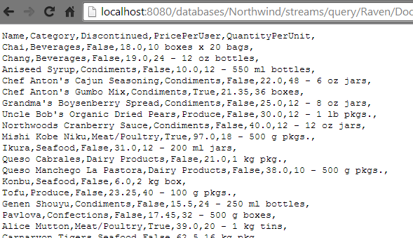
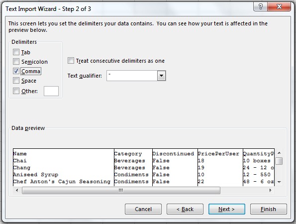

import Admonition from '@theme/Admonition';
import Tabs from '@theme/Tabs';
import TabItem from '@theme/TabItem';
import CodeBlock from '@theme/CodeBlock';
import LanguageSwitcher from "@site/src/components/LanguageSwitcher";
import LanguageContent from "@site/src/components/LanguageContent";

# How to integrate with Excel?

A very common use case for many application is to expose data to users as an Excel file. RavenDB has a dedicated support that allows to directly consume data stored in a database by Excel application. 
The integration of Excel with the data store is achieved by [query streaming](../session/querying/how-to-stream-query-results.mdx) and an appropriate output formatting understandable by Excel (Comma Separated Values).

In order to take advantage of this feature you need to specify [an index](../../indexes/what-are-indexes.mdx) that you want to query, a query itself and optionally [a result transformer](../../transformers/what-are-transformers.mdx) if you need to change the shape of results.
You have you also explicitly tell RavenDB to format results in Excel format.

The generic HTTP request will have the following address:

<TabItem value="plain" label="plain">
<CodeBlock language="plain">
{`http://localhost:8080/databases/[db_name]streams/query/[index_name]?query=[query]&resultsTransformer=[transformer_name]&format=excel
`}
</CodeBlock>
</TabItem>

## Example
 
Let's use the built-in Northwind sample data and default `Raven/DocumentsByEntityName` index. Let's also create a new transformer with the definition:

In order to load into Excel all `Products` and transforming them according to `Products/ForExcel` transformer and we need to create following url:   

<TabItem value="plain" label="plain">
<CodeBlock language="plain">
{`http://localhost:8080/databases/Northwind/streams/query/Raven/DocumentsByEntityName?query=Tag:Products&resultsTransformer=Products/ForExcel&format=excel
`}
</CodeBlock>
</TabItem>

Going to the above address in a web browser will give you the following results:

Now to push them to Excel we need to create new spreadsheet and import data `From Text`:

Then in a Open File Dialog we paste our querying url:

Next, the Import Wizard will show up where we can adjust our import settings (don't forget to check `Comma` as a desired delimiter):

Finally we need to select where we would like to place the imported data:

As a result of previous actions, the spreadsheet data should look like:

Now we must tell Excel to to refresh data. Click on `Connections` in `Data` panel:

You will see something like that:

Go to Properties and:   
1. **uncheck** `Prompt for file name on refresh`.   
2. **check** `Refresh data when opening the file`.   

Finally you can close the file, change something in the database and reopen it. You will see new values.