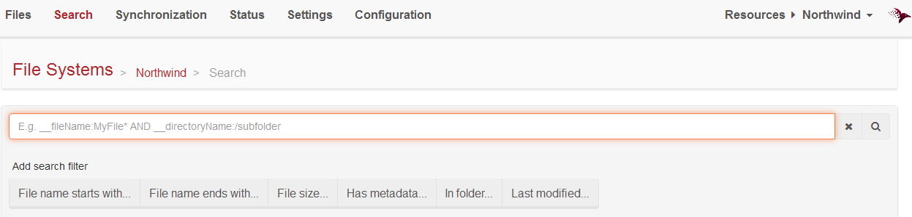

import Admonition from '@theme/Admonition';
import Tabs from '@theme/Tabs';
import TabItem from '@theme/TabItem';
import CodeBlock from '@theme/CodeBlock';
import LanguageSwitcher from "@site/src/components/LanguageSwitcher";
import LanguageContent from "@site/src/components/LanguageContent";

#Indexing

The file system allows you to search files using [Lucene query syntax](http://lucene.apache.org/core/3_0_3/queryparsersyntax.html). You can look for a file by using:

* name,
* size,
* directory,
* date of modification,
* any user defined metadata.

The more files and corresponded metadata you add, the more search terms you can use to build your search query. You can find all the available search fields using [`GetSearchFieldsAsync` method](./client-api/commands/files/search/get-search-fields). Below there is an explanation of the built-in search fields: 

Let's assume that we have a file `documents/pictures/wallpaper.jpg`, then default search terms would have the values:

* `__key` - the full name of the file: `documents/pictures/wallpaper.jpg`,
* `__fileName` - the last part of the file path `wallpaper.jpg`,
* `__rfileName` - the *reversed* version of `__fileName` (to support queries that end with the wildcard): `gpj.repapllaw`,
* `__directory` - the full directory path: `/documents/pictures`,
* `__rdirectory` - the *reversed* directory path (to support queries that ends with the wildcard): `serutcip/stnemucod/`
* `__directoryName` - the list of directories associated with the file: `/documents/pictures`, `/documents`, `/`,
* `__rdirectoryName` - the list of *reversed* paths of directories associated with the file (to support queries that ends with the wildcard): `serutcip/stnemucod/`, `stnemucod/`, `/`,
* `__level` - the nesting level: `3` (starts from `1`, which means root `/` directory),
* `__modified` - the date of the file indexing (the date index format is *yyyy-MM-dd_HH-mm-ss*),
* `__size` - the file length (in bytes) stored as string (format D20 used),
* `__size_numeric` - the file length (in bytes) stored as numeric fields, which allows to search by range.

A sample query to find all files under the `/documents` directory (or nested) that name ends with `.jpg` and size is greater than or equal to 1MB:

`__directoryName:/documents AND __rfileName:gpj.*  AND __size_numeric:[Lx1048576 TO *]`

The easiest way to search for files from the code is to use Client API methods provided by [commands](client-api/commands/files/search/search) or [a session](client-api/session/querying/basics).

Searching is also supported by studio, where you will find useful predefined search filters:

<Admonition type="note" title="Searching by user defined metadata" id="searching-by-user-defined-metadata" href="#searching-by-user-defined-metadata">

Metadata specified during [a file upload](./client-api/commands/files/upload) or changed by [a metadata update](./client-api/commands/files/metadata/update-metadata) action are sent in headers of a HTTP request. 
In order to keep names of headers consistently cased we transform received keys on the server side. They are modified by upper casing a first letter of dash separated parts of a header name, e.g. 'file-created-at' key becomes 'File-Created-At' and 'owner' becomes 'Owner'.

Also the metadata keys are sensitive during the search (in contrast to the metadata values, which are case insensitive). 

You will need to remember about that if you want to search files by your own metadata.
</Admonition>