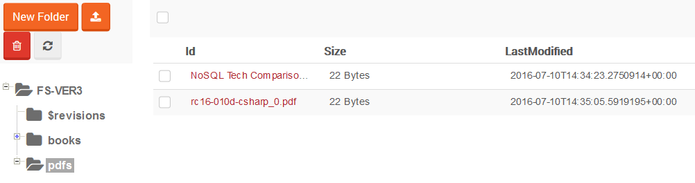
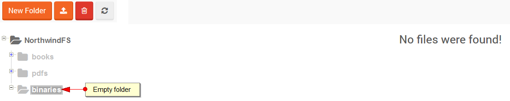
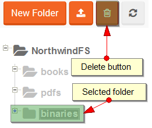
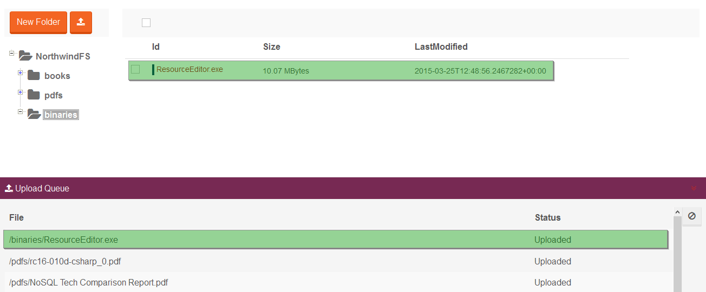
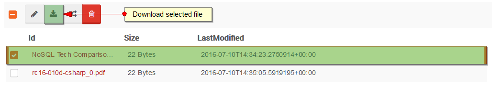
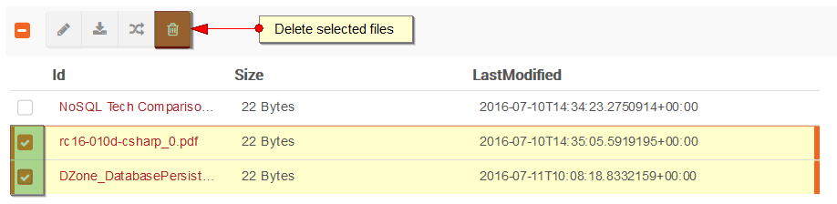
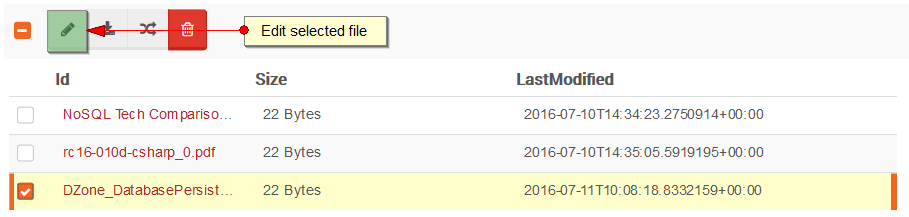

import Admonition from '@theme/Admonition';
import Tabs from '@theme/Tabs';
import TabItem from '@theme/TabItem';
import CodeBlock from '@theme/CodeBlock';
import LanguageSwitcher from "@site/src/components/LanguageSwitcher";
import LanguageContent from "@site/src/components/LanguageContent";

#Files view

The main view in the file system studio is a file explorer that allows you to browse and modify your files. It has the standard layout where
the directory structure is visible on the left side while a list files of the selected directory occupies right side of the view. The name of the file system
in the directory structure means the root directory.

  

<Admonition type="note" title="Note" id="note" href="#note">

$revisions folder is only visible when versioning bundle is enabled and it contain all revisions files.

</Admonition>

## Creating a folder

Directories in RavenFS are created automatically based on file names which are always full paths. The studio provides a feature to create
folders virtually in order to build the appropriate structure before a file upload. Use `New Folder` button located above the directory 
structure to create a new folder (it will become a subfolder of the currently selected one):

  

The folder remains virtual as long as it is empty. If you switch between studio pages without uploading any file there then it will disappear.

  

To *persist* this folder you need to add a file there.

## Deleting a folder

Choose which folder you want to delete and click the delete button

## Uploading a file

To upload a file you have to select the folder where it should to be placed and click the upload button:

A status of the upload operation is tracked by `Upload Queue` panel. If it finishes successfully it will be visible on the file list.

Upload queue status colors:

| Color | Description|
| ------------- | ----- |
| #772953 | No operation was made |
| &lt;div class="rect_legend" style="background-color:#28b62c" /&gt; | Upload was successful |
| #DF382C | Upload failed |

## Downloading a file

Choose which file you want to get and click the download button:

## Deleting files

You can select multiple files and delete them at once:

## Editing a file

Select a single document and click the edit button or click on its name to navigate you to [File Edit View](./file-edit-view).

## Renaming a file

Select a single document and click the rename button.

<Admonition type="note" title="Note" id="note" href="#note">

Multiple files can be selected using shift

</Admonition>
