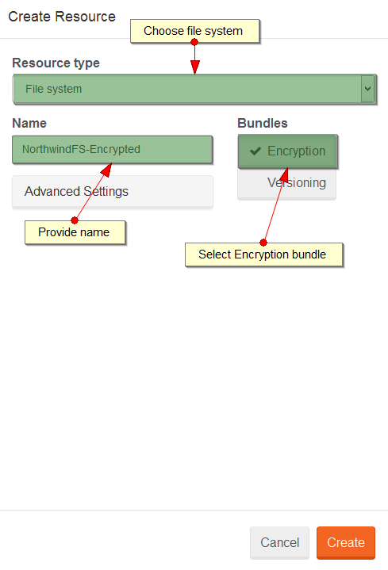

import Admonition from '@theme/Admonition';
import Tabs from '@theme/Tabs';
import TabItem from '@theme/TabItem';
import CodeBlock from '@theme/CodeBlock';
import LanguageSwitcher from "@site/src/components/LanguageSwitcher";
import LanguageContent from "@site/src/components/LanguageContent";

#How to setup file encryption?

To set up [Encryption](../../server/bundles/encryption.mdx) in RavenFS by using Studio, you need to first create a file system with 
`Encryption` bundle enabled:

  

Next you will see encryption configuration dialog:

  

Remember to copy the encryption key:

 