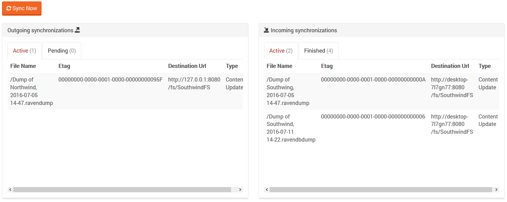
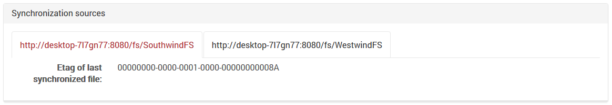

import Admonition from '@theme/Admonition';
import Tabs from '@theme/Tabs';
import TabItem from '@theme/TabItem';
import CodeBlock from '@theme/CodeBlock';
import LanguageSwitcher from "@site/src/components/LanguageSwitcher";
import LanguageContent from "@site/src/components/LanguageContent";

#Status View

This view presents synchronization information.

At the top of the view you can see incoming synchronizations (active and finished)  and outgoing  synchronizations (active and pending) .

At the bottom of the view you can see the Etag of the last synchronized file (from all sources).

<Admonition type="note" title="Note" id="note" href="#note">

Sync Now button forces all destinations to be synchronized

</Admonition>