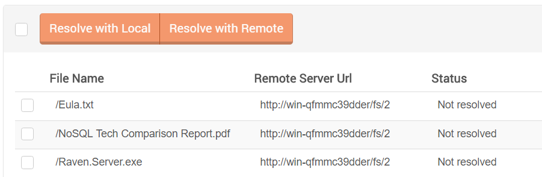
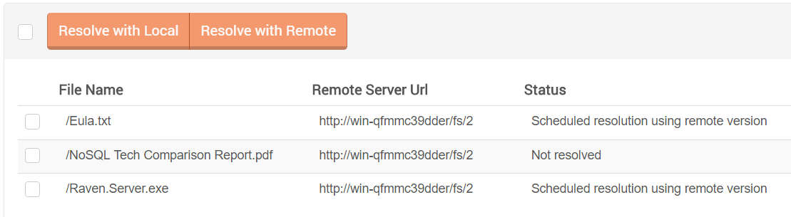
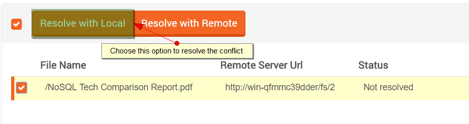
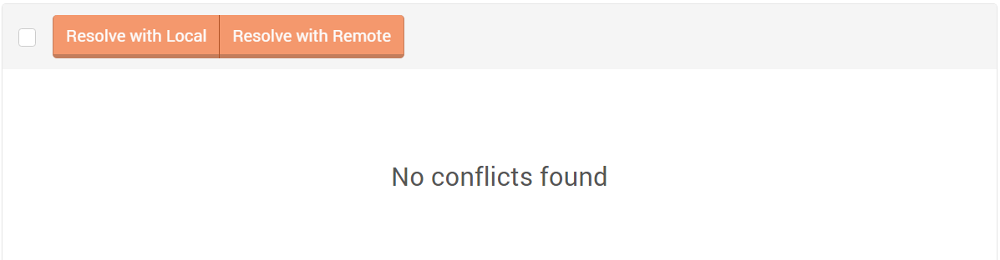

import Admonition from '@theme/Admonition';
import Tabs from '@theme/Tabs';
import TabItem from '@theme/TabItem';
import CodeBlock from '@theme/CodeBlock';
import LanguageSwitcher from "@site/src/components/LanguageSwitcher";
import LanguageContent from "@site/src/components/LanguageContent";

#Conflicts view

If two file system are configured to synchronize files to each other (*master/master*) then [conflicts](../../synchronization/conflicts.mdx) may occur.
The conflicts view presents the list of conflicted files and allows to resolve them.

  

If there is a conflict you need to choose which version of a file you want to take and resolve the conflict by using one of the 
two possible strategies:

* `Resolve with Local` if you want to resolve the conflict in favor of local version,
* `Resolve with Remote` to allow the synchronization source file system to synchronize its version.

<Admonition type="info" title="Remote strategy" id="remote-strategy" href="#remote-strategy">
      

After marking all the conflicts files we want to resolve. we can choose the option to resolve those conflicts.  
 
   

With Resolve with Remote we can see the status of those conflicts files changed from `Not resolve` to `Scheduled resolution using remote version`.
Using Resolve with Remote strategy will not cause the conflict to disappear. The conflict will exist until the source server retries the synchronization 
of the conflicted file and notices that the applied strategy lets him to push its version.
</Admonition>

<Admonition type="note" title="Note" id="note" href="#note">
With Resolve with Local the file will disappear immediately from the conflicts page.
   
 
</Admonition>