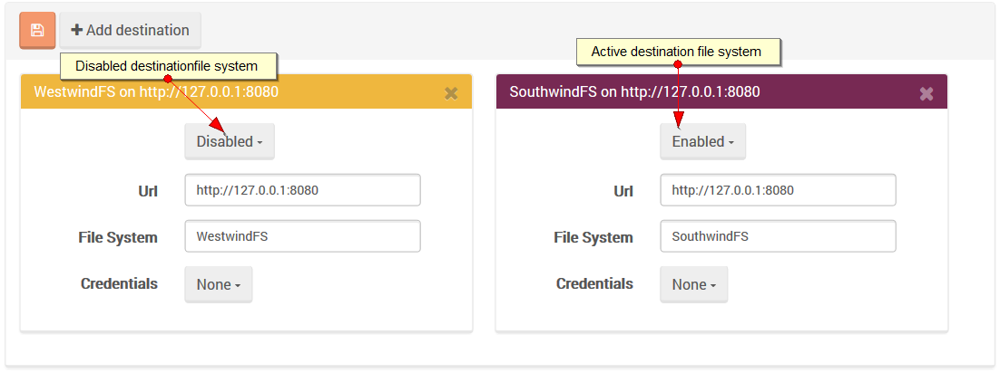
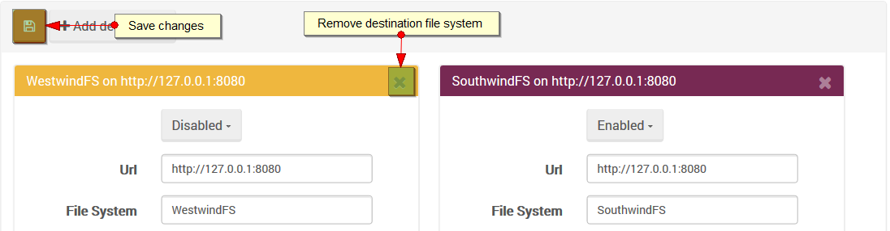

import Admonition from '@theme/Admonition';
import Tabs from '@theme/Tabs';
import TabItem from '@theme/TabItem';
import CodeBlock from '@theme/CodeBlock';
import LanguageSwitcher from "@site/src/components/LanguageSwitcher";
import LanguageContent from "@site/src/components/LanguageContent";

#Synchronization destinations view

This page is used to browse and modify synchronization destinations. This page basically presents and allow to edit [Raven/Synchronization/Destinations config](../../synchronization/configurations.mdx#ravensynchronizationdestinations).

When you enter the page you will see all configured destination file systems (both enabled and disabled).

  

## Adding new destination fs

In order to setup the new synchronization destination click `Add destination` button, provide such information as URL, the name of the destination file
system, credentials if needed and `Save changes`.

  

## Delete destination fs

If you want to drop destination server completely (you can also disable it temporary) just close the visible dialog and `Save changes`.

  
