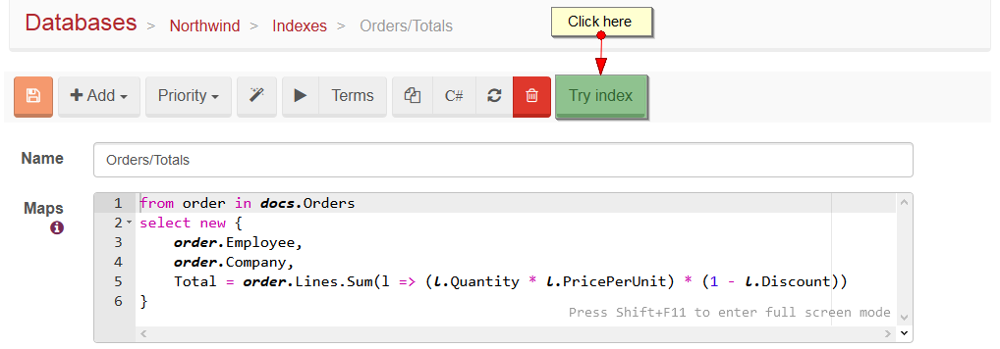

import Admonition from '@theme/Admonition';
import Tabs from '@theme/Tabs';
import TabItem from '@theme/TabItem';
import CodeBlock from '@theme/CodeBlock';
import LanguageSwitcher from "@site/src/components/LanguageSwitcher";
import LanguageContent from "@site/src/components/LanguageContent";

# Testing indexes

The common problem, especially when data set is too big and indexation takes very long time, is the need of changing the index definition. As you know, each change of the definition will reset index and start indexation process (for this index) from scratch which in many cases in fine, but not during the development, when you are shaping the index and demanding immediate feedback from server with the results (or at least partial results).

To resolve this issue, we have introduced the ability to test indexes on a limited data set. This way developers will get index results immediately from a limited data set so the can proceed with the index creation process, without resetting the main index till the new definition is ready.

## Limited data set

Data set for index testing is limited to first 512 matching records that are returned from built-in index [Raven/DocumentsByEntityName](../indexes/indexing-basics.mdx#default-index), so if this index is [stale](../indexes/stale-indexes.mdx) then the results might differ from your expectations.

<Admonition type="info" title="Info">
To change the default 512 matching records limit, you can change the `Raven/Indexing/MaxNumberOfItemsToProcessInTestIndexes` setting to appropriate value.
</Admonition>

## Example

Let's say that we want to change the `Orders/Totals` index in our [Northwind](../studio/overview/tasks/create-sample-data.mdx) database. To do this, we need edit our index using Studio in [Index Edit View](../studio/overview/indexes/index-edit-view.mdx), where we will see `Try Index` button. By pressing it, new index will be created with `Test/` prefix, any changes to this index will not affect the main index, but all tooling (e.g. ability to check indexing errors) is still available.

To overwrite the main index press the `Make permanent` button.

Tests indexes are visible on [Indexes View](../studio/overview/indexes/indexes-view.mdx) and are marked with `Test index` badge. Notice that there are only 512 entries, although the main index have 830, this happened because data set is limited.

## Remarks

<Admonition type="warning" title="Warning" id="warning" href="#warning">

Test indexes will be removed when:

- `Make permanent` is clicked,
- after 15 minutes of inactivity,
- after database restart

</Admonition>

