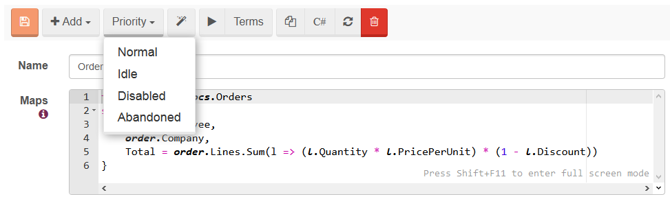

import Admonition from '@theme/Admonition';
import Tabs from '@theme/Tabs';
import TabItem from '@theme/TabItem';
import CodeBlock from '@theme/CodeBlock';
import LanguageSwitcher from "@site/src/components/LanguageSwitcher";
import LanguageContent from "@site/src/components/LanguageContent";

# Administration: Index administration

RavenDB indexes can be administrated easily by the user with a code or the Studio.

## Resetting an index

An index usually needs to be reset as it reached its error quota and was disabled. Resetting an index means forcing RavenDB to re-index all documents matched by the index definition, which can be a very lengthy process.

You can reset an index using either [Client API](../../client-api/commands/indexes/how-to/reset-index.mdx) or  the **Studio**.

## Deleting an index

You can delete an index by using either [Client API](../../client-api/commands/indexes/delete.mdx) or the **Studio** (please refer to the image above).

## Index locking

This feature allows you to change an index definition on the production server. Index locking hes two possible results: either any changes introduced to the locked index will be ignored, or  an error will be raised when someone tries to modify the index. You can update the index definition on the server, next update it on the codebase, and finally deploy the application to match them. While the index is locked, at any time when `IndexCreation.CreateIndexes()` on start up is called, the changes you've introduces will not be reverted.

It is important to note that this is not a security feature, and you can unlock an index at any time.

To lock the index you need to create a HTTP call:
<TabItem value="plain" label="plain">
<CodeBlock language="plain">
{`curl -X POST http://localhost:8080/databases/Northwind/indexes/Orders/ByCompany?op=lockModeChange&mode=LockedIgnore -d ''
`}
</CodeBlock>
</TabItem>

The available modes are:

* Unlock
* LockedIgnore
* LockedError

In the Studio this options are available on the Indexes page:

## Index Prioritization

RavenDB's index can have a priority that controls how much power of the indexing process it is allowed to consume. The database automatically manages indexes and the default logic 
is as follows:

* An auto index can be set to idle if it has not been queried for some time
* An index that was automatically set to idle will be set to normal on its first query

However, an index priority can be forced by the user. There are four available values that you can set:

* Normal
* Idle
* Disabled
* Abandoned

What do these priorities actually mean? The idle index will not be indexed by RavenDB during the normal course of action. Only when the database is idle for a given period of time (by default, about 10 minutes with no writes) will we actually get it indexing. In this case indexing will continue as long as there are no other activities that require resources. If such activities appear, indexing will complete its current run and continue waiting for the database to become idle again.

The disabled index will use no system resources and will never take part in the indexing. This option is available so you can manually shut down a single index, for example when the index very expensive, and the system would be more effective if you shut it down while doing an import.

Even idle indexes can take some of the system's resources, so there is yet another option available, namely the abandoned index. An index is abandoned if it has not been queried in the last 72 hours. Currently, RavenDB avoids indexing it even during the idle periods, yet it will get indexed eventually, if enough time has passed since the last indexation.

For example, in order to set an index priority to idle, you can either create a HTTP request like the following

<TabItem value="plain" label="plain">
<CodeBlock language="plain">
{`curl -X POST http://localhost:8080/databases/Northwind/indexes/set-priority/Orders/ByCompany?priority=Idle -d ''
`}
</CodeBlock>
</TabItem>

or change the `Priority` property in `AbstractIndexCreationTask` and [deploy it](../../indexes/creating-and-deploying.mdx#using-abstractindexcreationtask). Studio can also be used to and if you choose to use it, go to _Indexes_, _Edit_ selected index, and set up the priority there:

You can find all of the time settings used by RavenDB to automatically manage the priorities of indexes in the [configuration options page](../../server/configuration/configuration-options.mdx) (look for options that starts with &lt;em&gt;TimeToWaitBefore&lt;/em&gt;). 

## Persistence of an auto index

When auto indexes are created, they are kept in a memory until they reach a given size, specified in the configuration. You can force writing indexed data on a disk by executing:

<TabItem value="plain" label="plain">
<CodeBlock language="plain">
{`curl -X POST http://localhost:8080/databases/Northwind/indexes/Orders/ByCompany?op=forceWriteToDisk -d ''
`}
</CodeBlock>
</TabItem>
