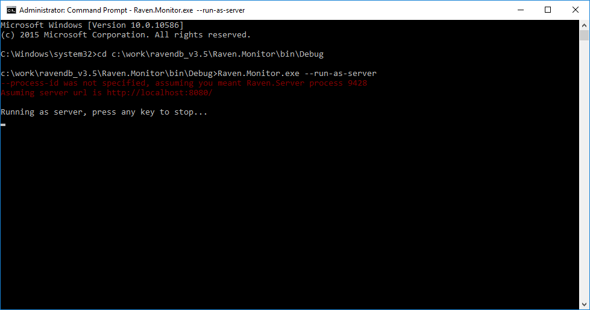

import Admonition from '@theme/Admonition';
import Tabs from '@theme/Tabs';
import TabItem from '@theme/TabItem';
import CodeBlock from '@theme/CodeBlock';
import LanguageSwitcher from "@site/src/components/LanguageSwitcher";
import LanguageContent from "@site/src/components/LanguageContent";

# Monitoring: Disk I/O Performance Monitor

It is possible to track I/O rates in RavenDB using the Monitor tool.

To get the Monitor tool you need to download RavenDB's ZIP package from the [download page](https://ravendb.net/downloads/builds)
The tool is located in the extracted ZIP package in the folder: \Raven.Monitor\bin\Debug\Raven.Monitor.exe

First, make sure there is a server instance running locally.   
Then open cmd as administrator and run Raven.Monitor.exe without specifying options to see the help menu.   

   

To start monitoring run: 
<TabItem value="plain" label="plain">
<CodeBlock language="plain">
{`Raven.Monitor.exe --disk-io
`}
</CodeBlock>
</TabItem>

You can also specify a different process or server URL.   
The default monitoring time is 60 seconds.   

If you'd like to control the duration or do it remotely you can run the monitor as a server:
<TabItem value="plain" label="plain">
<CodeBlock language="plain">
{`Raven.Monitor.exe --run-as-server
`}
</CodeBlock>
</TabItem>
   
Now the monitor is listening to port 9091 and can accept the following REST calls:
<TabItem value="plain" label="plain">
<CodeBlock language="plain">
{`http://localhost:9091/monitor/start-monitoring
http://localhost:9091/monitor/stop-monitoring
`}
</CodeBlock>
</TabItem>

While the monitor is running you can run your database scenario. 
When you're done recording, you can [view the report](../../../studio/management/disk-io-viewer.mdx) in the studio.

