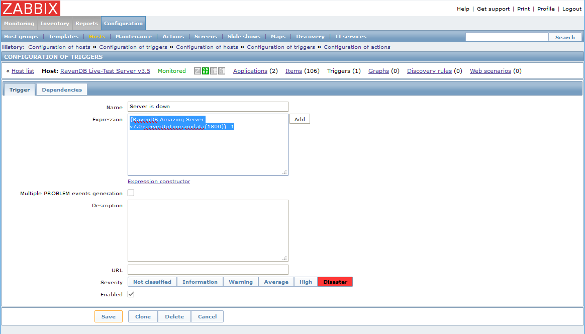

import Admonition from '@theme/Admonition';
import Tabs from '@theme/Tabs';
import TabItem from '@theme/TabItem';
import CodeBlock from '@theme/CodeBlock';
import LanguageSwitcher from "@site/src/components/LanguageSwitcher";
import LanguageContent from "@site/src/components/LanguageContent";

# Monitoring: How to Setup Zabbix Monitoring

RavenDB 3.5 supports [SNNP](./snmp), which means that with a few quick steps you can monitor your server using Zabbix.

### Installation

Before you setup Zabbix to monitor RavenDb make sure you have it up and running. If you haven't done so already, 
you should [read about Zabbix](https://www.zabbix.com/documentation/3.0/start), 
[install it](https://www.zabbix.com/documentation/3.0/manual/installation/getting_zabbix) 
and [create your own user](https://www.zabbix.com/documentation/3.0/manual/quickstart/login). 

Once installed, login to the frontend (the web interface provided with Zabbix). You should see the Zabbix dashboard.

 

### Importing the RavenDB Template

Navigate to `Configuration`-&gt;`Templates` and click the `Import` button on the top right corner.   
Import the RavenDB template which can be downloaded from:   
[https://github.com/ravendb/ravendb/blob/v3.5/Raven.Database/Plugins/Builtins/Monitoring/Snmp/Templates/zabbix_ravendb_template.xml](https://github.com/ravendb/ravendb/blob/v3.5/Raven.Database/Plugins/Builtins/Monitoring/Snmp/Templates/zabbix_ravendb_template.xml)

### Adding a Host

Navigate to `Configuration`-&gt;`Hosts` and click the `Create Host` button on the top right corner.
This is where we define what host we will monitor, in our case it's the server which runs the RavenDB instance.   
Name your host and choose the `Database servers` group.
Remove the default `Agent interface` and instead add an `SNMP interface`, using either an IP address or a DNS name and a port. 
Also, make sure you click the appropriate IP/DNS button.    

 

Still under `Configuration`-&gt;`Hosts`, go to the next tab: `Templates` and add a link to the template we imported earlier.
 
 

Still under `Configuration`-&gt;`Hosts`, go to the tab: `Macros` and add the `{$SNMP_COMMUNITY}` macro. Click `Save` when you're done.

 

That's it! We've added our host and can start exploring.    
Navigate to `Monitoring`-&gt;`Overview` and you should now see the different metrics RavenDB exposes.   

### Configuring a Trigger

Let's see an example of what you can do with all these metrics.   
We will create a trigger and action that will notify us when the server is up/down.   
Navigate to `Configuration`-&gt;`Hosts` and click the host name. Then, in the top navigation bar click on `Triggers`.
Click on `Create trigger` on the top right corner.

Now let's assume you have imported the template earlier and that you named your host "RavenDB Amazing Server v7.0". 
Name the trigger "Server is down" and enter the following expression into the text box:   
<TabItem value="plain" label="plain">
<CodeBlock language="plain">
{`\{RavenDB Amazing Server v7.0:serverUpTime.nodata(1800)\}=1
`}
</CodeBlock>
</TabItem>
Alternatively, you could click on `Add` button on the right and use the expression constructor to set your own conditions.   
You will need to choose an item (one of the metrics we imported using the template), choose conditions and set the parameters.  

<Admonition type="note" title="Note" id="note" href="#note">
This stage must be done after importing the template into Zabbix (described earlier). If you didn't import the template,
you would have to manually add items in order to configure a trigger. [Read more about items](https://www.zabbix.com/documentation/3.2/manual/config/items).
</Admonition>

You may add a description and severity level and make sure to check the `Enabled` check-box. Click `Save`.
We have created a trigger that will fire when the serverUpTime metric has no data for 1800 seconds.
Learn more about trigger expressions [here](https://www.zabbix.com/documentation/3.0/manual/config/triggers/expression).

 

Now we will define an action that will be executed whenever the trigger is fired.
Navigate to `Configuration`-&gt;`Actions` and click on the `Create action` button in the top right corner.   
Name your action and enter the default subject and/or message, you can also define a Recovery message for when the trigger condition is no longer true.

If you [configure e-mail as the delivery channel for messages](https://www.zabbix.com/documentation/3.0/manual/config/notifications/media/email), 
the message you define in an action will be sent to your e-mail address every time the trigger is fired. 

 

