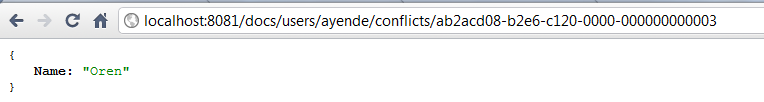

import Admonition from '@theme/Admonition';
import Tabs from '@theme/Tabs';
import TabItem from '@theme/TabItem';
import CodeBlock from '@theme/CodeBlock';
import LanguageSwitcher from "@site/src/components/LanguageSwitcher";
import LanguageContent from "@site/src/components/LanguageContent";

# Replication: Conflicts

In a replicating system, it is possible that two writes to the same document will occur on two different servers, resulting in two independent versions of the same document. Usually this scenario shows up only when there was a network or node failure that resulted in the failover node taking over the duties of the failed / unreachable node. Another scenario where this may happen is if you have setup replication in a master/master format, where a user may write any document to any node.

When replication occurs between these two versions, the Replication Bundle is faced with a problem. It has two authentic versions of the same entity, saying different things. At this point, the Replication Bundle will mark such document as conflicting, store all the conflicting documents in a safe place, and set the document content to point to the conflicting documents.

Let's see what we mean by that. Let's assume that we write the following document to one node:

And then write this document to a second node:

Now, let us setup replication between the first server (8080) and the second server (8081), and then try to access the document again on 8081:

Several things happened here:

* The server replied with 409 Conflict to the request.
* The document that we get back is a Conflict Document, which lists all the ids conflicting documents.

We can access each of the conflicting documents by their ids:

We can resolve the conflict by writing a new document, which the Replication Bundle will consider as the result of user defined merge operation between the conflicts.

The Client API fully supports working with such scenarios, as the following code sample demonstrates:

<TabItem value="replicationconflicts1" label="replicationconflicts1">
<CodeBlock language="csharp">
{`using (IDocumentSession session = store.OpenSession())
\{
	try
	\{
		User user = session.Load<User>("users/ayende");
		Console.WriteLine(user.Name);
	\}
	catch (ConflictException e)
	\{
		Console.WriteLine("Choose which document you want to preserve:");
		List<JsonDocument> list = new List<JsonDocument>();
		for (int i = 0; i < e.ConflictedVersionIds.Length; i++)
		\{
			var doc = store.DatabaseCommands.Get(e.ConflictedVersionIds[i]);
			list.Add(doc);
			Console.WriteLine("\{0\}. \{1\}", i, doc.DataAsJson.ToString(Formatting.None));
		\}

		int select = int.Parse(Console.ReadLine());

		JsonDocument resolved = list[select];
		resolved.Metadata.Remove("Raven-Replication-Conflict-Document");
		resolved.Metadata.Remove("Raven-Replication-Conflict");
		resolved.Metadata.Remove("@id");
		resolved.Metadata.Remove("@etag");

		store.DatabaseCommands.Put("users/ayende", null, resolved.DataAsJson, resolved.Metadata);
	\}
\}
`}
</CodeBlock>
</TabItem>

If this code detects a conflict, it will let the user choose which of the conflicting versions to keep. A more sophisticated approach would be to attempt going through an actual merge based on the business meaning of the document.

<Admonition type="note" title="">
Document Conflict listeners can be used to perform an automatic conflict resolution. More about it can be found [here](../../../client-api/listeners/what-are-conflict-listeners-and-how-to-work-with-them.mdx).
</Admonition>

