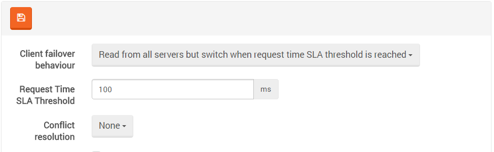

import Admonition from '@theme/Admonition';
import Tabs from '@theme/Tabs';
import TabItem from '@theme/TabItem';
import CodeBlock from '@theme/CodeBlock';
import LanguageSwitcher from "@site/src/components/LanguageSwitcher";
import LanguageContent from "@site/src/components/LanguageContent";

# SLA (Service Level Agreement)

In previous versions of RavenDB, the load balancing policy was using round robin between all nodes.
In RavenDB 3.5 we added support for Service Level Agreements which lets you define a policy.

It means that if a server starts responding too slowly for a provided policy, we are going to reduce 
the number of requests that we send its way. 

For example, let us say that we use the default threshold of 100ms per request, with three nodes.
In the normal scenario, all read requests are spread across all three servers. All of them respond pretty much 
the same, so we have no reason to change the load allocation. 

Now, let's assume an administrator is running a full backup on one of the nodes, which can consume 
quite a lot of I/O, so requests from this node become slower. If request processing times pass 
the defined threshold, RavenDB will start to balance the load away from the problematic node.

Note that we are not going to stop talking to it directly, the RavenDB client will just send fewer 
requests its way, until the server is able to keep up with the load in the given SLA. As long as it 
can't keep up with the SLA, we will further reduce the number of requests. This whole approach uses 
decaying semantics, so new responses are more important than old responses. It means that as soon 
as the backup operation completes and we have free I/O, RavenDB will detect that and ramp up the 
number of requests until we are balanced again.

We have two client modes:   
`Allow reads from secondaries when request time SLA threshold is reached` - In this mode the 
client talks only with the primary, and if the SLA is violated, it will then start directing queries 
to other servers.   
`Read from all servers but switch when request time SLA threshold is reached` - In this mode 
the load is spread along all servers, and only the servers that are under the provided SLA are used.

