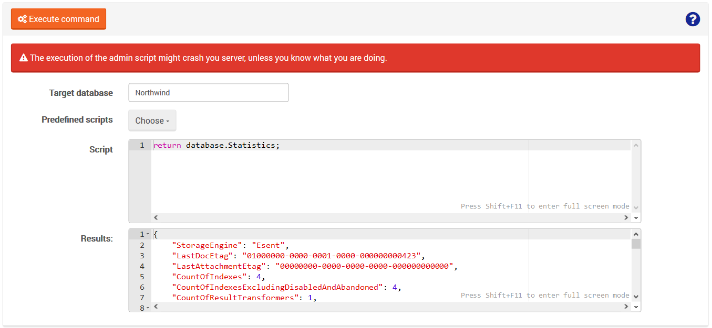

import Admonition from '@theme/Admonition';
import Tabs from '@theme/Tabs';
import TabItem from '@theme/TabItem';
import CodeBlock from '@theme/CodeBlock';
import LanguageSwitcher from "@site/src/components/LanguageSwitcher";
import LanguageContent from "@site/src/components/LanguageContent";

# Manage Your Server: Administrator JS Console
  
You can use this view to run JS scripts on a database.

It's a nice feature we introduced in RavenDB 3.5. It gives the administration a lot of power, 
allows to run RavenDB code on a live instance directly from the studio and might be extremely useful 
in support cases where we need to figure out what's going on a production system.   
     
The Administrator JS Console is a way for a server administrator to execute arbitrary code on a running system, 
The idea here is that we have the ability to query and modify the state of the server directly. 
We don't have to rely on prepared-ahead-of-time end points, and only being able to do whatever it is we thought of beforehand.   
The `database` variable available in the script body is a reference of [DocumentDatabase](https://github.com/ayende/ravendb/blob/v3.5/Raven.Database/DocumentDatabase.cs) instance, chosen in `Target database` option.
It means that users can do things like modify configuration on the fly, get statistics, etc.   
   
For your convenience, there are several predefined scripts but you can also write one of your own.   
At the bottom of the view you can see the script results.
  

