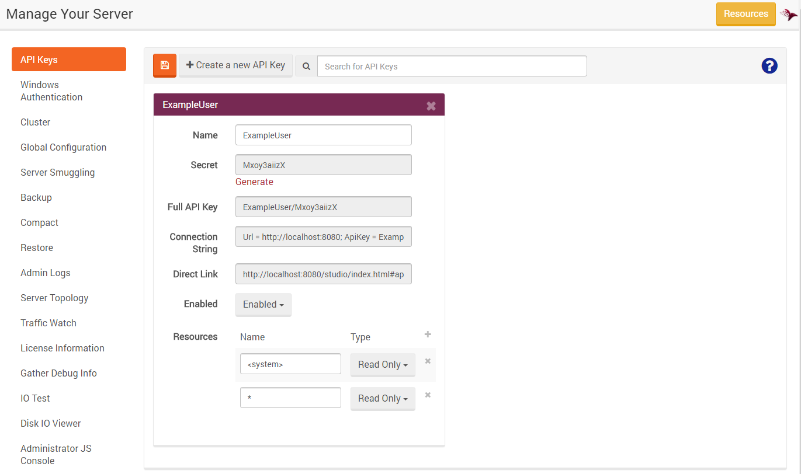

import Admonition from '@theme/Admonition';
import Tabs from '@theme/Tabs';
import TabItem from '@theme/TabItem';
import CodeBlock from '@theme/CodeBlock';
import LanguageSwitcher from "@site/src/components/LanguageSwitcher";
import LanguageContent from "@site/src/components/LanguageContent";

# Manage Your Server: API Keys

Here you can quickly create API Keys or edit already existing ones (read more about Authentication & Authorization [here](../../server/configuration/authentication-and-authorization.mdx)).

Additionally, the following will be generated:

- Connection string - may be used while configuring Client API. Read more [here](../../client-api/setting-up-connection-string.mdx),
- Direct link to Studio granting access with API Key

Read more about Server Permissions [here](./server-permissions).

