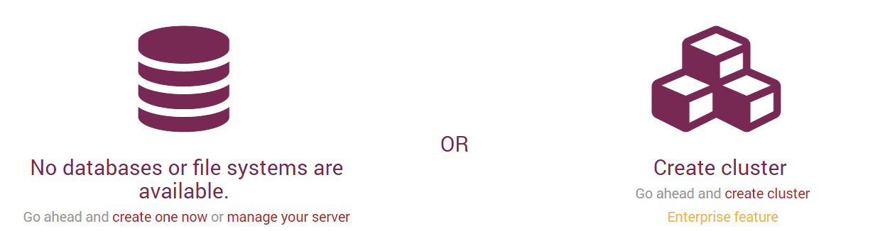
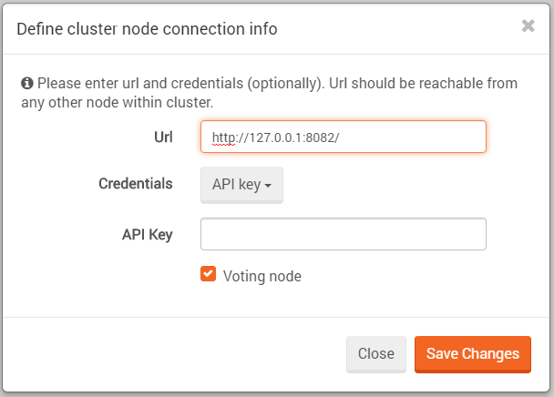
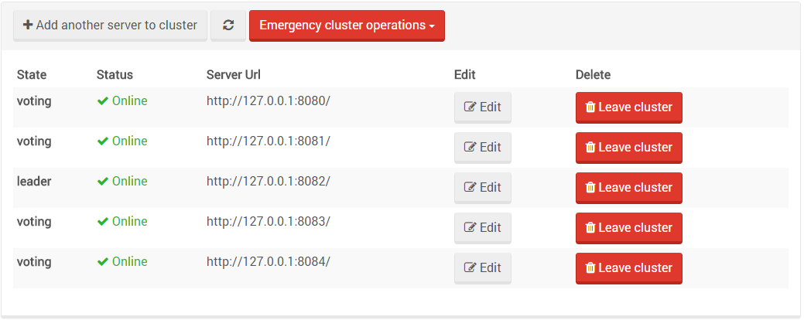
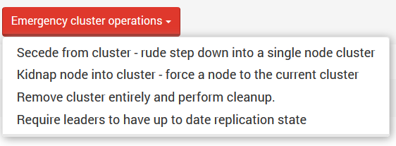

import Admonition from '@theme/Admonition';
import Tabs from '@theme/Tabs';
import TabItem from '@theme/TabItem';
import CodeBlock from '@theme/CodeBlock';
import LanguageSwitcher from "@site/src/components/LanguageSwitcher";
import LanguageContent from "@site/src/components/LanguageContent";

# Manage Your Server: Cluster

### Setting up the cluster

The first thing you'll see when starting a new server is this:   

Then, you'll need to select `Create cluster` and supply the server URL and credentials (optional).   

You can then add the other nodes to the cluster by pressing the `Add another server to cluster` button. 
The default leader will be the node from which the cluster was first created.   

After adding a few nodes to the cluster it should look something like this:   

### Emergency cluster operations

In addition to the expected options like editing a node's address or leaving the cluster, 
we have added some `Emergency cluster operations`. These are operations that are not part of 
Raft and are provided only for out-of-the-ordinary cases and should only be used wisely 
(and with caution) by the admin.   

A node can ask to `Secede from cluster`, which means it will be disconnected and removed from 
the cluster topology. A side effect is that the node will be left with its own single-node cluster.   

Another option is the ability to `Kidnap a node - force a node to the cluster`, even if it's in 
another cluster. In that case, the new node will be promotable until its state is synced with 
the rest of the cluster. Only then it will get voting privileges.   

The third option is `remove the cluster entirely and perform cleanup`. This option is needed 
after a node secedes from the cluster and is left with a cluster of its own. It removes the 
clustering information from the node, turning it into a normal non-cluster node.   

The fourth option is to choose a leader selection mode. You can either 
`Require leaders to have up to date replication state` or `Allow leaders without up to 
date replication state`. When the first option is set, the cluster will avoid choosing a leader 
whose replication state it too far out of date. See `Clustering and Replication` below.   

Notice that when you choose a mode, the selection box will display the other mode (toggle between them):

When the cluster is up and running, you can click on `Manage your server -> Server topology -> Fetch topology` 
and get a map of your cluster.   

### Clustering and Replication
When in a cluster, every new database you will create will have the replication bundle enabled by default.   

   
 
This is done because in a cluster, not all operations pass through the Raft (Rachis) algorithm. Some 
operations like creating and deleting databases do, but document replication for example is done  through 
the replication mechanism instead. In the cluster case - the replication topology is a full connected graph 
where all nodes are connected to all other nodes (clique).   

Failover behavior is shared with standard replication failover behavior and can be configured via the studio. This means that when a cluster is configured,
the admin can choose a failover behavior in the same way as in the [replication settings view](../../studio/overview/settings/replication.mdx) 
but only cluster-related failover options will be displayed.   

Note that in the [Global configuration view](./global-configuration) an admin can change replication 
settings for the entire cluster while in the [Replication settings view](../../studio/overview/settings/replication.mdx), 
the settings will change only for a specific database.

Another way to change failover behavior is by using the [client API](../../client-api/bundles/how-client-integrates-with-replication-bundle.mdx).
 
   

<Admonition type="note" title="Hot Spare behavior under clustering" id="hot-spare-behavior-under-clustering" href="#hot-spare-behavior-under-clustering">
Hot Spare nodes are allowed in a cluster configuration. If not activated, the hot spare node will not have voting privileges, thus it cannot be considered for a quorum. 
After activation, the hot spare node becomes promotable and can be elected as a leader. When activation expires, 
if the hot spare node is the leader, it will gracefully (notifying the other cluster nodes) step down.   
</Admonition> 
  
<Admonition type="warning" title="Warning" id="warning" href="#warning">
Setting replication between nodes in different clusters is not supported. You may however, define 
replication to a node outside the cluster, as long as it doesn't belong to a different cluster.
</Admonition>

