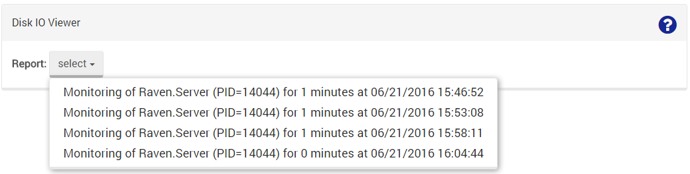
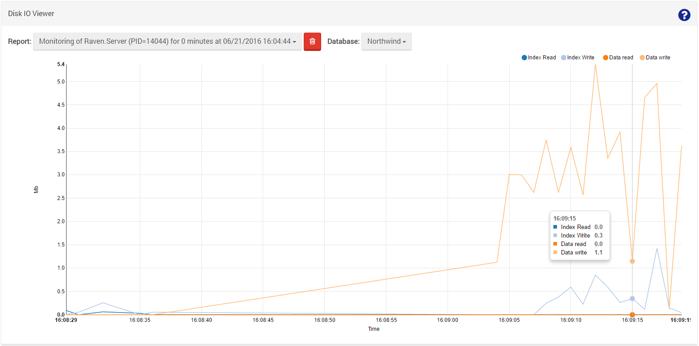

import Admonition from '@theme/Admonition';
import Tabs from '@theme/Tabs';
import TabItem from '@theme/TabItem';
import CodeBlock from '@theme/CodeBlock';
import LanguageSwitcher from "@site/src/components/LanguageSwitcher";
import LanguageContent from "@site/src/components/LanguageContent";

# Manage Your Server: Disk I/O Viewer

You can use this option to view reports of disk I/O tests which were performed earlier.

If no tests were run yet, there will be no reports to show.

[First run the performance monitor](../../server/administration/monitoring/disk-io-perf-monitor.mdx), then you will be able to choose a report to display.

Finally, you can view the generated report. &lt;br &gt;
Notice how you can hover with the mouse over a point on the graph and get the actual numbers for that time.

