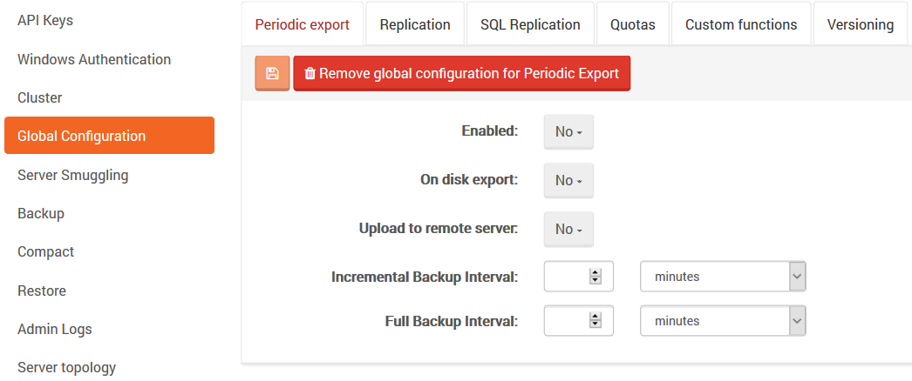
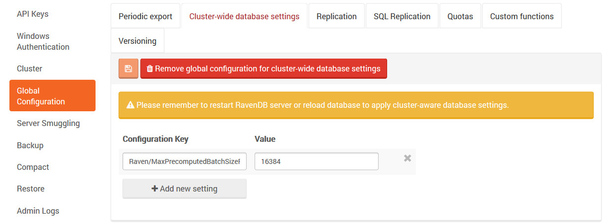

import Admonition from '@theme/Admonition';
import Tabs from '@theme/Tabs';
import TabItem from '@theme/TabItem';
import CodeBlock from '@theme/CodeBlock';
import LanguageSwitcher from "@site/src/components/LanguageSwitcher";
import LanguageContent from "@site/src/components/LanguageContent";

# Manage Your Server: Global Configuration

### Bundles

Global Configuration feature allows you to define behavior for all server databases in one place. 
This behavior is inherited automatically but also can be overridden by a user per database basis.

You can configure global behavior for the following bundles:      
`Periodic export` - read more about periodic export configuration [here](../overview/settings/periodic-export.mdx).   
`Replication` - read more about replication configuration [here](../overview/settings/replication.mdx).   
`SQL Replication` - read more about SQL replication configuration [here](../overview/settings/sql-replication.mdx).   
`Quotas` - read more about quotas configuration [here](../overview/settings/quotas.mdx).   
`Custom functions` -read more about custom functions configuration [here](../overview/settings/custom-functions.mdx).   
`Versioning` - read more about versioning configuration [here](../overview/settings/versioning.mdx).   
   

### Cluster-wide database settings

Cluster-wide database settings feature allow you to define databases behavior for all nodes in the cluster.
You can read more about all databases configuration [here](../../server/configuration/configuration-options.mdx).
You can change only databases configuration and not server configuration.

<Admonition type="note" title="Important" id="important" href="#important">

Remember to restart RavenDB server or reload database to apply cluster-aware database settings.

</Admonition>

