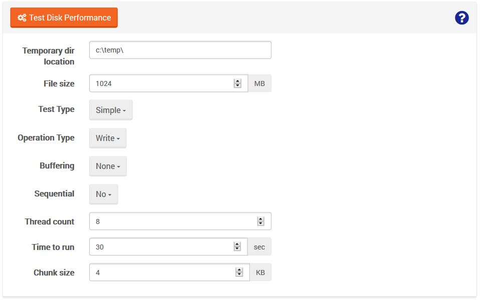
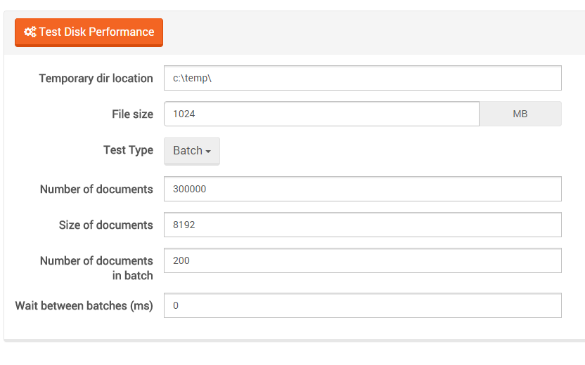

import Admonition from '@theme/Admonition';
import Tabs from '@theme/Tabs';
import TabItem from '@theme/TabItem';
import CodeBlock from '@theme/CodeBlock';
import LanguageSwitcher from "@site/src/components/LanguageSwitcher";
import LanguageContent from "@site/src/components/LanguageContent";

# Manage Your Server: IO Test

You can use this view to test the speed of reading or writing (or reading and writing simultaneously) of the data from the disk.

IO Test has two modes: **simple** and **batch**. 

To test disk performance in **simple** mode, you need to provide the following:

- temporary record path (a folder has to exist already),
- file size,
- operation type (Write, Read, Read and Write),
- information whether the operation should be buffered,
- information whether the operation should be sequential or random,
- thread count,
- runtime of the operation,
- chunk size

To test disk performance in **batch** mode, you need to provide the following:

- Number of documents
- Size of documents
- Number of documents in batch
- Wait between batches (ms)

When the test is complete, the results including an average speed of reading and writing, disk throughput and latency are displayed.

 
