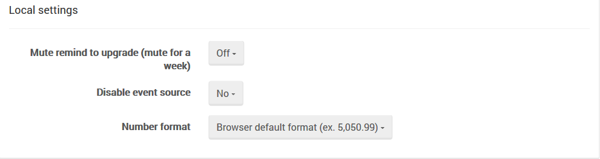

import Admonition from '@theme/Admonition';
import Tabs from '@theme/Tabs';
import TabItem from '@theme/TabItem';
import CodeBlock from '@theme/CodeBlock';
import LanguageSwitcher from "@site/src/components/LanguageSwitcher";
import LanguageContent from "@site/src/components/LanguageContent";

# Manage Your Server: Studio Config

Here you can configure the following:

### Server-Wide Settings

- Send anonymous usage statistics,
- Warn when using System Database,
- Choose studio theme color related to an environment, so you will be able to easily distinguish between production and testing boxes, for example.

### Local Settings

- Mute remind to upgrade (mute for a week),
- Disable event source (alternative way to notify studio about server side changes if websockets aren't available),
- Choose number format

