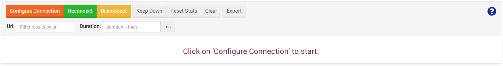

import Admonition from '@theme/Admonition';
import Tabs from '@theme/Tabs';
import TabItem from '@theme/TabItem';
import CodeBlock from '@theme/CodeBlock';
import LanguageSwitcher from "@site/src/components/LanguageSwitcher";
import LanguageContent from "@site/src/components/LanguageContent";

# Manage Your Server: Traffic Watch

Thanks to the Traffic Watch you can easily view all incoming HTTP Requests, and their details, for a chosen database (or for all databases).   

To establish such a connection, click the `Configure Connection` button and fill the following options:   
- Maximum number of displayed entries   
- name of the database/filesystem that will be monitored (or all databases)

Once connected, you will see every request made to the selected database. Notice you can filter the results by URL or duration and export the results as a JSON document.

