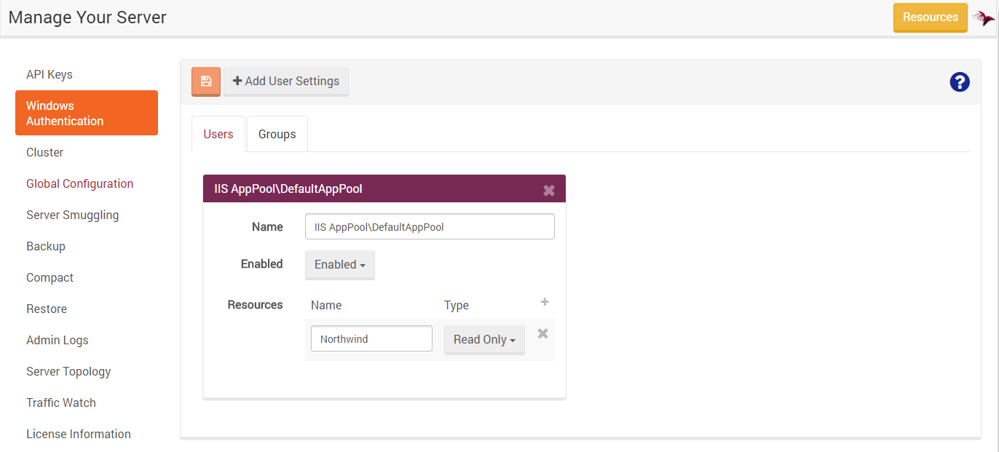
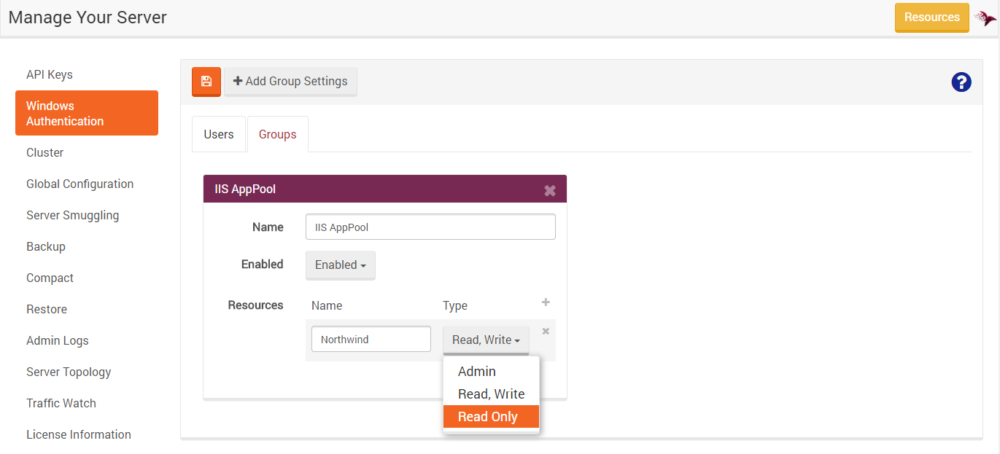

import Admonition from '@theme/Admonition';
import Tabs from '@theme/Tabs';
import TabItem from '@theme/TabItem';
import CodeBlock from '@theme/CodeBlock';
import LanguageSwitcher from "@site/src/components/LanguageSwitcher";
import LanguageContent from "@site/src/components/LanguageContent";

# Manage Your Server: Windows Authentication

The Studio supports configuring Windows Authentication. In this view you can configure authentication settings for a single user or a user group (read more about Authentication & Authorization [here](../../server/configuration/authentication-and-authorization.mdx)).

Read more about Server Permissions [here](./server-permissions).

