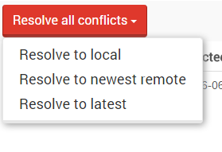

import Admonition from '@theme/Admonition';
import Tabs from '@theme/Tabs';
import TabItem from '@theme/TabItem';
import CodeBlock from '@theme/CodeBlock';
import LanguageSwitcher from "@site/src/components/LanguageSwitcher";
import LanguageContent from "@site/src/components/LanguageContent";

# Documents: Conflicts View

If [Replication Bundle](../../../server/scaling-out/replication/how-replication-works.mdx) is enabled then an additional view is available in the studio - Conflicts. In order navigate there expand the `Documents` option from the main bar.

  

This view presents all [replication conflicts](../../../server/scaling-out/replication/replication-conflicts.mdx) created by replication process.

  

Each of the conflicts contains the following information:

* conflicted document identifier,
* conflict detection time,
* links to conflict items which are different versions of a conflicted document.

After accessing the conflicted document you will see the which parts of its content are conflicted:

  

You can resolve the conflict in the studio by editing the conflicted parts and saving it.

  

Then the conflict will disappear:

Another way to solve all the issues in this page is to press the Resolve all conflicts button and chose how to resolve them:

&lt;span class="float-left"&gt;

You can resolve all the conflicts in the studio by three options:

&lt;span class="float-left"&gt;

* `Resolve with Local` if you want to resolve the conflicts in favor of local version,
* `Resolve to newest remote` if you want to resolve the conflicts in favor of newest remote version,
* `Resolve to latest` if you want to resolve the conflicts in favor of latest document that was created

