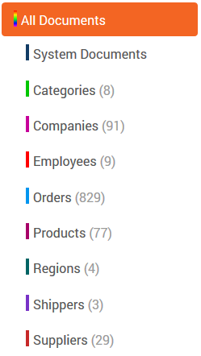
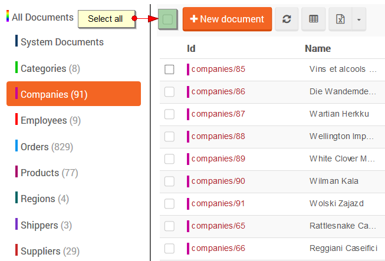
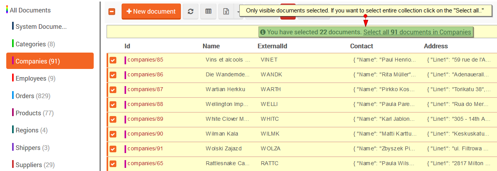
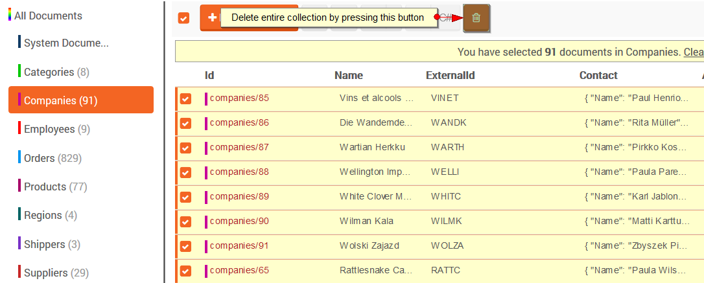
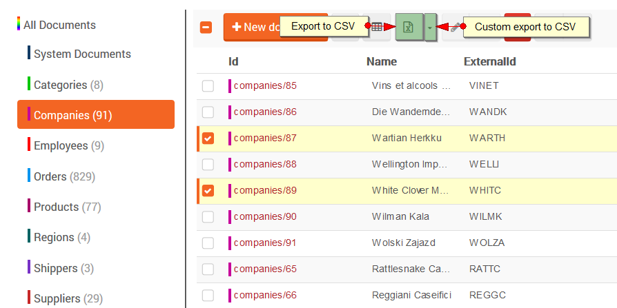
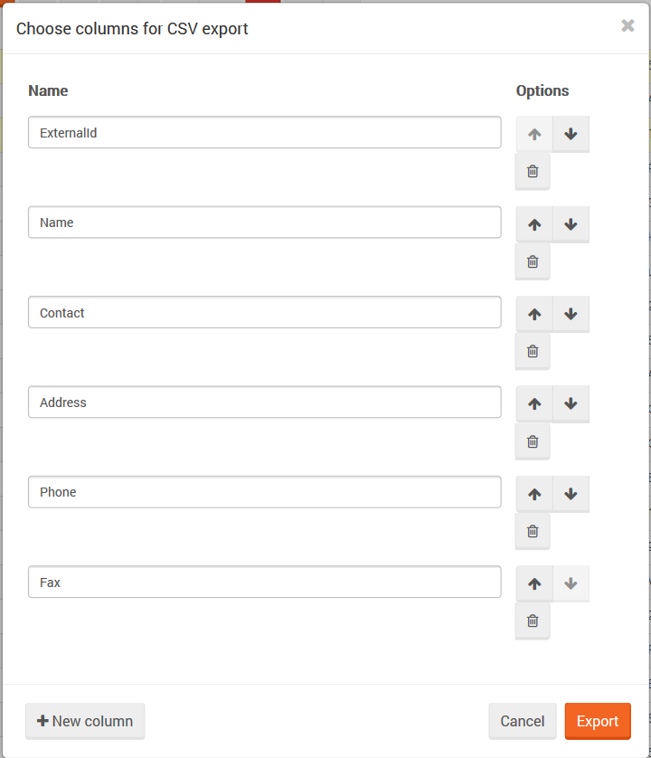

import Admonition from '@theme/Admonition';
import Tabs from '@theme/Tabs';
import TabItem from '@theme/TabItem';
import CodeBlock from '@theme/CodeBlock';
import LanguageSwitcher from "@site/src/components/LanguageSwitcher";
import LanguageContent from "@site/src/components/LanguageContent";

# Documents: Documents View

Documents view gives you the overview of all documents available in a specific database.

## Document collections

On the left side of the screen, you will see all the available [collections](../../../client-api/faq/what-is-a-collection.mdx) for the current database. Each collection will be represented by a different color and number of documents that belong to it.

  

## Deleting collections

Here you can delete a bulk of documents based on their collection association.

Since a collection is just a logical unit in RavenDB, there is no actual meaning in deleting a collection. By deleting a collection in this screen, you are telling RavenDB to delete all documents sharing the same entity name which is equal to the name of the collection you are asking to delete.

- First step is to select all documents using Task Bar placed on top of the displayed documents:

  

- Next, if your collection contains more documents than are visible on the screen, you must select rest of the documents:

  

- Finally, clicking on the 'garbage' icon will display a confirmation dialog, and if you press accept, then documents will be deleted (asynchronous operation - might take some time)

  

<Admonition type="danger" title="Danger">
This operation cannot be undone, and it is likely to delete a lot of documents. Use this option wisely.
</Admonition>

## Exporting to CSV

To do an CSV Export you need to select a collection from the left side of the screen, then select the documents which you want to export, and click on the `Export to CSV` button.
To do a partial CSV export (custom columns) click on the drop down menu next to `Export to CSV` button and choose the columns to be exported.

## Editing documents

Selecting a single document or click on its Id will navigate you to [Document Edit View](../../../studio/overview/documents/document-edit-view.mdx).

