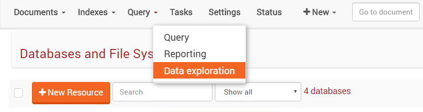
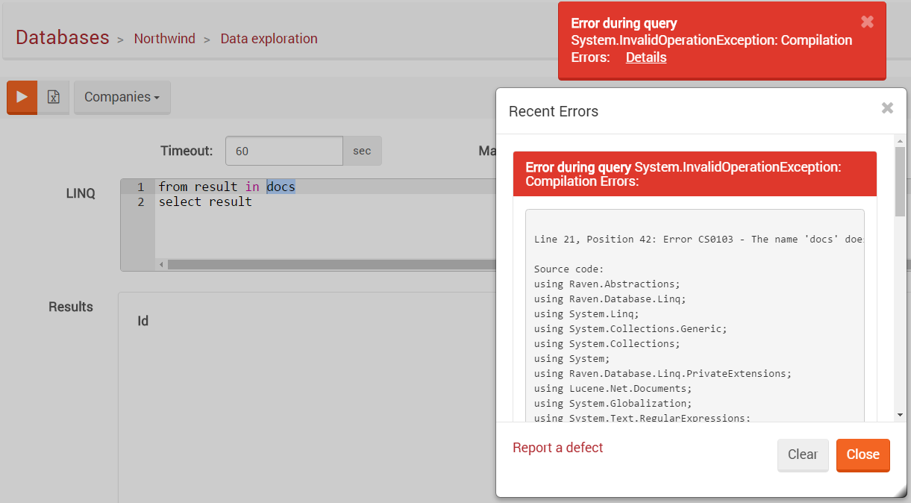

import Admonition from '@theme/Admonition';
import Tabs from '@theme/Tabs';
import TabItem from '@theme/TabItem';
import CodeBlock from '@theme/CodeBlock';
import LanguageSwitcher from "@site/src/components/LanguageSwitcher";
import LanguageContent from "@site/src/components/LanguageContent";

# Query: Data Exploration View

One of the things that tend to happen a lot when we are developing with a database is that we need to peek at 
the data, and a lot of the time, just looking at the data one document at a time isn't good for us.

We noticed that a lot of users will create temporary indexes (usually map/reduce ones) to get some idea about 
what is actually going on in the database, or for one off reporting. That is pretty inefficient, and in order 
to handle that, in RavenDB 3.5 we added the Data Exploration feature. It gives you an easy way to explore 
the data in detail - by using LINQ.

The Data Exploration view is located in the Query drop-down menu:   

First, you must choose a collection to search in.

Then, you may write a LINQ query in the `LINQ` pane.   The results will be displayed on 
the `Results` pane. Another option is to export the results to a CSV.

<Admonition type="warning" title="Warning" id="warning" href="#warning"> 
Before running the query, a syntax check is performed and warns about wrong usage. You must use the
word "results" as the collection name or you will get a compilation error.
</Admonition>

