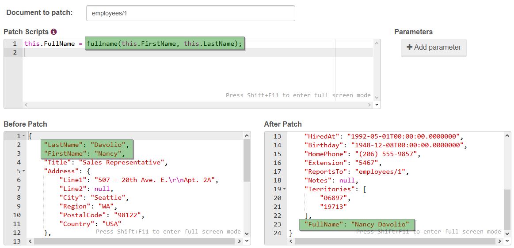

import Admonition from '@theme/Admonition';
import Tabs from '@theme/Tabs';
import TabItem from '@theme/TabItem';
import CodeBlock from '@theme/CodeBlock';
import LanguageSwitcher from "@site/src/components/LanguageSwitcher";
import LanguageContent from "@site/src/components/LanguageContent";

# Settings: Custom Functions

This view allows you to write custom JavaScript functions that can be used by all functionalities on server side that take leverage of JavaScript e.g. [patching API](../../../client-api/commands/patches/how-to-use-javascript-to-patch-your-documents.mdx) or [SQL Replication](../../../server/bundles/sql-replication/basics.mdx). To write custom functions, you need to create your own [commonjs module](http://wiki.commonjs.org/wiki/Modules/1.1).

## Example

- for start, let's define a function that will produce from `firstName` and `lastName` a fullname:

- now, in [Patch View](../../../studio/overview/documents/patch-view.mdx) we can use it as follows:

