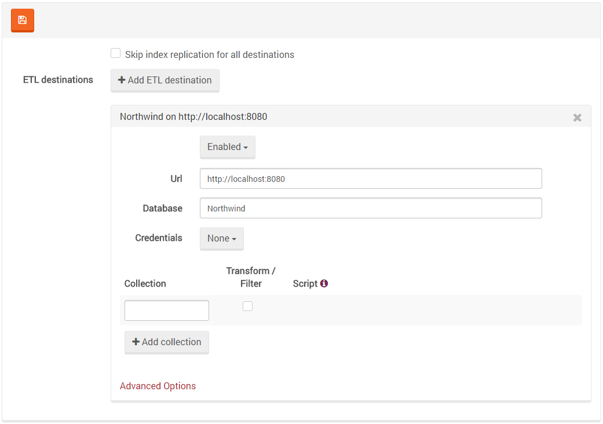
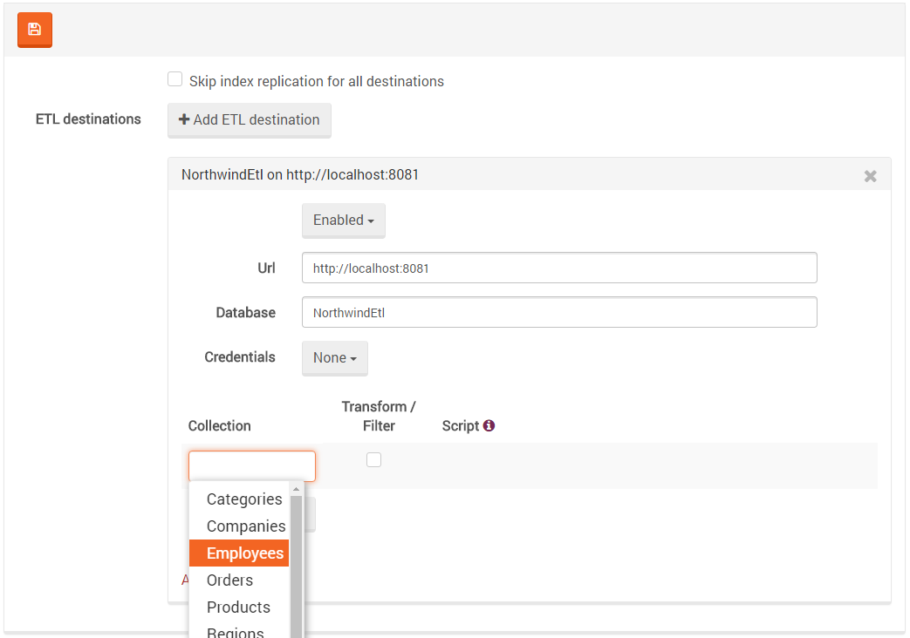
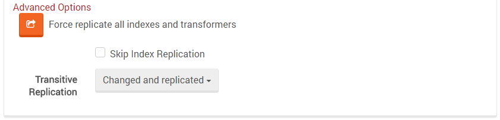

import Admonition from '@theme/Admonition';
import Tabs from '@theme/Tabs';
import TabItem from '@theme/TabItem';
import CodeBlock from '@theme/CodeBlock';
import LanguageSwitcher from "@site/src/components/LanguageSwitcher";
import LanguageContent from "@site/src/components/LanguageContent";

# Settings: ETL (Extract Transform Load)

Here you can edit the following [ETL](../../../server/scaling-out/etl.mdx) settings:      
   
You can choose `Skip index replication for all destinations` to configure it globally instead of per destination.
   

## Adding an ETL destination

Adding an ETL destination is quite similar to [replication setup](./replication), with a few key differences:   
- There is no `Client failover behavior` and `Conflict resolution` in ETL   
- A collection (to replicate from) must be chosen

Simple ETL can be configured by choosing the source collection and providing the destination URL and Database.

## Defining Transformation and Filtering scripts

If you want to manipulate the replicated documents in a custom way, you can easily define transformation and filtering. 
There is an option to write a JS function [(examples)](../../../client-api/commands/patches/how-to-use-javascript-to-patch-your-documents.mdx) 
for each collection/destination, which means that the script will run on every replicated document from that collection.

<Admonition type="note" title="Note">
The deletion of documents (tombstones) will be replicated to their destination without applying the transformation script on them. It means that they won't be filtered out and all deletes will be processed as usual.
</Admonition>

## Advanced Options
Some advanced options you can use are:   
- `Force replicate all indexes and transformers`   
- `Skip Index Replication` - for the current destination   
- `Transitive Replication` - marks what document types should be replicated:   
&emsp;&emsp;- Changed only - locally   
&emsp;&emsp;- Changed and replicated - from other sources   

<Admonition type="warning" title="Warning: Failover behavior" id="warning-failover-behavior" href="#warning-failover-behavior">
An important consideration with ETL is that because the data is filtered and possibly transformed, 
a destination that is using this feature isn't a viable fall-back target, and it will not be considered as such by the client. 
If you want failover, you need to have multiple replicas, some with the full data set and some with the filtered data.
</Admonition>

