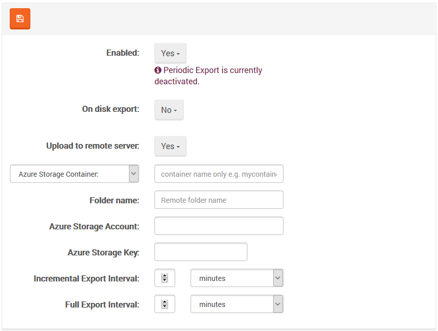

import Admonition from '@theme/Admonition';
import Tabs from '@theme/Tabs';
import TabItem from '@theme/TabItem';
import CodeBlock from '@theme/CodeBlock';
import LanguageSwitcher from "@site/src/components/LanguageSwitcher";
import LanguageContent from "@site/src/components/LanguageContent";

# Settings: Periodic Export

In this view you can set up `Periodic Export` bundle configuration (you can read more about that bundle [here](../../../server/bundles/periodic-export.mdx)).

For the `File System Folder`, you can set up the following:

- *Incremental Backup Interval* (in minutes),
- *Full Backup Interval* (in minutes)

For the `Glacier Vault Name` and `S3 Bucket name`, you can set up the following:

- *Folder Name* (S3 only) - remote folder name, if empty then root folder will be assumed,
- *AWS Access Key*,
- *AWS Secret Key*,
- *AWS Region Endpoint*,
- *Incremental Backup Interval* (in minutes),
- *Full Backup Interval* (in minutes)

For the `Azure Storage Container`, you can set up the following:

- *Folder Name* - remote folder name, if empty then root folder will be assumed,
- *Azure Storage Account*,
- *Azure Storage Key*,
- *Incremental Backup Interval* (in minutes),
- *Full Backup Interval* (in minutes)

