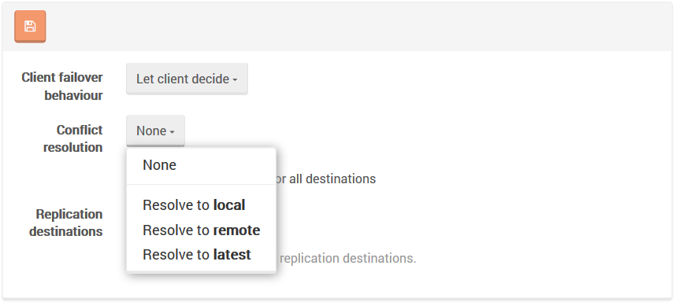
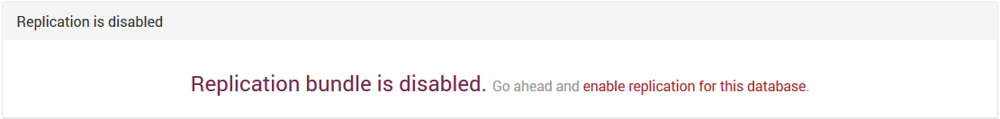

import Admonition from '@theme/Admonition';
import Tabs from '@theme/Tabs';
import TabItem from '@theme/TabItem';
import CodeBlock from '@theme/CodeBlock';
import LanguageSwitcher from "@site/src/components/LanguageSwitcher";
import LanguageContent from "@site/src/components/LanguageContent";

# Settings: Replication

Here you can edit the following [replication](../../../server/scaling-out/replication/how-replication-works.mdx) settings:

## Client failover behavior

Client can decide which failover behavior to use by default (`Let client decide`) or the failover behavior can be enforced by a server, with the following options:

- `Allow reads from secondaries`,
- `Allow reads from secondaries when request time SLA threshold is reached`,
- `Allow reads from secondaries and writes to secondaries`,
- `Fail immediately`,
- `Read from all servers`,
- `Read from all servers but switch when request time SLA thresold is reached`,
- `Read from all servers and allow write to secondaries`

If you want to read more about failover behavior, please visit following [article](../../../client-api/bundles/how-client-integrates-with-replication-bundle.mdx#failover-behavior).

## Conflict resolution

Server can automatically resolve any occured conflicts based on predefined strategies:

- `None` (default),
- `Resolve to local`,
- `Resolve to remove`,
- `Resolve to latest`

## Replication Destinations

List of all destinations to which a database replicates. Here you can choose the following:

- `Enabled` - toggles replication on and off,
- `Url` - url of the server to which a database replicates,
- `Database` - new databases on a target server,
- `Credentials` - credentials to use in server authentication,
- `Client Visible Url`,
- `Failover` - toggles if this destination should be ignored by client,
- `Transitive Replication` - marks what document types should be replicated:
	- Changed only - locally
	- Changed and replicated - from other sources
		

<Admonition type="note" title="Note" id="note" href="#note">

You can replicate, skip replication or force replication for all indexes and transformers.

</Admonition>

## Conflict Resolution

You can resolve all existing conflict acording to the current conflict resolution

## Server HiLo prefix

Please refer to following [article](../../../client-api/bundles/how-client-integrates-with-replication-bundle.mdx#custom-document-id-generation).

<Admonition type="note" title="Note" id="note" href="#note">

Since version 3.5, enabling the replication bundle is possible for an existing databases. In that case, `Raven/ConflictDocuments` and `Raven/ConflictDocumentsTransformer` are automatically deployed.

</Admonition>

<Admonition type="warning" title="Warning" id="warning" href="#warning">

This is not recommended if your database already contain documents.   
In case you decided to do it anyway, there will be a side effect where replication info will be missing from the document's metadata (can cause conflicts)
until you "touch" the document again.    
For more information read about influence on metadata in [Advanced replication details](../../../server/kb/advanced-replication-details.mdx).

</Admonition>

