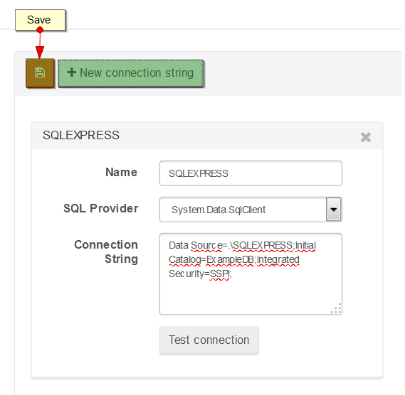

import Admonition from '@theme/Admonition';
import Tabs from '@theme/Tabs';
import TabItem from '@theme/TabItem';
import CodeBlock from '@theme/CodeBlock';
import LanguageSwitcher from "@site/src/components/LanguageSwitcher";
import LanguageContent from "@site/src/components/LanguageContent";

# Settings: SQL Replication

Here you can adjust the [SQL Replication](../../../server/bundles/sql-replication/basics.mdx) settings.

## Manage connection string

Here a list of the Connection Strings can be defined. Those Connection Strings can be used while you setup SQL Replication later on.

## Adding SQL Replication

When you click on the `New SQL replication` button, a view for adding a new replication will appear. There you can adjust the following:

- `Name` - name of the connection,
- `Source Document Collection` - collection which should be replicated,
- `SQL Replication Tables` - a list of SQL Tables with the keys to which a chosen collection will be replicated,
- `Replication` - choose whether the replication should be disabled or enabled,
- `Connection Settings` - various settings that depend on the selected `Connection String Source`,
- `SQL Provider` - provider that should be used for that connection,
- `Parameterized Deletes` - enabled or disabled if the deletes should be parameterized,
- `Table Quotation` - indicates if quotes should be used for table or not,
- `Script` - JavaScript that will be used to perform replication, where:
	- `this` - is the document that is being processed,
	- `replicateTo` - is the method that replicates to a given table e.g. `replicateToOrders` replicates to table `Orders`
	
Except for `Save`, `Refresh`, `Reset`, and `Delete`, there are `Tools` available in the `Action Bar` as well. `Tools` allow us to:

- go through replication statistics (`Stats`),
- test replication using simulation (`Simulate`),
- go to the replication metrics page (`Metrics Page`)

