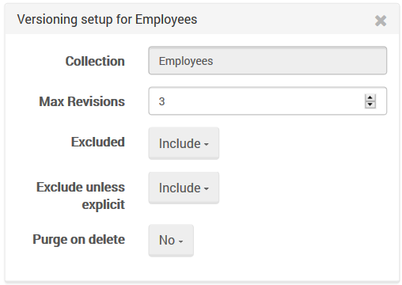

import Admonition from '@theme/Admonition';
import Tabs from '@theme/Tabs';
import TabItem from '@theme/TabItem';
import CodeBlock from '@theme/CodeBlock';
import LanguageSwitcher from "@site/src/components/LanguageSwitcher";
import LanguageContent from "@site/src/components/LanguageContent";

# Settings: Versioning

In this view you can change the settings of the [Versioning](../../../server/bundles/versioning.mdx) bundle. 
Default settings will appear, yet you can change the collection settings manually by clicking on the `Add versioning` button. 
You will need to enter collection name, the maximum number of revisions for the document, and all other settings option. 

