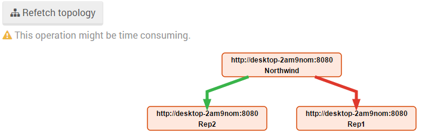
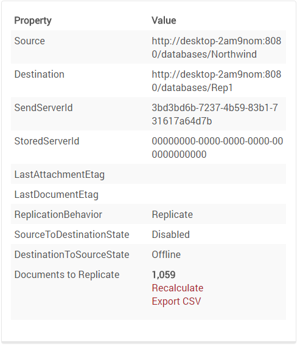
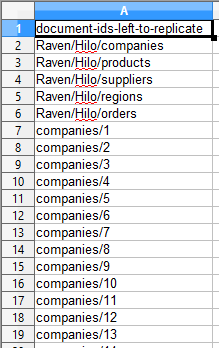
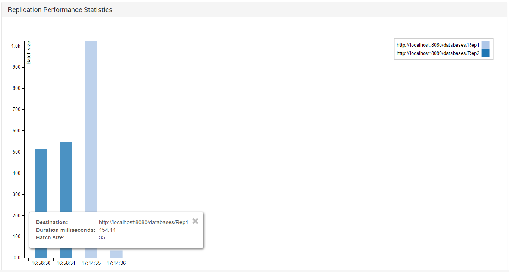

import Admonition from '@theme/Admonition';
import Tabs from '@theme/Tabs';
import TabItem from '@theme/TabItem';
import CodeBlock from '@theme/CodeBlock';
import LanguageSwitcher from "@site/src/components/LanguageSwitcher";
import LanguageContent from "@site/src/components/LanguageContent";

# Status: Replication Stats

Here you can find information about replication status and detailed information concerning each node to which data is replicated or from which it is received.

## Replication Topology

An additional functionality allows requesting the server for a replication topology. 
When the answer is received, a graph presenting nodes and their connection status will be displayed.

<Admonition type="note" title="">
A red link indicates there is no connection between the nodes and replication is disabled.
</Admonition>

If you click on one of the links, the arrow will be displayed as a broken line, and some useful replication information will be displayed.

In our example, the "Rep1" node was taken down before it got a chance to receive the replicated documents from the "Northwind" node.
In that case, you might want to know what's the status of the replication task and which documents weren't replicated yet. 
Just click calculate for a count of not-replicated documents, or export a CSV to see a detailed list.   

<Admonition type="note" title="">
If there are more than 25,000 documents waiting to be replicated, the number displayed will only be an approximation.
</Admonition>

## Replication Performance Statistics

Here you can find information about replication performance - when and how many documents were replicated, and to which node.

