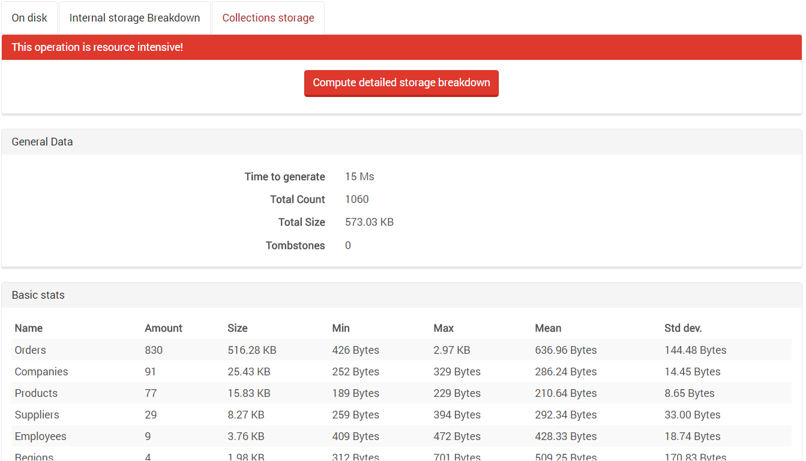
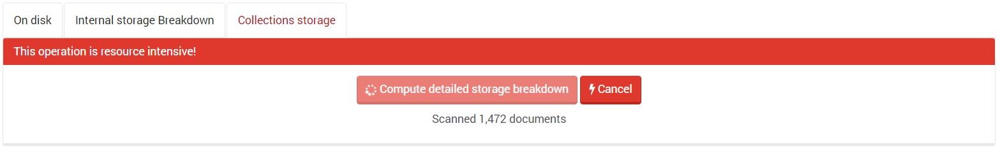

import Admonition from '@theme/Admonition';
import Tabs from '@theme/Tabs';
import TabItem from '@theme/TabItem';
import CodeBlock from '@theme/CodeBlock';
import LanguageSwitcher from "@site/src/components/LanguageSwitcher";
import LanguageContent from "@site/src/components/LanguageContent";

# Status: Storage

`On disk` - shows general information about space used and paths to logs, data and indexes.

`Internal storage breakdown` - shows detailed information about space used. 

`Collections storage` - shows statistics for each collection.

<Admonition type="note" title="">
Because these operations are expensive, we show the progress and added a cancellation button.
</Admonition>

