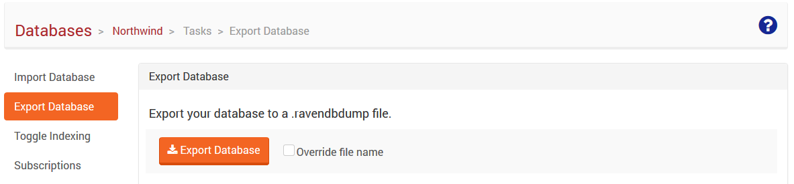
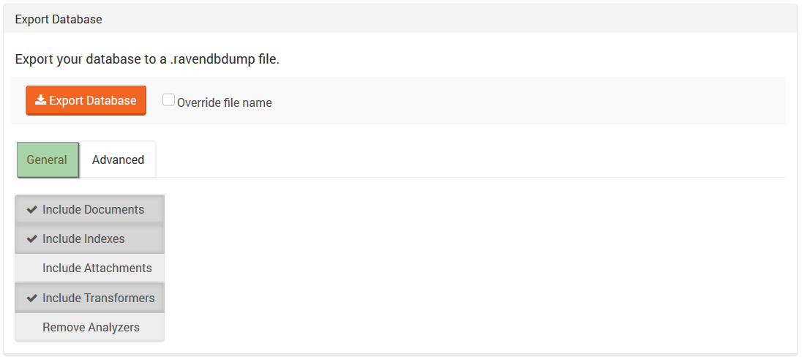
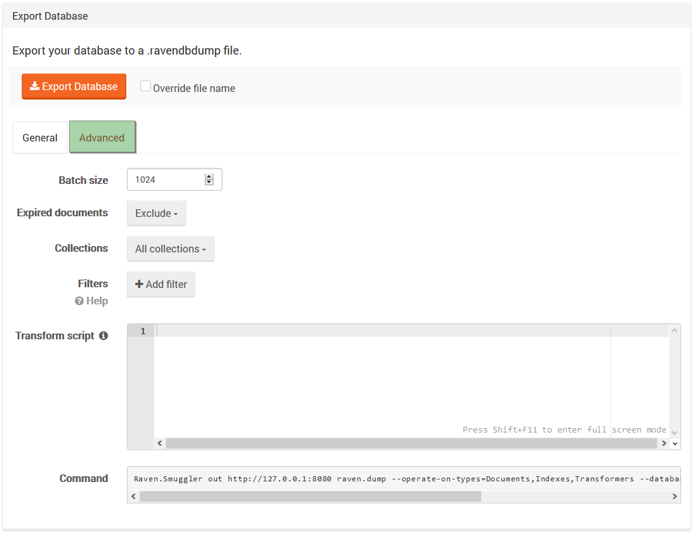
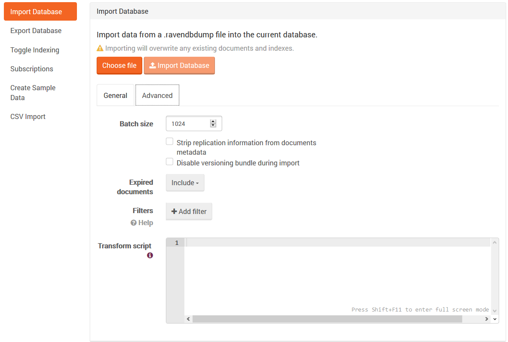

import Admonition from '@theme/Admonition';
import Tabs from '@theme/Tabs';
import TabItem from '@theme/TabItem';
import CodeBlock from '@theme/CodeBlock';
import LanguageSwitcher from "@site/src/components/LanguageSwitcher";
import LanguageContent from "@site/src/components/LanguageContent";

# Tasks: Import & Export Database

Import and Export Tabs enable fast data moving between databases. For data export, the following tools can be used:

- [Smuggler](../../../server/administration/exporting-and-importing-data.mdx),
- Export Database Tab from Studio (which uses Smuggler underneath)

## Export

The easiest way to export a database is by clicking the `Export Database` button. Dialog for saving file will appear and default export options will be applied (documents, indexes and transformer included).

To change default options you need to choose desired options in `General` tab or, if necessary, change **batch size**, toggle if export should **include or exclude expired documents**, add **filters**, or **transform script** in the `Advanced` tab. You can read more about these functionalities [here](../../../server/administration/exporting-and-importing-data.mdx#filtering).

<Admonition type="note" title="Information" id="information" href="#information">

When exporting database the equivalent Smuggler command will be shown in the bottom of the view.

</Admonition>

---

## Import

Import follows the same procedure as export. You can click the `Choose file` button to choose a file you need and import will start automatically, with default options. Import options can be changed in `General` or `Advanced` tab and this must be done prior choosing the file for import.

<Admonition type="note" title="Note" id="note" href="#note">

Since version 3.5, you can disable versioning bundle and strip synchronization information from files metadata during import.

</Admonition>

<Admonition type="note" title="Disk space verification" id="disk-space-verification" href="#disk-space-verification">

Verification of free disk space happens before importing data.

</Admonition>

<Admonition type="danger" title="">
Importing will overwrite any existing documents, indexes and transformers.
</Admonition> 
