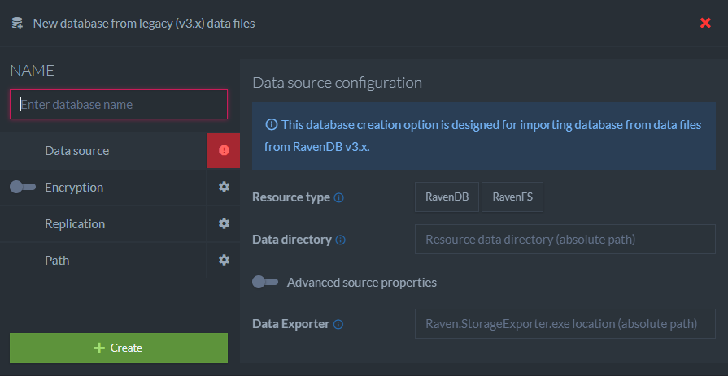
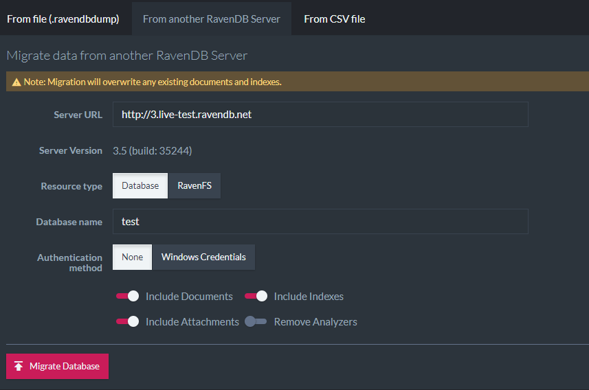

import Admonition from '@theme/Admonition';
import Tabs from '@theme/Tabs';
import TabItem from '@theme/TabItem';
import CodeBlock from '@theme/CodeBlock';
import LanguageSwitcher from "@site/src/components/LanguageSwitcher";
import LanguageContent from "@site/src/components/LanguageContent";

# Migration: How to Migrate Data from 3.x Server to 4.0

<Admonition type="warning" title="Backward compatibility" id="backward-compatibility" href="#backward-compatibility">

RavenDB 4.0 is a major version upgrade from 3.x. As such, applications using 3.x client DLLs will not be able to work against a 4.0 server and requires migrating to the latest 4.0 client release prior the server upgrade.

Please refer to our [client migration guide](../../migration/client-api/introduction.mdx) if you haven't migrated your application yet.
</Admonition>

There are a few options to migrate 3.x data to RavenDB 4.0:

- create a database from 3.x data
- live import data from a running instance
- restore 3.x backup
- import a database from `.ravendump` file

&lt;br /&gt;

## How to create a database from 3.x database or file system data

The process of upgrading to a RavenDB 4.0 server is as follows:

- Ensure backups of 3.x databases have been made
- Stop existing the 3.x server
- Start the new RavenDB 4.0 server (4.0 binaries must not be extracted the same directory as 3.x ones)
- Create a new database using `New database from v3.x (legacy) data files`:

You will see the following dialog:

Next, you need to provide the migration configuration:

- `Resource type` - whether you are going to import a database or a file system
- `Data directory` - the absolute path to 3.x data directory
- `Data exporter` - the absolute path to `Raven.StorageExporter.exe` - RavenDB 3.5 tool that can be found on [ravendb.net](https://ravendb.net/download) as a part of the tools package. Please make sure to use the latest version (patch or stable).

The `Advanced` options section allows you to:

- specify a custom path to journals / logs (use if the migrated resource has the `Raven/TransactionJournalsPath` or `Raven/Esent/LogsPath` setting defined),
- indicates that the source data had the compression bundle enabled
- provides encryption key if the source data are encrypted (if you need the new database to be encrypted, please configure it in `Encryption` section)

<Admonition type="note" title="Files and legacy attachments" id="files-and-legacy-attachments" href="#files-and-legacy-attachments">

RavenDB 4.0 introduces the notion of [attachments](../../client-api/session/attachments/what-are-attachments.mdx) that can be bound to documents. 
The files migrated from RavenFS and legacy database attachments will be saved as documents in `@files` collection. Each document will have a single attachment.
The name of the document will be `files/{attachment-name}`, the name of an attachment will remain unchanged.

</Admonition>

## How to live import data from a running instance?

Another option of moving data to RavenDB 4.0 is to import a database or a file system from running the RavenDB 3.x instance. To import data running 3.x resources, please create a new empty database on a 4.0 server and go to `Settings -> Import Data -> From another RavenDB Server`

## How to restore an existing 3.x backup?

If you want to restore a database from a 3.x backup to a 4.0 server, first you need to restore it manually to running a 3.x instance (by [command line](https://ravendb.net/docs/article-page/3.5/Csharp/server/administration/backup-and-restore) or [RavenDB Studio](https://ravendb.net/docs/article-page/3.5/csharp/studio/management/backup-restore)).

Next, use one of the above options and point the just restored database / file system.

## How to import database from `.ravendump` file?

The export file (`.ravendump`) from a 3.x  database can be imported to 4.0 using the Studio: `Settings -> Import Data -> From file`

