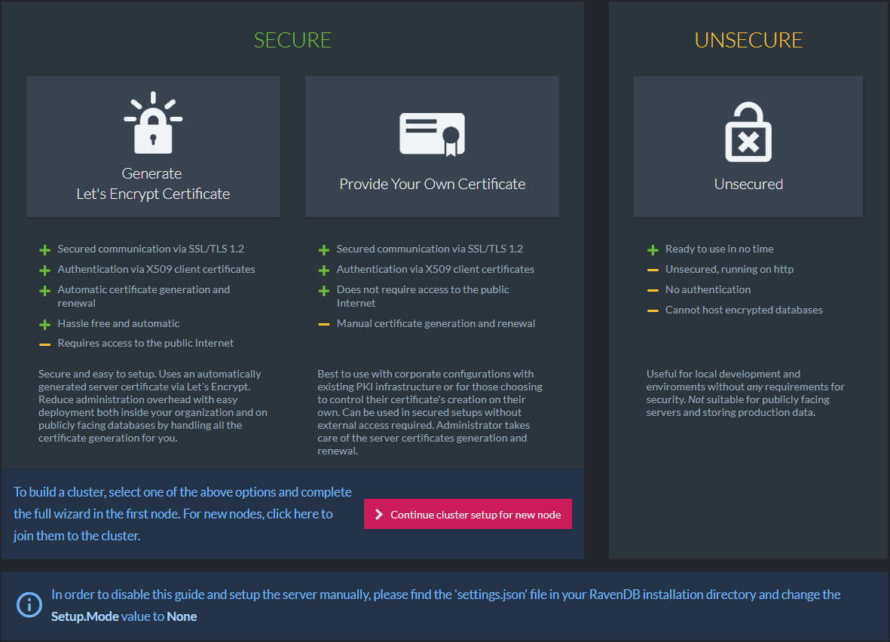
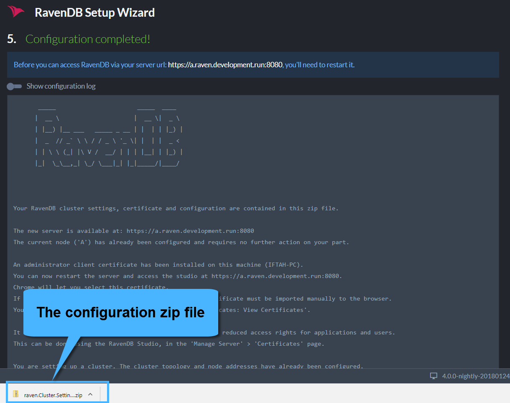
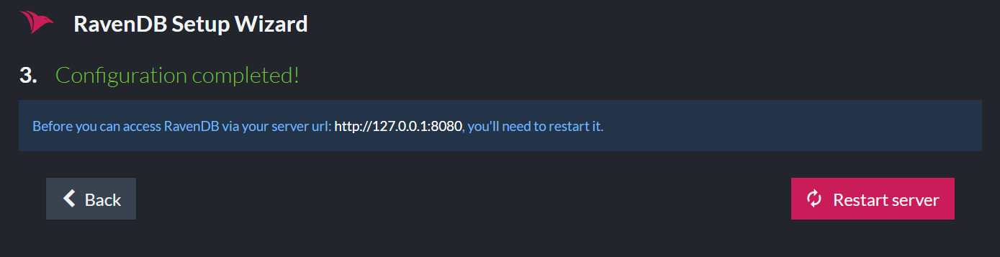
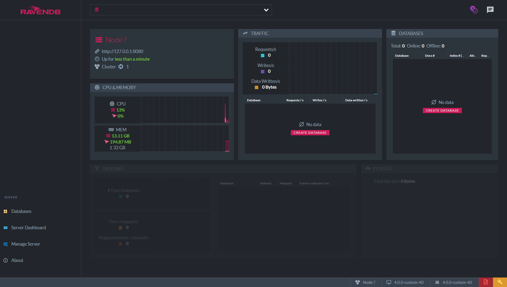

import Admonition from '@theme/Admonition';
import Tabs from '@theme/Tabs';
import TabItem from '@theme/TabItem';
import CodeBlock from '@theme/CodeBlock';
import LanguageSwitcher from "@site/src/components/LanguageSwitcher";
import LanguageContent from "@site/src/components/LanguageContent";

# Installation: Setup Wizard Walkthrough

We want to make it as easy as possible for you to start RavenDB with a valid trusted certificate from the very beginning and to stay secure through your entire application lifecycle, starting from early stages of development, ending on production and day-to-day usage.

To make the setup process as smooth as possible, we introduced the "Setup Wizard", a step-by-step guide to help you configure your desired level of security and easily deploy a secured cluster.

You have 4 options to choose from:

1. [Secure Setup with a Let's Encrypt certificate](../../start/installation/setup-wizard.mdx#secure-setup-with-a-let)
2. [Secure Setup with your own certificate](../../start/installation/setup-wizard.mdx#secure-setup-with-your-own-certificate)
3. [Unsecured Setup](../../start/installation/setup-wizard.mdx#unsecured-setup)
4. [Manual Setup](../../start/installation/manual.mdx)

When running the RavenDB server for the first time, you will be redirected to the setup wizard welcome screen where you can choose your preferred option.

  

This section explains how to follow the setup wizard. It does not go into detail about security concerns. If you wish to learn about how authentication and authorization work in RavenDB or more about security in general, please read the [security section](../../server/security/overview.mdx). 

If you are having trouble using the wizard or with security in general, please visit the [Security FAQ section](../../server/security/common-errors-and-faq.mdx).

## Secure Setup with a Let's Encrypt Certificate

[Let's Encrypt](https://letsencrypt.org/) is a free, automated, and non-profit certificate authority. It will generate a certificate for your domain as long as you can prove that you own it.

During the wizard, RavenDB will give you a free subdomain. It lets you configure the DNS records for this subdomain to point to the IP addresses your server will listen to. The subdomain is owned by RavenDB, and we let you manage it through our [Customer Portal](https://customers.ravendb.net). Login with your license, and you can add/remove/update DNS records for your cluster.

The free subdomain is given to you only for the purpose of proving ownership to Let's Encrypt. If you wish to use your own domain, you are welcome to acquire your own certificate and use that instead.

<Admonition type="warning" title="Security consideration and ownership of certificates and domains" id="security-consideration-and-ownership-of-certificates-and-domains" href="#security-consideration-and-ownership-of-certificates-and-domains"> 

The automatic setup is designed to be as convenient and as easy as possible. It takes care of all the nitpicks of setting up DNS records, generating certificates, and doing their renewals. Because of those requirements, the ownership of the certificates and DNS records needs to stay within the Hibernating Rhinos company. This gives us the ability to generate valid certificates and modify DNS settings for your registered domains and should be a consideration to keep in mind while reviewing the security of your system. Hibernating Rhinos **will never** exploit these abilities and will never perform any modifications to the certificates and DNS records unless explicitly requested by the client.

The purpose of this feature is to make it easy for users to get set up and running with a minimum of fuss. We **recommend** that for actual production deployments and for the highest level of security and control, you'll use **your own certificates and domains**, avoiding the need to rely on third party for such a critical part of your security.

</Admonition>

After choosing the Let's Encrypt Secure Setup option, you are required to enter your license. This process will associate your license with the chosen subdomain to ensure that valid certificates can only be generated by a single license holder.

  

The next step is to claim your subdomain. In the example below, we choose the "raven" subdomain.

  

### Configuring The Server Addresses

In the next screen, you will choose the IP address and port that your server will bind to.

If you wish to setup a cluster, this is the place to add nodes to the cluster and choose their addresses. You should configure the cluster only on the first node and **not** on each of them separately. The first node will generate the required configuration for the entire cluster and will provide a Zip file and detailed guidance on how to continue with the other nodes.

For a smooth setup experience, please make sure that the IP address and port are available in each machine. The wizard will validate this and throw an error if they are being used. When using port 443, you need to ensure that it hasn't already been taken by other applications like Skype, IIS, Apache, etc. On Linux, you might need to [allow port 443 for non-root processes](https://superuser.com/questions/710253/allow-non-root-process-to-bind-to-port-80-and-443). 

IP addresses may be changed at a later time by running the setup wizard again which will update the DNS records.

### Example I

In the following screenshot, we show an example of constructing a cluster for local development:

  

All 3 nodes will run on the local machine:

- Node A (https://a.raven.development.run) will listen to 127.0.0.1 on port 8080.
- Node B (https://b.raven.development.run) will listen to 127.0.0.2 on port 8080.
- Node C (https://c.raven.development.run) will listen to 127.0.0.3 on port 8080.

Each node will run in its own process and have its own data directory and [settings.json](../../server/configuration/configuration-options.mdx#settingsjson) file. You should have 3 separate RavenDB folders.

### Example II

Each node will run on its own machine in a network.

A common scenario for running an internal cluster will be:  

- Node A (https://a.raven.development.run) will listen to 10.0.0.84 on port 443.
- Node B (https://b.raven.development.run) will listen to 10.0.0.75 on port 443.
- Node C (https://c.raven.development.run) will listen to 10.0.0.91 on port 443.

You can deploy a cluster that is completely internal to your network and still gain all the benefits of using certificates and SSL with full trust and complete support from all the standard tooling.

### Example III

A RavenDB server can run behind a firewall (in cloud environments for example).

RavenDB will bind to the **private** IP address. However, the DNS records must be updated to the **external** IP address which is reachable from the outside world. Requests made to the external IP address will be forwarded to the private IP address (which RavenDB listens on).

Check the box "Customize external IP and Ports" and supply the external IP address.  

  

### Example IV

In Docker, if you choose to use port mapping with the `-p` flag, You need to check the box "Customize external IP and Ports" and supply the external IP address as well as the exposed ports.  

So if a container was created using:

    sudo docker run -t -p 38889:38888 -p 443:8080 ravendb/ravendb

Then the following configuration should be applied:  

  

### Getting The Certificate

When you click next, the wizard will establish a connection with Let's Encrypt to obtain a valid certificate for the entire cluster. 

It usually takes this process a couple of minutes to complete. The wizard validates that the DNS records updated successfully and that the server can run with the supplied addresses and certificate and is reachable using the new domain name.

<Admonition type="warning" title="Caching of Let's Encrypt Certificates" id="caching-of-let-s-encrypt-certificates" href="#caching-of-let-s-encrypt-certificates"> 
In some scenarios you will run the setup wizard again. In that case, if none of the cluster domains changed, the wizard will use the cached certificate and not request a new one from Let's Encrypt.
</Admonition>

  

If the validation fails, you will receive a detailed error. You can go back in the wizard, change settings and try again.

A [common error](../../server/security/common-errors-and-faq.mdx) is that DNS records didn't update locally. You may wait a bit and try again. An easy workaround is to configure (just for the setup) your network card to use Google's DNS server (8.8.8.8), to bypass caching of DNS records.

Tip:  use dns.google.com to see the dns record of your domain.

When finished you will receive a Zip file containing all of the cluster configuration files and certificates. In case you are setting up a cluster, you will use this Zip file to setup the other nodes.

  

Click the "Restart Server" button and wait until the browser redirects you to the new URL (in our example, it's "https://a.raven.development.run").

If you checked the relevant box in the previous stage, a client certificate is registered in the OS trusted store during setup. The Chrome and Edge browsers use the OS store, so they will let you choose your certificate right before you are redirected. Firefox users will have to manually import the certificate to the browser via Tools &gt; Options &gt; Advanced &gt; Certificates &gt; View Certificates.

If you didn't check the box, before you continue please register the client certificate in the OS store or import it to the browser.

If you are setting up a single node, the setup is complete and you can start working.

### Continuing The Cluster Setup

When you access the Studio please navigate to: Manage Server &gt; Cluster. You will see something similar to this:

Nodes B and C are not running yet. As soon as we start them, node A will detect it and add them to the cluster.

Now, let's bring node B up.

First, copy the configuration Zip file to node B and download/copy a fresh RavenDB server folder. In **Windows**, start RavenDB using the `run.ps1` script. In **Linux**, use the `start.sh` script.

This time we will choose to continue the cluster setup.

  

Now we will supply the downloaded Zip file and select the node we are currently setting up.

  

Click restart when finished and repeat the process for more nodes. When all the nodes are up, you can view the updated topology in the studio.

You have successfully finished setting up a secure cluster of RavenDB servers using a Let's Encrypt certificate.

## Secure Setup with Your Own Certificate

In RavenDB, users can provide their own server certificate. The certificate can be issued by a trusted SSL vendor or it can be a self-signed certificate. In the latter case, it's the user's responsibility to have the self-signed CA registered in the OS stores on all the relevant machines.

RavenDB will accept PFX server certificates which contain the private key, are not expired, and have the following fields:

- KeyUsage: DigitalSignature, KeyEncipherment
- ExtendedKeyUsage: Client Authentication, Server Authentication

If you wish to use the setup wizard to construct a cluster, you must use the same certificate for all nodes. If you wish to use a different certificate for each node, it's possible only through manual setup. A wildcard certificate is probably the easiest way to go. Another option is to issue a certificate which contains all the domains of all the cluster nodes as "Subject Alternative Names" (SANs). 

After choosing the Secure Setup with your own certificate option, you are required to upload the certificate and click next. In the example, we will use the *.ravendb.example.com wildcard certificate.  

### Configuring The Server Addresses

In the next screen, you will choose the IP address and port that your server will bind to.

If you wish to setup a cluster, this is the place to add nodes to the cluster and choose their addresses. You should configure the cluster only on the first node and **not** on each of them separately. The first node will generate the required configuration for the entire cluster, and will provide a Zip file and detailed guidance on how to continue with the other nodes.

For a smooth setup experience, please make sure that the IP address and port are available in each machine. The wizard will validate this and throw an error if they are being used. When using port 443, you need to ensure that it hasn't already been taken by other applications like Skype, IIS, Apache, etc. On Linux, you might need to [allow port 443 for non-root processes](https://superuser.com/questions/710253/allow-non-root-process-to-bind-to-port-80-and-443). 

<Admonition type="note" title="Note" id="note" href="#note">
When you provide a wildcard certificate, node tags are assigned automatically in alphabetical order. For example, when using CN=*.my.domain then the cluster domain names will be a.my.domain, b.my.domain, c.my.domain and so on.

If you wish to use different domain names or build a cluster with more than 26 nodes you can either do a manual setup or use the wizard and provide a certificate with as many domains as you need under the "Subject Alternative Names" (SAN) property.
</Admonition>
<Admonition type="warning" title="Important" id="important" href="#important"> 
If you bring your own certificate, you must also take care of the DNS records. If you choose to bind to 127.0.0.1, and provide a certificate with CN=my.domain, then the DNS record of my.domain must point to 127.0.0.1.

If you are running behind a firewall, the DNS records must point to the **external** IP address.
</Admonition>

### Example I

In the following screenshot, we show an example of constructing a cluster for local development:

  

All 3 nodes will run on the local machine:

- Node A (https://a.ravendb.example.com) will listen to 127.0.0.1 on port 8080.
- Node B (https://b.ravendb.example.com) will listen to 127.0.0.2 on port 8080.
- Node C (https://c.ravendb.example.com) will listen to 127.0.0.3 on port 8080.

Each node will run in its own process and have its own data directory and [settings.json](../../server/configuration/configuration-options.mdx#settingsjson) file. You should have 3 separate RavenDB folders.

### Example II

Each node will run on its own machine in a network.

A common scenario for running an internal cluster will be:  

- Node A (https://a.ravendb.example.com) will listen to 10.0.0.84 on port 443.
- Node B (https://b.ravendb.example.com) will listen to 10.0.0.75 on port 443.
- Node C (https://c.ravendb.example.com) will listen to 10.0.0.91 on port 443.

You can deploy a cluster that is completely internal to your network and still gain all the benefits of using certificates and SSL with full trust and complete support from all the standard tooling.

### Example III

A RavenDB server can run behind a firewall (in cloud environments for example).

RavenDB will bind to the **private** IP address. However, the DNS records must be updated to the **external** IP address which is reachable from the outside world. Requests made to the external IP address will be forwarded to the private IP address (which RavenDB listens on).

It is your responsibility to update the DNS record of your domain to point to your external IP address.  

### Example IV

In Docker, if you choose to use port mapping with the -p flag, You need to check the box "Customize external ports" and supply the exposed ports.  

It is your responsibility to update the DNS record of your domain to point to your external IP address. 

So if a container was created using:

    sudo docker run -t -p 38889:38888 -p 443:8080 ravendb/ravendb

Then the following configuration should be applied:  

  

When finished, you will receive a Zip file containing all of the cluster configuration files and certificates. In case you are setting up a cluster, you will use this Zip file to setup the other nodes.

At this point, click the "Restart Server" button, and wait until the browser redirects you to the new URL (in the example it's "https://a.ravendb.example.com").

If you checked the relevant box in the previous stage, a client certificate is registered in the OS trusted store during setup. The Chrome and Edge browsers use the OS store, so they will let you choose your certificate right before you are redirected. Firefox users will have to manually import the certificate to the browser via Tools &gt; Options &gt; Advanced &gt; Certificates &gt; View Certificates &gt; Your Certificates Tab &gt; Import.

If you didn't check the box, please register the client certificate in the OS store or import it to the browser before you continue.

If you are setting up a single node, the setup is complete and you can start working.

### Continuing The Cluster Setup

When you access the Studio please navigate to: Manage Server &gt; Cluster. You will see something similar to this:

  

Nodes B and C are not running yet. As soon as we start them, node A will detect it and add them to the cluster.

Now, let's bring node B up.

First, copy the configuration Zip file to node B and download/copy a fresh RavenDB server folder. In **Windows**, start RavenDB using the `run.ps1` script. In **Linux**, use the `start.sh` script.

This time, we will choose to continue the cluster setup.

  

Now we will supply the downloaded Zip file and select the node we are currently setting up.

  

Click restart when finished and repeat the process for more nodes. When all the nodes are up, you can view the updated topology in the studio.

You have successfully finished setting up a secure cluster of RavenDB servers using you own wildcard certificate.

## Unsecured Setup

In Unsecured Setup, all you need to do is choose the IP address and ports that the server will listen to.

<Admonition type="note" title="Note" id="note" href="#note">
In unsecured mode all security features are disabled (authentication, authorization and encryption).
</Admonition>

The following screenshot shows a simple local configuration, listening to 127.0.0.1 on port 8080.

<Admonition type="danger" title="Danger" id="danger" href="#danger">
When choosing to listen to an outside network, the RavenDB server does not provide any security. Authentication is off. Anyone who can access the server using the configured IP address will be granted **administrative privileges**. 
</Admonition>

When you are done configuring the server, click next and then restart. After a few seconds, the server will be ready and accessible.

Access the Studio by entering the URL in the browser: "http://127.0.0.1:8080" or "http://localhost:8080".

  

You have successfully finished setting up a RavenDB server.

To construct a cluster, unzip the downloaded RavenDB package to more machines (or local folders), as many as the number of nodes you want. In each node, start the RavenDB server and complete the setup wizard, with a different IP address.

Once all the servers are up and running, building the cluster is simple. Access the studio, go to Manage Server &gt; Cluster, and add nodes to the cluster by their URL.  

