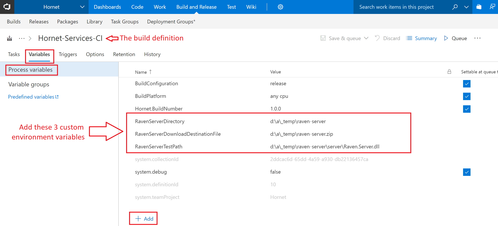
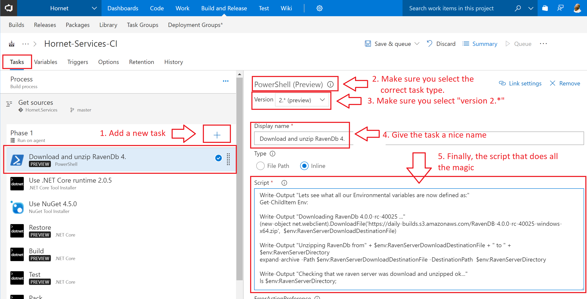

import Admonition from '@theme/Admonition';
import Tabs from '@theme/Tabs';
import TabItem from '@theme/TabItem';
import CodeBlock from '@theme/CodeBlock';
import LanguageSwitcher from "@site/src/components/LanguageSwitcher";
import LanguageContent from "@site/src/components/LanguageContent";

export const supportedLanguages = ["java", "csharp"];

# Getting Started: Writing your Unit Test using TestDriver
<LanguageSwitcher supportedLanguages={supportedLanguages} />
<LanguageContent language="java">

In this section we will explain how to use [RavenDB.TestDriver](https://www.nuget.org/packages/RavenDB.TestDriver/) in order to write unit tests for working with RavenDB.

- [RavenServerLocator](../start/test-driver.mdx#ravenserverlocator)
- [RavenTestDriver](../start/test-driver.mdx#raventestdriver)
- [Pre-initializing the store](../start/test-driver.mdx#preinitialize)
- [Unit test](../start/test-driver.mdx#unittest)
- [Complete example](../start/test-driver.mdx#complete-example)

## RavenServerLocator

The first thing we need to implement is a class derived from `RavenServerLocator`

<TabItem value="RavenServerLocator" label="RavenServerLocator">
<CodeBlock language="java">
{`public abstract class RavenServerLocator \{
    /**
     * Allows to fetch the server path
     * @return server path
     */
    public abstract String getServerPath();

    /**
     * Allows to fetch the command used to invoke the server.
     * @return command
     */
    public abstract String getCommand();

    /**
     * Allows to fetch the command arguments.
     * @return command line arguments
     */
    public String[] getCommandArguments() \{
        return new String[0];
    \}
\}
`}
</CodeBlock>
</TabItem>

### Example

<TabItem value="test_driver_5" label="test_driver_5">
<CodeBlock language="java">
{`public class MyRavenDBLocator extends RavenServerLocator \{
    @Override
    public String getServerPath() \{
        return "/opt/RavenDB/Server/Raven.Server";
    \}

    @Override
    public String getCommand() \{
        return getServerPath();
    \}
\}
`}
</CodeBlock>
</TabItem>

## RavenTestDriver

Now that we learned how to implement a server locator we can define a class that derives from Raven's TestDriver.
Lets start with reviewing the TestDriver's methods and properties and later we will get into implementation (complete code sample of a RavenTestDriver can be found at the [bottom](../start/test-driver.mdx##complete-example) of the page).

### Properties and Methods
| Signature | Description |
| ----------| ----- |
| **public IDocumentStore getDocumentStore()** | Gets you an IDocumentStore instance with random database name |
| **public IDocumentStore getDocumentStore(String database)** | Gets you an IDocumentStore instance for the requested database. |
| **protected virtual void customizeStore(DocumentStore documentStore)** |Allows you to pre-initialize the IDocumentStore. |
| **public void waitForIndexing(IDocumentStore store)** | Allows you to wait for indexes to become non-stale. |
| **public void waitForIndexing(IDocumentStore store, String database)** | Allows you to wait for indexes to become non-stale. |
| **public void waitForIndexing(IDocumentStore store, String database, Duration timeout)** | Allows you to wait for indexes to become non-stale. |
| **public void waitForUserToContinueTheTest(IDocumentStore store)** | Allows you to break the test and launch the Studio to examine the state of the database. |
| **public void close()** | Allows you to dispose of the server. |

## PreInitialize

Pre-Initializing the IDocumentStore allows you to mutate the conventions used by the document store.

### Example

<TabItem value="test_driver_3" label="test_driver_3">
<CodeBlock language="java">
{`//This allows us to modify the conventions of the store we get from 'getDocumentStore'
@Override
protected void customizeStore(DocumentStore store) \{
    store.getConventions().setMaxNumberOfRequestsPerSession(50);
\}
`}
</CodeBlock>
</TabItem>

## UnitTest
Finally we can write down a simple test, note that I'm using JUnit for my test framework in the below example.
Also note that the test itself is meant to show diffrent capabilities of the test driver and is not meant to be the most efficient.
The example below depends on the `TestDocumentByName` index and `TestDocument` class that can be seen in the [full example](../start/test-driver.mdx##complete-example)

### Example

<TabItem value="test_driver_4" label="test_driver_4">
<CodeBlock language="java">
{`@Test
public void myFirstTest() throws Exception \{
    try (IDocumentStore store = getDocumentStore()) \{
        store.executeIndex(new TestDocumentByName());

        try (IDocumentSession session = store.openSession()) \{
            TestDocument document1 = new TestDocument();
            document1.setName("Hello world!");

            TestDocument document2 = new TestDocument();
            document2.setName("Goodbye...");

            session.store(document1);
            session.store(document2);
            session.saveChanges();
        \}

        waitForIndexing(store);  //If we want to query documents sometime we need to wait for the indexes to catch up
        waitForUserToContinueTheTest(store); //Sometimes we want to debug the test itself, this redirect us to the studio

        try (IDocumentSession session = store.openSession()) \{
            List<TestDocument> query = session.query(TestDocument.class, TestDocumentByName.class)
                .whereEquals("name", "hello")
                .toList();

            Assert.assertEquals(1, query.size());
        \}
    \}
\}
`}
</CodeBlock>
</TabItem>

In the test we get an IDocumentStore to our test database, deploy an index and insert two documents into it. 
We then wait for the indexing to complete and launch the Studio so we can verify the documents and index are deployed (we can remove this line once the test is working).
At the end of the test we query for TestDocument where their name contains the world 'hello' and assert that we have only one such document.

## Complete Example

<TabItem value="test_driver_1" label="test_driver_1">
<CodeBlock language="java">
{`public class MyRavenDBTestDriver extends RavenTestDriver \{
    public MyRavenDBTestDriver(RavenServerLocator locator, RavenServerLocator securedLocator) \{
        super(new MyRavenDBLocator(), null);
    \}

    //This allows us to modify the conventions of the store we get from 'getDocumentStore'
    @Override
    protected void customizeStore(DocumentStore store) \{
        store.getConventions().setMaxNumberOfRequestsPerSession(50);
    \}

    @Test
    public void myFirstTest() throws Exception \{
        try (IDocumentStore store = getDocumentStore()) \{
            store.executeIndex(new RavenDBTestDriver.TestDocumentByName());

            try (IDocumentSession session = store.openSession()) \{
                TestDocument document1 = new TestDocument();
                document1.setName("Hello world!");

                TestDocument document2 = new TestDocument();
                document2.setName("Goodbye...");

                session.store(document1);
                session.store(document2);
                session.saveChanges();
            \}

            waitForIndexing(store);  //If we want to query documents sometime we need to wait for the indexes to catch up
            waitForUserToContinueTheTest(store); //Sometimes we want to debug the test itself, this redirect us to the studio

            try (IDocumentSession session = store.openSession()) \{
                List<RavenDBTestDriver.TestDocument> query = session
                        .query(
                            RavenDBTestDriver.TestDocument.class,
                            RavenDBTestDriver.TestDocumentByName.class
                        )
                    .whereEquals("name", "hello")
                    .toList();

                Assert.assertEquals(1, query.size());
            \}
        \}
    \}
\}

public class MyRavenDBLocator extends RavenServerLocator \{
    @Override
    public String getServerPath() \{
        return "/opt/RavenDB/Server/Raven.Server";
    \}

    @Override
    public String getCommand() \{
        return getServerPath();
    \}
\}

public static class TestDocumentByName extends AbstractIndexCreationTask \{
    public TestDocumentByName() \{
        map = "from doc in docs select new \{ doc.name \}";
        index("name", FieldIndexing.SEARCH);
    \}
\}

public class TestDocument \{
    private String name;

    public String getName() \{
        return name;
    \}

    public void setName(String name) \{
        this.name = name;
    \}
\}
`}
</CodeBlock>
</TabItem>

</LanguageContent>
<LanguageContent language="csharp">

In this section we will explain how to use [RavenDB.TestDriver](https://www.nuget.org/packages/RavenDB.TestDriver/) in order to write unit tests for working with RavenDB.

- [RavenServerLocator](../start/test-driver.mdx#ravenserverlocator)
- [RavenTestDriver](../start/test-driver.mdx#raventestdriver)
- [Pre-initializing the store](../start/test-driver.mdx#preinitialize)
- [Unit test](../start/test-driver.mdx#unittest)
- [Complete example](../start/test-driver.mdx#complete-example)
- [CI Servers](../start/test-driver.mdx#continuous-integration-servers)

## RavenServerLocator

The first thing we need to implement is a class derived from `RavenServerLocator`

<TabItem value="RavenServerLocator" label="RavenServerLocator">
<CodeBlock language="csharp">
{`public abstract class RavenServerLocator
\{
    /// 

    /// Allows to fetch the server path
    /// 

    public abstract string ServerPath \{ get; \}

    /// 

    /// Allows to fetch the command used to invoke the server.
    /// 

    public virtual string Command => ServerPath;

    /// 

    /// Allows to fetch the command arguments.
    /// 

    public virtual string CommandArguments => string.Empty;
\}
`}
</CodeBlock>
</TabItem>

### Example

<TabItem value="test_driver_5" label="test_driver_5">
<CodeBlock language="csharp">
{`public class MyRavenDBLocator : RavenServerLocator
\{
    private string _serverPath;
    private string _command = "dotnet";
    private readonly string RavenServerName = "Raven.Server";
    private string _arguments;

    public override string ServerPath
    \{
        get
        \{
            if (string.IsNullOrEmpty(_serverPath) == false)
            \{
                return _serverPath;
            \}
            var path = Environment.GetEnvironmentVariable("Raven_Server_Test_Path");
            if (string.IsNullOrEmpty(path) == false)
            \{
                if (InitializeFromPath(path))
                    return _serverPath;
            \}
            //If we got here we didn't have ENV:RavenServerTestPath setup for us maybe this is a CI environment
            path = Environment.GetEnvironmentVariable("Raven_Server_CI_Path");
            if (string.IsNullOrEmpty(path) == false)
            \{
                if (InitializeFromPath(path))
                    return _serverPath;
            \}
            //We couldn't find Raven.Server in either environment variables let's look for it in the current directory
            foreach (var file in Directory.GetFiles(Environment.CurrentDirectory, $"\{RavenServerName\}.exe; \{RavenServerName\}.dll"))
            \{
                if (InitializeFromPath(file))
                    return _serverPath;
            \}
            //Lets try some brut force
            foreach (var file in Directory.GetFiles(Directory.GetDirectoryRoot(Environment.CurrentDirectory), $"\{RavenServerName\}.exe; \{RavenServerName\}.dll", SearchOption.AllDirectories))
            \{
                if (InitializeFromPath(file))
                \{
                    try
                    \{
                        //We don't want to override the variable if defined
                        if (string.IsNullOrEmpty(Environment.GetEnvironmentVariable("Raven_Server_Test_Path")))
                            Environment.SetEnvironmentVariable("Raven_Server_Test_Path", file);
                    \}
                    //We might not have permissions to set the enviroment variable
                    catch
                    \{

                    \}
                    return _serverPath;
                \}
            \}
            throw new FileNotFoundException($"Could not find \{RavenServerName\} anywhere on the device.");
        \}
    \}

    private bool InitializeFromPath(string path)
    \{
        if (Path.GetFileNameWithoutExtension(path) != RavenServerName)
            return false;
        var ext = Path.GetExtension(path);
        if (ext == ".dll")
        \{
            _serverPath = path;
            _arguments = _serverPath;
            return true;
        \}
        if (ext == ".exe")
        \{
            _serverPath = path;
            _command = _serverPath;
            _arguments = string.Empty;
            return true;
        \}
        return false;
    \}

    public override string Command => _command;
    public override string CommandArguments => _arguments;
\}
`}
</CodeBlock>
</TabItem>

## RavenTestDriver

Now that we learned how to implement a server locator we can define a class that derives from Raven's TestDriver.
Let's start with reviewing the TestDriver's methods and properties and later we will get into implementation (complete code sample of a RavenTestDriver can be found at the [bottom](../start/test-driver.mdx##complete-example) of the page).

### Properties and Methods
| Signature | Description |
| ----------| ----- |
| **protected virtual string DatabaseDumpFilePath =&gt; null;** | Allows you to override the path to the database dump file that will be loaded when calling ImportDatabase. |
| **protected virtual Stream DatabaseDumpFileStream =&gt; null;** |  Allows you to override the stream containing the database dump that will be loaded when calling ImportDatabase.  |
| **`public static bool Debug { get; set; }`** | Indicates if the test driver is running in debug mode or not. |
| **public static Process GlobalServerProcess =&gt; globalServerProcess;** |Gives you access to the server's process. |
| **public IDocumentStore GetDocumentStore([CallerMemberName] string database = null, TimeSpan? waitForIndexingTimeout = null)** | Gets you an IDocumentStore instance for the requested database. |
| **protected virtual void PreInitialize(IDocumentStore documentStore)** |Allows you to pre-initialize the IDocumentStore. |
| **protected virtual void SetupDatabase(IDocumentStore documentStore)** | Allows you to initialize the database. |
| **protected event EventHandler DriverDisposed;** |An event that is raised when the test driver is been disposed of. |
| **public void WaitForIndexing(IDocumentStore store, string database = null, TimeSpan? timeout = null)** | Allows you to wait for indexes to become non-stale. |
| **public void WaitForUserToContinueTheTest(IDocumentStore store)** | Allows you to break the test and launch the Studio to examine the state of the database. |
| **protected virtual void OpenBrowser(string url)** | Allows you to open the browser. |
| **public virtual void Dispose()** | Allows you to dispose of the server. |

## PreInitialize

Pre-Initializing the IDocumentStore allows you to mutate the conventions used by the document store.

### Example

<TabItem value="test_driver_3" label="test_driver_3">
<CodeBlock language="csharp">
{`//This allows us to modify the conventions of the store we get from 'GetDocumentStore'
protected override void PreInitialize(IDocumentStore documentStore)
\{
    documentStore.Conventions.MaxNumberOfRequestsPerSession = 50;
\}
`}
</CodeBlock>
</TabItem>

## UnitTest
Finally we can write down a simple test, note that I'm using [xunit](https://www.nuget.org/packages/xunit/) for my test framework in the below example.
Also note that the test itself is meant to show diffrent capabilities of the test driver and is not meant to be the most efficient.
The example below depends on the `TestDocumentByName` index and `TestDocument` class that can be seen in the [full example](../start/test-driver.mdx##complete-example)

### Example

<TabItem value="test_driver_4" label="test_driver_4">
<CodeBlock language="csharp">
{`[Fact]
public void MyFirstTest()
\{
    using (var store = GetDocumentStore())
    \{
        store.ExecuteIndex(new TestDocumentByName());
        using (var session = store.OpenSession())
        \{
            session.Store(new TestDocument \{ Name = "Hello world!" \});
            session.Store(new TestDocument \{ Name = "Goodbye..." \});
            session.SaveChanges();
        \}
        WaitForIndexing(store); //If we want to query documents sometime we need to wait for the indexes to catch up
        WaitForUserToContinueTheTest(store);//Sometimes we want to debug the test itself, this redirect us to the studio
        using (var session = store.OpenSession())
        \{
            var query = session.Query<TestDocument, TestDocumentByName>().Where(x => x.Name == "hello").ToList();
            Assert.Single(query);
        \}
    \}
\}
`}
</CodeBlock>
</TabItem>

In the test we get an IDocumentStore to our test database, deploy an index and insert two documents into it. 
We then wait for the indexing to complete and launch the Studio so we can verify the documents and index are deployed (we can remove this line once the test is working).
At the end of the test we query for TestDocument where their name contains the world 'hello' and assert that we have only one such document.

## Complete Example

<TabItem value="test_driver_1" label="test_driver_1">
<CodeBlock language="csharp">
{`using Raven.Client.Documents;
using Raven.TestDriver;
using Xunit;
using System;
using System.IO;
using System.Linq;
using Raven.Client.Documents.Indexes;

namespace RavenDBTestDriverFullExample
\{
    public class RavenDBTestDriver : RavenTestDriver<MyRavenDBLocator>
    \{
        //This allows us to modify the conventions of the store we get from 'GetDocumentStore'
        protected override void PreInitialize(IDocumentStore documentStore)
        \{
            documentStore.Conventions.MaxNumberOfRequestsPerSession = 50;
        \}

        [Fact]
        public void MyFirstTest()
        \{
            using (var store = GetDocumentStore())
            \{
                store.ExecuteIndex(new TestDocumentByName());
                using (var session = store.OpenSession())
                \{
                    session.Store(new TestDocument \{ Name = "Hello world!" \});
                    session.Store(new TestDocument \{ Name = "Goodbye..." \});
                    session.SaveChanges();
                \}
                WaitForIndexing(store); //If we want to query documents sometime we need to wait for the indexes to catch up
                WaitForUserToContinueTheTest(store);//Sometimes we want to debug the test itself, this redirect us to the studio
                using (var session = store.OpenSession())
                \{
                    var query = session.Query<TestDocument, TestDocumentByName>().Where(x => x.Name == "hello").ToList();
                    Assert.Single(query);
                \}
            \}
        \}
    \}

    public class MyRavenDBLocator : RavenServerLocator
    \{
        private string _serverPath;
        private string _command = "dotnet";
        private readonly string RavenServerName = "Raven.Server";
        private string _arguments;

        public override string ServerPath
        \{
            get
            \{
                if (string.IsNullOrEmpty(_serverPath) == false)
                \{
                    return _serverPath;
                \}
                var path = Environment.GetEnvironmentVariable("RavenServerTestPath");
                if (string.IsNullOrEmpty(path) == false)
                \{
                    if (InitializeFromPath(path))
                        return _serverPath;
                \}
                //If we got here we didn't have ENV:RavenServerTestPath setup for us maybe this is a CI environment
                path = Environment.GetEnvironmentVariable("RavenServerCIPath");
                if (string.IsNullOrEmpty(path) == false)
                \{
                    if (InitializeFromPath(path))
                        return _serverPath;
                \}
                //We couldn't find Raven.Server in either environment variables let's look for it in the current directory
                foreach (var file in Directory.GetFiles(Environment.CurrentDirectory, $"\{RavenServerName\}.exe; \{RavenServerName\}.dll"))
                \{
                    if (InitializeFromPath(file))
                        return _serverPath;
                \}
                //Lets try some brut force
                foreach (var file in Directory.GetFiles(Directory.GetDirectoryRoot(Environment.CurrentDirectory), $"\{RavenServerName\}.exe; \{RavenServerName\}.dll", SearchOption.AllDirectories))
                \{
                    if (InitializeFromPath(file))
                    \{
                        try
                        \{
                            //We don't want to override the variable if defined
                            if (string.IsNullOrEmpty(Environment.GetEnvironmentVariable("RavenServerTestPath")))
                                Environment.SetEnvironmentVariable("RavenServerTestPath", file);
                        \}
                        //We might not have permissions to set the enviroment variable
                        catch
                        \{

                        \}
                        return _serverPath;
                    \}
                \}
                throw new FileNotFoundException($"Could not find \{RavenServerName\} anywhere on the device.");
            \}
        \}

        private bool InitializeFromPath(string path)
        \{
            if (Path.GetFileNameWithoutExtension(path) != RavenServerName)
                return false;
            var ext = Path.GetExtension(path);
            if (ext == ".dll")
            \{
                _serverPath = path;
                _arguments = _serverPath;
                return true;
            \}
            if (ext == ".exe")
            \{
                _serverPath = path;
                _command = _serverPath;
                _arguments = string.Empty;
                return true;
            \}
            return false;
        \}

        public override string Command => _command;
        public override string CommandArguments => _arguments;
    \}

    public class TestDocumentByName : AbstractIndexCreationTask<TestDocument>
    \{
        public TestDocumentByName()
        \{
            Map = docs => from doc in docs select new \{ doc.Name \};
            Indexes.Add(x => x.Name, FieldIndexing.Search);
        \}
    \}

    public class TestDocument
    \{
        public string Name \{ get; set; \}
    \}
\}
`}
</CodeBlock>
</TabItem>

## Continuous Integration Servers

Best practice is to use a CI/CD server to help automate the testing and deployment of your new code. 
Popular CI/CD products are [AppVeyor](https://www.appveyor.com/) or [Visual Studio Team Services (aka. VSTS)](https://visualstudio.microsoft.com/team-services/). Some customization is required for any
CI/CD product you use, because you will need to manually download the RavenDb Server _before_ any tests are kicked off. Remember, the Test Driver
requires a `path location` for a `Raven.Server.exe` or `Raven.Server.dll` to be located, where the path on your CI/CD server 
will most likely be different to the path on your localhost-development machine.

### AppVeyor settings

1. Create some environment variables and powershell script to download RavenDB Server and unzip it.
2. Make sure your custom test-driver knows to check/look for those environment variables you've just set.
3. Queue/build away!

#### Step 1 - Create environment variables and powershell script.

Here's some simple, sample appveyor.yml which set the environmental variables, downloads, unzips, restores, builds and then tests.

<TabItem value="powershell" label="powershell">
<CodeBlock language="powershell">
{`version: '\{build\}.0.0-dev'
configuration: Release
os: Visual Studio 2017
pull_requests:
  do_not_increment_build_number: true
environment:
  RavenServerDirectory: '%temp%\\raven-server'
  RavenServerDownloadDestinationFile: '%temp%\\raven-server.zip'
  RavenServerTestPath: '%RavenServerDirectory%\\server\\Raven.Server.dll'

init:
  - ps: |
      iex ((new-object net.webclient).DownloadString('https://gist.githubusercontent.com/PureKrome/0f79e25693d574807939/raw/f5b40256fc2ca77d49f1c7773d28406152544c1e/appveyor-build-info.ps'))
      
      Write-Output "Lets see what all our Environmental variables are now defined as:"
      Get-ChildItem Env:

      Write-Output "Downloading RavenDb 4.0.7 ..."
      (new-object net.webclient).DownloadFile('https://daily-builds.s3.amazonaws.com/RavenDB-4.0.7-windows-x64.zip', $env:RavenServerDownloadDestinationFile)

      Write-Output "Unzipping RavenDb from $env:RavenServerDownloadDestinationFile to $env:RavenServerDirectory"
      expand-archive -Path $env:RavenServerDownloadDestinationFile -DestinationPath $env:RavenServerDirectory

before_build:
  # Display .NET Core version
  - cmd: dotnet --info
  # Display minimal restore text
  - cmd: dotnet restore --verbosity quiet

build_script:
  - dotnet build -c %CONFIGURATION% -v minimal /p:Version=%APPVEYOR_BUILD_VERSION% --no-restore

test_script:
  - dotnet test -c %CONFIGURATION% -v minimal --no-restore --no-build

cache:
  - packages -> **\\packages.config
`}
</CodeBlock>
</TabItem>

#### Step 2 - Check/update your custom test-driver code

Here's some sample code which the test-driver checks for environmental variables.

<TabItem value="powershell" label="powershell">
<CodeBlock language="powershell">
{`var path = Environment.GetEnvironmentVariable("RavenServerTestPath");
if (!string.IsNullOrWhiteSpace(path))
\{
	if (InitializeFromPath(path))
	\{
		return _serverPath;
	\}
\}
`}
</CodeBlock>
</TabItem>

#### Step 3 - Queue/Build away!
Now queue up a new build to push up a commit and this should kick off where RavenDb-Server downloads, unzips and the 
test-driver references that downloaded server, in your tests.

### VSTS Settings

1. Create some environment variables for the entire build definition.
2. Make sure your custom test-driver knows to check/look for those environment variables you've just set.
3. Add a custom powershell task to manually download and unzip the RavenDB distribution package.
4. Queue/build away!

#### Step 1 - Global Environment Variables for the build definition.

#### Step 2 - Check/update your custom test-driver code

Here's some sample code which the test-driver checks for environmental variables.

<TabItem value="powershell" label="powershell">
<CodeBlock language="powershell">
{`var path = Environment.GetEnvironmentVariable("RavenServerTestPath");
if (!string.IsNullOrWhiteSpace(path))
\{
	if (InitializeFromPath(path))
	\{
		return _serverPath;
	\}
\}
`}
</CodeBlock>
</TabItem>

#### Step 3 - Add a custom powershell task

here's the code to quickly copy/paste the script into your VSTS task settings:

<TabItem value="powershell" label="powershell">
<CodeBlock language="powershell">
{`Write-Output "Lets see what all our Environmental variables are now defined as:"
Get-ChildItem Env:

Write-Output "Downloading RavenDb 4.0.7 ..."
(new-object net.webclient).DownloadFile('https://daily-builds.s3.amazonaws.com/RavenDB-4.0.7-windows-x64.zip',  $env:RavenServerDownloadDestinationFile)

Write-Output "Unzipping RavenDb from" + $env:RavenServerDownloadDestinationFile + " to " + $env:RavenServerDirectory
expand-archive -Path $env:RavenServerDownloadDestinationFile -DestinationPath  $env:RavenServerDirectory
`}
</CodeBlock>
</TabItem>

#### Step 4 - Queue/Build away!
Now queue up a new build to push up a commit and this should kick off where RavenDb-Server downloads, unzips and the 
test-driver references that downloaded server, in your tests.

</LanguageContent>

<!---
### Troubleshooting
- [Sending Support Ticket](../server/troubleshooting/sending-support-ticket)

-->