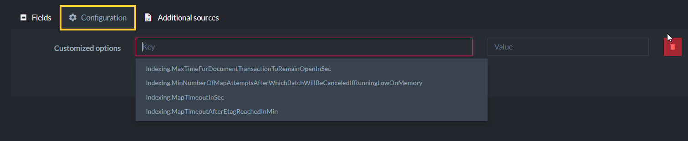

import Admonition from '@theme/Admonition';
import Tabs from '@theme/Tabs';
import TabItem from '@theme/TabItem';
import CodeBlock from '@theme/CodeBlock';
import LanguageSwitcher from "@site/src/components/LanguageSwitcher";
import LanguageContent from "@site/src/components/LanguageContent";

# Create Map Index
<Admonition type="note" title="">

* A **Map index** consists of one or more LINQ-based mapping functions that indicate how to index selected document fields.  

* In this page:  
  * [Edit Index View](../../../studio/database/indexes/create-map-index.mdx#edit-index-view)  
  * [Index Fields & Terms](../../../studio/database/indexes/create-map-index.mdx#index-fields--terms)  
  * [Index Field Options](../../../studio/database/indexes/create-map-index.mdx#index-field-options)  
  * [Configuration](../../../studio/database/indexes/create-map-index.mdx#configuration)  
  * [Additional Sources](../../../studio/database/indexes/create-map-index.mdx#additional-sources)  
  * [Spatial Field Options](../../../studio/database/indexes/create-map-index.mdx#spatial-field-options)  
</Admonition>
## Edit Index View

1. **Index Name**  

2. **Save** - Save index definition  
   **Clone** - Clone this index (available for an already saved index)  
   **Delete** - Delete this index (available for an already saved index)  

3. Options avaliable for an already saved index:  
   **Copy C#** - Click to view and copy the C# class that defines the index as set in the Studio.  
   **Query** - Click to go the the Query View and query this index.  
   **Terms** - Click to see the index terms, see [below](../../../studio/database/indexes/create-map-index.mdx#index-entries--terms).  

4. **The Map Function** of the index.  

  * In the above example, the index will go over documents from the `Products` collection and 
    will only index documents whose `Discontinued` property is _'true'_.  

  * Note: The range of documents from which the query on this index will supply results will be on only Products collection documents 
    that have _'true'_ in the _'Discontinued'_ document field property. If the index was defined without the _'where'_ clause, but only using _'from p in docs.Products'_, 
    then the documents range for the query result would have been the whole Products collection.  

  * Each **Index Entry** that will be created for this index will be composed of the following 4 fields:  
    `Name`, `Category`, `PricePerUnit` & `SupplierName`.  
    The first 3 are taken directly from the document fields, while _SupplierName_ is a calculated index field.  
    The supplier's name is derived from the _Name_ field that is taken from the _loaded_ supplier document.  

  * At **query time**, when querying this index, the resulting documents can be searched on and further filtered  
    by these **Index Fields** defined and by the created **Terms**. 
    See the query results on this index in Query View.  

  * See more Map-Indexes examples in [Map Index defined from Code](../../../indexes/map-indexes.mdx)  

## Index Fields & Terms

1. **Index Fields**  
   The index-fields that are indexed per index-entry with the above index-definition are:  
   `Name`, `Category`, `PricePerUnit` & `SupplierName`.  

2. **Terms**  
   The terms are listed under each field.  
   The terms are created from the value of the field that was requested to be indexed 
   according to the specified [Field Options](../../../studio/database/indexes/create-map-index.mdx#fields-(index-entries)-options).  

## Index Field Options

1. **Default values**  
   Set the default values that will apply to _all_ index fields.  

2. **Add a Field**  
   Override the default values with specific settings for selected index entries. 

3. **Select Field**  
   Select a field from the drop-down. The settings will override the default settings.  

4. * `Store` - Setting _'Store'_ will store the value of this field in the index itself.  
               At query time, if _'Store'_ is set, then the value is fetched directly from the index, instead of from the original document.  
               If the field value is not stored in the index then it will be fetched from the document.  
               Storing data in the index will increase the index size.  
               Learn more in [Storing Data in Index](../../../indexes/storing-data-in-index.mdx).  

  *  `Full-Text-Search` - Set this to _'Yes'_ to allow searching for a particular text without having an exact match.  
                          The terms that are being indexed are _tokens_ that are split from the original string according to the specified [Analyzer](../../../indexes/using-analyzers.mdx).  
                          The Analyzer is set in the _'Indexing'_ dropdown. The default analyzer is a simple case-insensitive analyzer.  

  * `Indexing` -  Specify which ***Analyzer*** will be used (under Advanced):  
     * ***Exact*** - A no-operation analyzer. Text is not splitted and matches are case-sensitive.  
     * ***Default*** - _'LowerCaseKeywordAnalyzer'_ is used. Matches are case-insensitive, the input string is converted to lowercase.  
     * ***Search*** - Set a specific analyzer to use.  
               The default option is _'StandardAnalyzer'_. Input strings are broken into individual terms on a word boundary and are lowercased, 
               while omitting the 'stop words' (a, the, to, from, is, are, etc.) as well as possessive “s”.  
               Details about the available analyzers can be found in [Indexes: Analyzers](../../../indexes/using-analyzers.mdx).  

  * `Suggestions` -  Setting _'Suggestions'_ will allow you to query what the user probably meant to ask about. i.e. spelling errors.  
                      Learn more in this [Blog Post](https://ayende.com/blog/180899/queries-in-ravendb-i-suggest-you-can-do-better), 
                      and in [Querying: Suggestions](../../../indexes/querying/suggestions.mdx).  

  *  `Term Vector` -  Term Vectors (under Advanced) are used in RavenDB's query feature [More Like This](../../../indexes/querying/morelikethis.mdx), 
                      which suggests documents that are similar to a selected document, based on shared indexed terms. i.e. suggest similar catalogs.  
                      A _'Term Vector'_ for a text paragraph will contain a list of all unique words and how often they appeared.  
                      Set _'full-text-search'_ on the field (index entry) and define it to have a _'Term Vector'_.  
                      Learn more in [Indexes: Term Vectors](../../../indexes/using-term-vectors.mdx), 
                      and in this [Blog Post](https://ayende.com/blog/180900/queries-in-ravendb-gimme-more-like-this).  

  * `Spatial` -  See [below](../../../studio/database/indexes/create-map-index.mdx#spatial-field-options)

## Configuration

* Set values for specific index configuration options.  
* Learn more about each option in: [Configuration: Indexing](../../../server/configuration/indexing-configuration.mdx).  

## Additional Sources

* Use the Additional Sources feature to introduce additional classes and methods that can be used in the index definition.  
  This enables advanced scenarios since complex logic can be performed in the indexing process.  

* In the above example, file _'PeopleUtil.cs'_ was uploaded and method _'CalculatePersonEmail'_ is used to calculate the index entry _'SupplierEmail'_.  

## Spatial Field Options

* **Spatial Field**  
  Spatial searches allow you to search using geographical data.  
  In order to be able to do such searches, a _spatial index field_ has to be defined.  

* **CreateSpatialField()**  
  This method instructs RavenDB to use the provided longitude and latitude from the document field properties 
  and create the spatial field named _'Coordinates'_. 
  Spatial queries can then be made on the _'Coordinates'_ field.  

* **Spatial Type**  
  RavenDB supports both the _'Geography'_ and _'Cartesian'_ systems.  

* **Spatial Indexing Strategy**  
  _'Strategy'_ determines the format of the indexed term values.  
  The following indexing strategies are supported:  
  • Bounding box  
  • Geohash prefix tree  
  • Quad prefix tree  

* **Radius Units**  
  Set the units (miles, kilometers) to be used when querying with RQL _'spatial.circle'_.  
  Learn more about querying spatial fields in: [Querying: Spatial](../../../indexes/querying/spatial.mdx).  

* **Max Tree Level**  
  Control how precise the spatial queries are going to be.  

* **X & Y Min & Max Values**  
  Setting the min & max values for X & Y is relevant only for the _'Cartesian'_ system type.  

* Learn more about spatial indexes in: [Indexing: Spatial](../../../indexes/indexing-spatial-data.mdx).  

