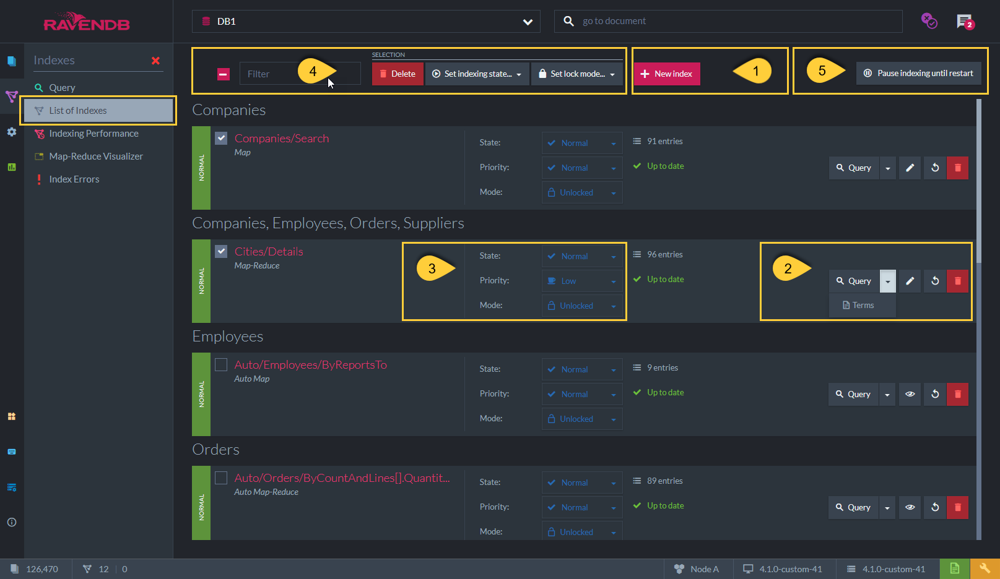
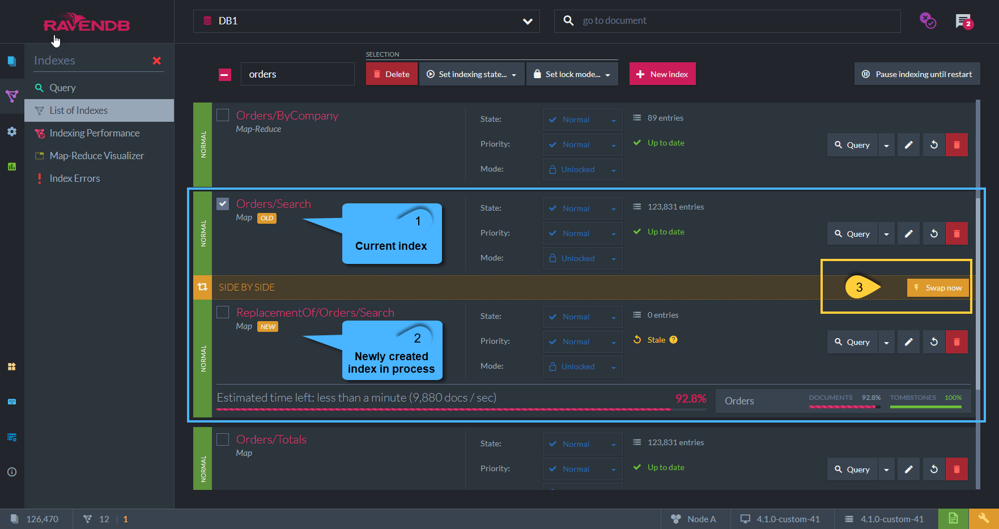

import Admonition from '@theme/Admonition';
import Tabs from '@theme/Tabs';
import TabItem from '@theme/TabItem';
import CodeBlock from '@theme/CodeBlock';
import LanguageSwitcher from "@site/src/components/LanguageSwitcher";
import LanguageContent from "@site/src/components/LanguageContent";

# Index List View
<Admonition type="note" title="Note">

* All the database indexes are listed in this view. 

* Actions such as creating a new index, modifying an existing index, setting its desired state, and much more can be performed.  

* In this page:  
  * [Index List View](../../../studio/database/indexes/indexes-list-view.mdx#index-list-view)  
  * [Index List View - Actions](../../../studio/database/indexes/indexes-list-view.mdx#index-list-view---actions)  
  * [Index List View - Index Errors](../../../studio/database/indexes/indexes-list-view.mdx#index-list-view---errors)  
  * [Index List View - Side by Side Indexing](../../../studio/database/indexes/indexes-list-view.mdx#index-list-view---side-by-side-indexing)
</Admonition>
## Index List View

**1**. **Index name and type**  

   * `Name` - e.g. In the above example the index name is: 'Cities/Details'.  
   * `Type` - This is the [Index Type](../../../studio/database/indexes/indexes-overview.mdx#indexes-types)  
     Can be: Map | Map-Reduce | Auto Map | Auto Map-Reduce  

**2**. **Collections**  

   * These are the collections that are defined in the Map part of the index-definition.  
   * Data from these collections documents is scanned and indexed.  
   * A simple `Map-index` operates on a single collection while a `Multi-Map index` is defined with more than one collection.  
   * In the above example - Index _'Cities/Details'_ is a Multi-Map index operating on _'Companies, Employees, Orders, Suppliers'_ collections.  

**3**. **Index State**  

   * `Normal` - 
      * Index is active, any new data is indexed.  

   * `Paused` - 
      * New data is not being indexed.  
        Queries will be stale as new data is not indexed.  
      * Indexing process will resume upon setting _'Resume'_ or when the server is _restarted_.  

   * `Disabled` - 
      * New data is not being indexed.  
        Queries will be stale as new data is not indexed.  
      * Indexing process will _not_ automatically resume upon a server restart but only when setting _'Enable'_.  

   * `Idle` - 
      * An auto-index becomes idle when the time difference between its last-query-time and
        the most recent time the database was queried on (with any other index) is greater than a configurable threshold (30 min by default).  
        This is done in order to avoid marking indexes as idle for databases that were offline for a long period of time -  
        not having new data to index and not queried in general, as well as for databases that were just restored from a snapshot or a backup.  
      * The auto-index will resume its work and go back to the _'Normal'_ state upon a new query or when resetting the index.  
        If not resumed, the idle auto-index will be deleted by the server after a configurable time period (72 hrs default).  

   * `Error` - 
      * A malformed indexing-function or missing/corrupted document data will result in an indexing error.  
        See more [below](../../../studio/database/indexes/indexes-list-view.mdx#index-list-view---errors).  

   * `Faulty` - 
      * Index will be _'Faulty'_ if its data files are corrupted or if not accessible.  
        See more [below](../../../studio/database/indexes/indexes-list-view.mdx#index-list-view---errors).  

**4**. **Index Status**

   * `Entries` - The number of documents that are the result for a basic query on this index. (e.g. _from index 'Cities/Details'_)  
   * `Status` - Indicate if the index is up-to-date or if it is [stale](../../../indexes/stale-indexes.mdx).  

## Index List View - Actions

1. **Crate a new index** - See more in [Create New Index](../../../studio/database/indexes/create-map-index.mdx).  

2. **Query** - Click to query the index.  
   **Terms** - Click to view the index's terms that were actually indexed.  
   **Edit/View Index** - Click to edit/view the index definition.  
   Static-index: View and edit the index definition.  
   Auto-Index: View only.  
   **Reset Index** - Click to reset the index. All documents matched by the index definition will be re-indexed.  
   **Delete** - Click to delete the index.  

3. **State** - _Disable_ index or set as _Paused_. See states explanation above (under the figure-1).  
   **Priority** - Set the indexing-process thread priority as RavenDB prioritizes requests-processing over [Indexing](../../../server/administration/index-administration.mdx#priority) by default.  
   **Mode** - Set modifications behavior:  
   Unlocked - Changes to the index definitions will be applied. See [Side by Side Indexing](../../../studio/database/indexes/indexes-list-view.mdx#index-list-view---side-by-side-indexing)  
   Locked - Index definitions changes will not be applied! No Error will be raised.  
   Locked(Error) - Index definitions changes will not be applied! An error is raised upon trying to modify.  

4. **Selected Indexes Options** - Can apply the following for selected/checked indexes from the list:  
   Delete, set indexes state (disable/pause), set lock mode  

5. **Pause Indexing until Restart**  
   Setting this will pause **all** indexes in the database.  
   Indexes will resume only when selecting this button again (Resume Indexing) or upon a server restart.  

## Index List View - Errors

**1**. **Errored Index**

  * An indexing error can occur when the indexing-function is malformed or when the document data is corrupted/missing.  
    Once the index errors rate exceeds a certain rate, the index state will be marked with _'Error'_ and queries can't be made to it.  

  * Resetting the index will re-index all documents matching its definition and clear the previous errors.  

  * In the above example, Index _'Cities/Details'_ state is _'Error'_ as 500 errors were encountered.  
    See more in [Degugging Index Errors](../../../indexes/troubleshooting/debugging-index-errors.mdx)  

**2**. **Faulty Index** 

   * When an index is already defined but the server fails to open its index data file from disk, or if this file is corrupted,  
     then the server will mark the index as _Faulty_, indicating that something is wrong with this index data files.  

   * If the issue with the index's data file is resolved, you can click **'Open Index'** (label **'3'** in above figure),  
     so that the index is processed again.  

   * A possible solution is to **reset** the index - restart the indexing process from scratch,  
     so that new data files for the index are created, replacing the corrupted ones.  

**Note**: The detailed errors list can be found in the **Index Errors** view.  

## Index List View - Side by Side Indexing

* All index updates in RavenDB are done using the **side-by-side strategy**.  

* When an index-definition is modified, RavenDB creates a 'new index' with the new definition.  
  This index will start processing all relevant documents.  

* The 'old index' (label **'1'** in above figure) will answer queries and index new documents until  
  the 'new index' (label **'2'** in above figure) is caught up and has indexed everything.  

* Once the updated version of the index has completed its work, it will automatically replace the old one.  
  You can also force an immediate replacement if needed, by clicking **'Swap Now'** (label **'3'** in above figure).  

