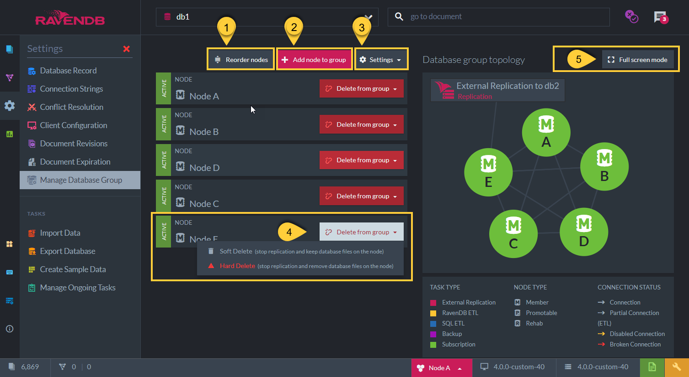

import Admonition from '@theme/Admonition';
import Tabs from '@theme/Tabs';
import TabItem from '@theme/TabItem';
import CodeBlock from '@theme/CodeBlock';
import LanguageSwitcher from "@site/src/components/LanguageSwitcher";
import LanguageContent from "@site/src/components/LanguageContent";

# Database Group
<Admonition type="note" title="">

* A **Database instance** can reside on a single node, on a number of nodes, or on all cluster nodes,  
  depending on the replication factor defined when [creating the database](../../server/databases/create-new-database/general-flow.mdx).  
  The replication factor determines the number of copies we hold for that database in the cluster,  
  so we still have a copy of the data when a node goes down.  

* The **Database Group** refers to all the database instances in the cluster.  
  Every node in a Database Group will have a _full copy_ of all the data,  
  including documents, indexes, tombstones (which is how we replicate deletes), 
  attachments and revisions,  
  and is able to serve all queries, operations and write requests.  

* The **Database Group Topology** is the specification of nodes that contain the database in the cluster in a particular point in time.  

* At the **Database Group Level**, all the nodes are working cooperatively together.  
  The connections between the databases on the different nodes do not go through any consensus protocol.  
  Instead of selecting a leader, as in the [Cluster Level](../../server/cluster/cluster-view.mdx), 
  there is a direct TCP connection among the various nodes that hold a particular database. 
  Whenever there is a write on one of the databases instances, it will immediately be recorded and replicated (sent) to all the other nodes in the Database Group.  

* Note 1: If the database instance is unable to replicate the data for some reason, it will still accept that data and send it later.  

* Note 2: Although not all nodes in the cluster belong to the Database Group, each node in the cluster _has_ a full copy of _all_ Database Group Topologies.  

* In this page:  
  * [Database Group Topology - View](../../../studio/database/settings/manage-database-group.mdx#database-group-topology---view)  
  * [Database Group Topology - Actions](../../../studio/database/settings/manage-database-group.mdx#database-group-topology---actions)  
  * [Database Group Topology - Add New Node](../../../studio/database/settings/manage-database-group.mdx#database-group-topology---add-new-node)  
  * [Database Group Topology - Members Duties](../../../studio/database/settings/manage-database-group.mdx#database-group-topology---members-duties)  
</Admonition>
## Database Group Topology - View

1. **List of nodes** that are in the Database Group Topology.  
   In this example, database _db1_ exists on nodes: A, B, C, D, and E as well.  
   Note: There are other nodes defined in the cluster but they do not belong to this database group.  

2. **Tasks** for which a node is responsible for.  
   i.e. Node 'A' is responsible for an 'External Replication Task'.  
   See more about the database tasks in [Ongoing Tasks](../../../studio/database/tasks/ongoing-tasks/general-info.mdx)  

3. A node is marked as ***Rehab*** if it is down or unreachable.  
   i.e. Node 'E'  

4. This is the **responsible node** that will update the _Rehabed_ node once its up again.  
   Once Node 'E' will be up again, Node 'A' will update the database instance on 'E' with all changes that occurred while it was down.  

## Database Group Topology - Actions

1. **Reorder Nodes**  
   The order of the nodes is relevant for the client, as it selects which node to contact from this list.  
   Click this button to reorder the nodes order.  

2. **Add a Node to the database group** - See [below](../../../studio/database/settings/manage-database-group.mdx#database-group-topology---add-new-node)  

3. **Settings**  
   Open settings to set ***Dynamic Database Distribution***  
   When _Dynamic Database Distribution_ is turned on, then once a node is down,  
   the cluster observer will handle finding a replacement node in order to maintain database replication factor.
   See [States Flow](../../server/cluster/cluster-observer.mdx#states-flow)  

4. **Delete From Database Group**  
   Deleting the database from the group will:  
   1. Remove the node from the database group topology  
   2. Delete the database from that node, by either:  
      **Soft** Delete:  The physical file will be kept on the removed node's disk.  
      **Hard** Delete:  All database files are deleted on this removed node.  
   3. No more replication will occur from the other nodes to this node that is removed.  

5. **Full Screen**  
   Click to view graph in a full-screen mode. (Esc to exit)  

## Database Group Topology - Add New Node 

1. **Node:**  
   Select the cluster Node to add to the Database Group Topology  
   Note: Node should be already part of the Cluster Topology. See [Adding a node to the Cluster](../../server/cluster/add-node-to-cluster.mdx)  

2. **Preferred Mentor:**  
   Check the 'Choose preferred mentor node manually' checkbox in order to specify which node will be the preferred mentor for the newly added node.  
   If not checked, then any one of the already existing Member nodes in the group will become the mentor node.  
   The preferred mentor will be responsible for updating the new node with all the database data and its state. 
   See [Members Duties](../../../studio/database/settings/manage-database-group.mdx#database-group-topology---members-duties)  

**Note**:  

* The new node is added as a `Promotable`  
* Once the new node is fully updated and has finished indexing the last data that was sent to it,  
  it will be promoted to a full `Member`.  

## Database Group Topology - Members Duties 

#### Members Duties Are:

* Replication of the database data to all other nodes in Database Group (Done by ***all*** nodes)  

* Becoming a mentor for newly added nodes or nodes that came back from _Rehab_ state  

* Be responsible for tasks defined on the database  
  i.e. external replication, subscriptions, ETL Replication, Backups, etc.

<Admonition type="note" title="Who's Duty is it ?" id="who-s-duty-is-it" href="#who-s-duty-is-it">

* Topology changes (i.e. new node in the database group, delete node from Database Group), 
as well as tasks that are defined on the database, are written to the [Database Record](../../../studio/database/settings/database-record.mdx). 
The database record exists in each node in the cluster.  

* When a new node is added and a mentor is needed for the new node, or when a new task is added,  
  each node in the Database Group checks the Database Record and determines (based on a pre-defined algorithm) if it is the task owner.  
</Admonition>

