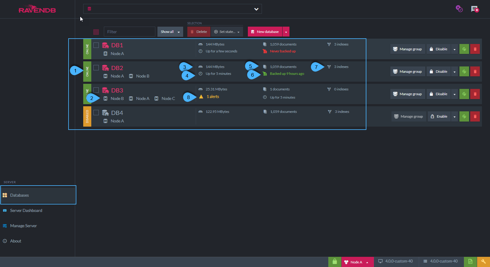

import Admonition from '@theme/Admonition';
import Tabs from '@theme/Tabs';
import TabItem from '@theme/TabItem';
import CodeBlock from '@theme/CodeBlock';
import LanguageSwitcher from "@site/src/components/LanguageSwitcher";
import LanguageContent from "@site/src/components/LanguageContent";

# Databases List View
<Admonition type="note" title="Note">

* All your databases are listed in this view  
  * Database stats can be viewed  
  * Actions can be performed on each database  

* In this page:  
  * [Database Stats](../../../studio/server/databases/databases-list-view.mdx#database-stats)  
  * [Database Actions](../../../studio/server/databases/databases-list-view.mdx#database-actions)  
  * [Creating New Database Options](../../../studio/server/databases/databases-list-view.mdx#creating-new-database-options)  
  * [More Actions](../../../studio/server/databases/databases-list-view.mdx#more-actions)  
  * [Remote Database](../../../studio/server/databases/databases-list-view.mdx#remote-database)  
</Admonition>
## Database Stats

1. **Database State**    
   A database can be: _Online_ , _Offline_ or _Disabled_        

   * ***Online***   - Database is active and ready to use. Read and write actions can be done.  
   * ***Offline***  - Database was not used recently, and will become online upon access.  
   * ***Disabled*** - Database has been disabled.  
  
   * Note:  
     If the database is contained in one of the cluster's nodes, but Not in the node that shows in this current view,
     then ***'Remote'*** will be indicated - see more below

2. **Containing Nodes**   
   These are the nodes that contain a replica of the database. 

3. **Database Size**    
   Total size of database, including documents and indexes.

4. **Up time**        
   Time that has passed since database last went online. 

5. **Number of documents**      
   The number of documents in database.

6. **Latest backup time**      
   Time of the latest database backup.
      
7. **Number of indexes**    
   The number of index errors will show if relevant.

8. **Alerts**    
   The number of alerts on this database if there are any.

## Database Actions

1. **Create new database**  
   A new database can be created from scratch, from a backup copy, or from existing 3.x data - see more [below](databases-list-view#creating-new-database-options)  

2. **Manage group**  
   Click to manage the nodes that contain this database - see more about [The Database Group](../../../studio/database/settings/manage-database-group.mdx)  

3. **Disable/Enable the database**  
   A disabled database cannot be accessed  

4. **More actions**  
   Pause indexing, Disable indexing, Compact database - see more below  

5. **Refresh data**  
   Refresh the database stats data in this view from the server  

6. **Delete the database**  

## Creating New Database Options

1. **Create new database from scratch**   
2. **Create new database from an existing backup copy**   
3. **Create new database from legacy data files**      
   Create a new database from a 3.x RavenDB version database    

## More Actions

1. **Pause indexing**      
   All indexes on this database will stop indexing.
   Indexing will be resumed upon a restart to the server.  

2. **Disable indexing**     
   All indexes on this database will stop indexing.  
   Indexing will be NOT be resumed upon a restart to the server.  

3. **Compact database**   
   Physically compact the database on disk

## Remote Database

* If the database is contained in one of the cluster's nodes but Not in the node that shows in this current view,  
  then ***'Remote'*** is indicated  

* For example, in the above figure, DB2 is contained in nodes A & B  
  It is indicated as _'Remote'_ since the current view is for node C  

* **Note:** Clicking on a remote database will navigate to the documents view for this database on its containing node  

