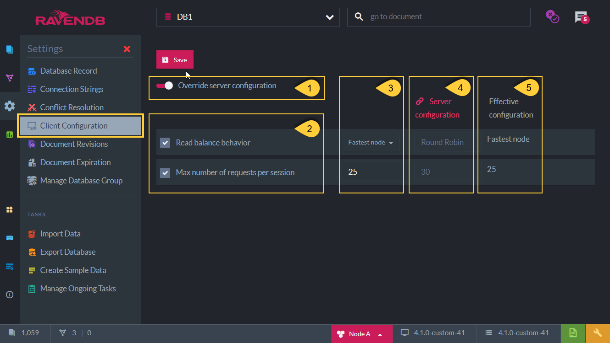

import Admonition from '@theme/Admonition';
import Tabs from '@theme/Tabs';
import TabItem from '@theme/TabItem';
import CodeBlock from '@theme/CodeBlock';
import LanguageSwitcher from "@site/src/components/LanguageSwitcher";
import LanguageContent from "@site/src/components/LanguageContent";

# Client Configuration (Per Database)
<Admonition type="note" title="">

* The general server [Client Configuration](../../../studio/server/client-configuration.mdx) can be overwritten per database.  
</Admonition>
## Client Requests Configuration - Per Database

* **1**. Override Server Configuration -  
      This option needs to be checked in order to be able to override the existing requests configuration.  
      If not checked, then the existing general server requests configuration will be used.  

* **2**. Check these options to actually override the existing [general server requests configuration](../../../studio/server/client-configuration.mdx).  
      If not checked, when the above 'override' is turned on, then the Effective Configuration will be: 'Client Default'.  

* **3**. Set the specific _read-balance_ method and the _max requests_ number value desired for this database.  
      For a detailed explanation about each field see: [server requests configuration](../../../studio/server/client-configuration.mdx) 
      & [Load Balance & Failover](../../../client-api/configuration/load-balance-and-failover.mdx).  

* **4**. This is the existing general server requests configuration.  

* **5**. This is the **Effective Configuration** that will actually be used.  

<Admonition type="note" title="Note" id="note" href="#note">
This view will be as in the above image when a general configuration is defined.  
If a general configuration is not yet defined then this view will be similar to the general server configuration view.  
</Admonition>

