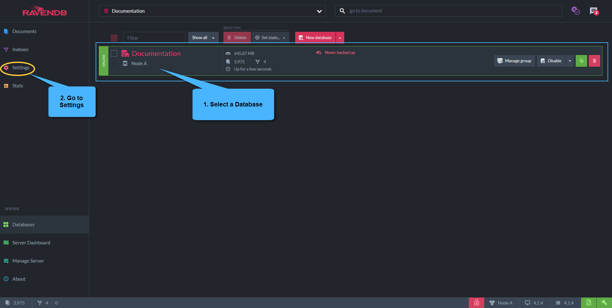
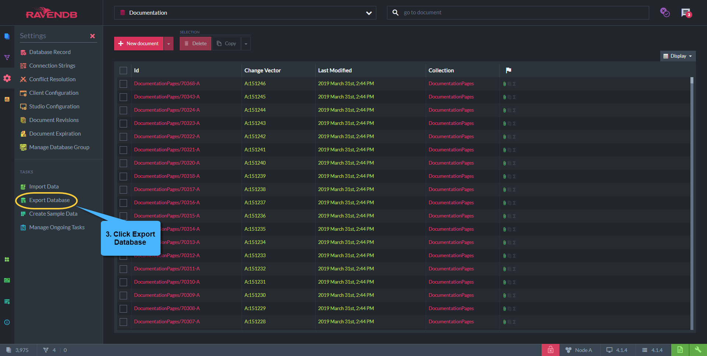
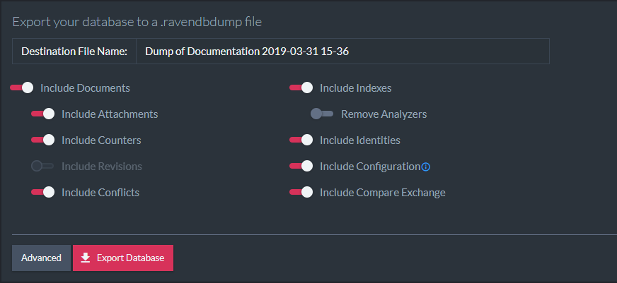
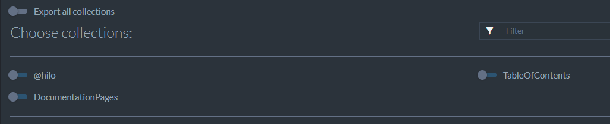
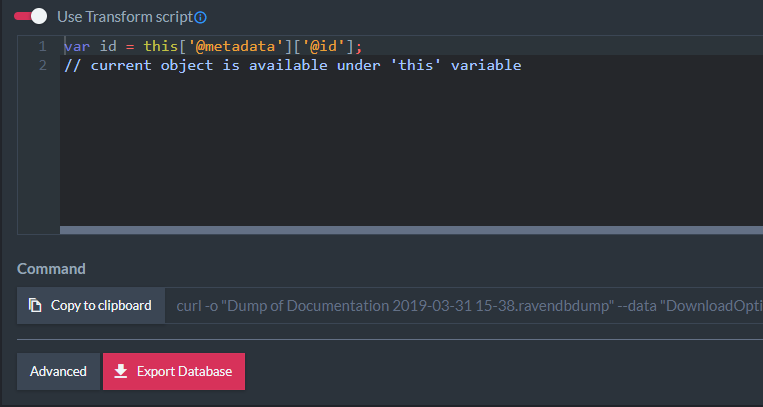

import Admonition from '@theme/Admonition';
import Tabs from '@theme/Tabs';
import TabItem from '@theme/TabItem';
import CodeBlock from '@theme/CodeBlock';
import LanguageSwitcher from "@site/src/components/LanguageSwitcher";
import LanguageContent from "@site/src/components/LanguageContent";

# Export Database to a .ravendbdump file

A `.ravendbdump` file is the RavenDB format for exporting/importing a database. It is backwards compatible between RavenDB versions. 
In order to export a `.ravendbdump` file we need an existing database. Let's select a database and navigate to `Settings`.  

Select `Export Data` under `Tasks` submenu.

## Export options 

Here you can filter the data you want to export, select collections and apply a transform script on your documents.

- **Include Documents:** Determines whether or not documents contained in the database should be exported or not, if disabled _Attachments_ and _Counters_ will automatically be disabled too. 
    - **Include Attachments:** Determines whether or not attachments contained in the database should be exported. 
    - **Include Counters:** Determines whether or not Counters contained in the database should be exported. 
    - **Include Revisions:** Determines whether or not Revisions contained in the database should be exported.
    - **Include Conflicts:** Determines whether or not Conflicts contained in the database should be exported.
- **Include Indexes:** Determines whether or not Indexes contained in the database should be exported. 
    - **Remove Analyzers:** Determines whether or not Analyzers used by indexes contained in the file should be stripted or not. 
- **Include Identities:** Determines whether or not Identities contained in the database should be exported.
- **Include Configuration:** Determines whether or not Configuration settings of _Revisions_, _Expiration_ and _Client_ should be exported.
- **Include Compare Exchange:** Determines whether or not Compare Exchange values contained in the database should be exported.

## Advanced export options

### Export all collections

- **Export all collections:** Determines whether or not All database collections should be exported.
    - If _Export all collections_ is disabled list of all database collections will be displayed with the ability to filter collections by name.
### Transform Script

- Use Transform Script: when enabled will allow to supply a transform javascript script to be operated on each document contained by the file

<TabItem value="javascript" label="javascript">
<CodeBlock language="javascript">
{`var id = doc['@metadata']['@id'];
if (id === 'orders/999')
    throw 'skip'; // filter-out
`}
</CodeBlock>
</TabItem>
### Copy command as PowerShell

- Generates the commands to run the exporting logic from PowerShell.
