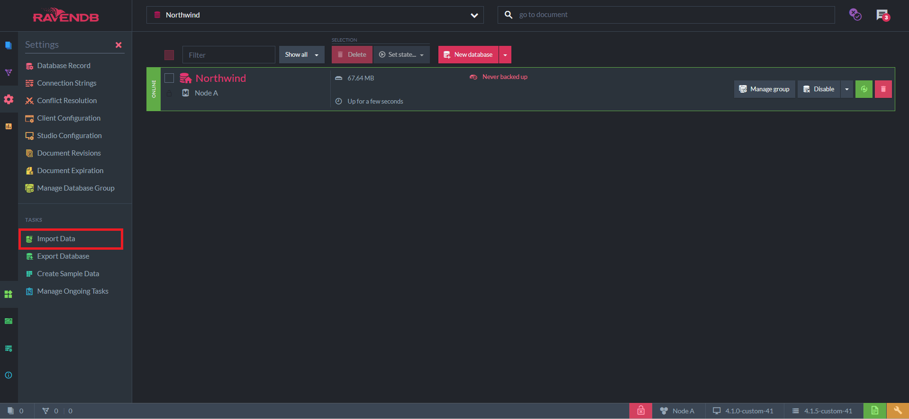
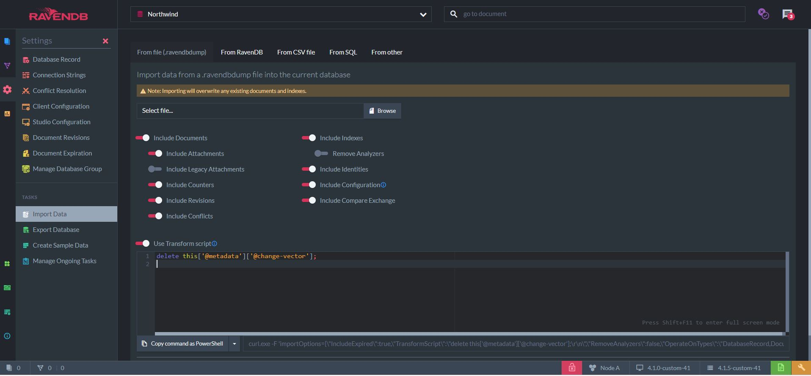

import Admonition from '@theme/Admonition';
import Tabs from '@theme/Tabs';
import TabItem from '@theme/TabItem';
import CodeBlock from '@theme/CodeBlock';
import LanguageSwitcher from "@site/src/components/LanguageSwitcher";
import LanguageContent from "@site/src/components/LanguageContent";

# Import Data From .ravendbdump File

A `.ravendbdump` file is the RavenDB format for exporting a database. It is backwards compatible between RavenDB versions. 
In order to import a `.ravendbdump` file we need an existing database. Let's create a new `Northwind` database and navigate to `Settings`.  

Next, navigate to `Import Data`  

Now we are faced with multiple optional filters for importing data.  

## Import Options 

- **Include Documents**: determines whether the documents contained in the file should be imported. If disabled, attachments and counters will automatically be disabled as well.  
- **Include Attachments**: determines whether attachments contained in the file should be imported.  
- **Include Legacy Attachments**: legacy attachments refers to v2.x and v3.x attachments. Determines whether legacy attachments contained in the file should be imported.  
- **Include Counters**: determines whether Counters contained in the file should be imported.  
- **Include Revisions**: determines whether Revisions contained in the file should be imported.  
- **Include Conflicts**: determines whether Conflicts contained in the file should be imported.  
- **Include Indexes**: determines whether Indexes contained in the file should be imported.  
- **Remove Analyzers**: determines whether the Analyzers used by indexes should be scripted.  
- **Include Identities**: determines whether Identities contained in the file should be imported.  
- **Include Configuration**: determines whether configurations of Revisions, Expiration and Client contained in the file should be imported.  
- **Include Compare Exchange**: determines whether Compare Exchange values contained in the file should be imported.  

<Admonition type="note" title="Note" id="note" href="#note">
No error is thrown if you select an option that is Not contained in the file.  
</Admonition>

## Advanced Import Options
  

- **Use Transform script**: when enabled, you will be able to input a transform JavaScript script to be operated on each document contained by the file.

<TabItem value="javascript" label="javascript">
<CodeBlock language="javascript">
{`delete this['@metadata']['@change-vector']
`}
</CodeBlock>
</TabItem> 

For example, the script above will delete the Change Vectors from imported documents and generate new Change Vectors during import. 
This is very helpful if the data is imported from a different database group and you want to avoid adding old change vector entries to a new environment. 

- **Copy command as PowerShell**: generates the commands to run the importing logic from PowerShell.

